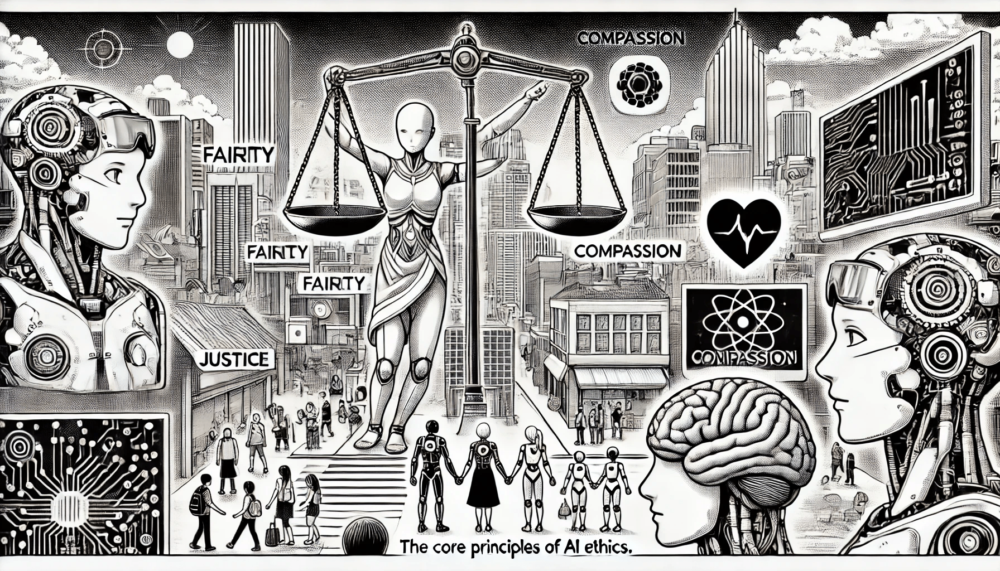

# Core Principles of AI Ethics

As artificial intelligence continues to shape industries, societies, and daily life, ethical considerations have become essential to responsible AI development. This section explores the foundational principles that guide ethical AI, ensuring fairness, transparency, and accountability in its deployment.

<figure><figcaption>
Core Principles of AI Ethics
</figcaption></figure>

Here are the **Core Principles of AI Ethics**:

1. **Transparency**\
   AI systems should be clear about how they work and make decisions. People should know when they’re interacting with AI and have access to understandable explanations.
2. **Fairness**\
   AI should treat everyone equally. It should not discriminate against people based on race, gender, background, or any other unfair reason.
3. **Accountability**\
   Humans should take responsibility for the actions and impacts of AI systems. If something goes wrong, there should be a clear person or group who is responsible.
4. **Privacy**\
   AI must respect people’s personal data. Information should be protected, and people should have control over how their data is used.
5. **Safety and Security**\
   AI systems should be built to avoid harm. They need to be secure from attacks and tested to make sure they work safely.
6. **Beneficence (Doing Good)**\
   AI should help people and improve lives. It should be designed to support human well-being and not cause harm.
7. **Autonomy**\
   AI should support human freedom and decision-making. It shouldn't manipulate people or take away their ability to choose.
