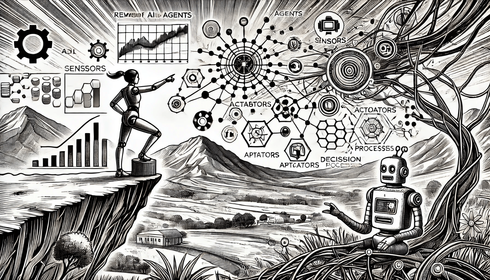

# Components of AI Agents

### Components of AI Agents

AI agents are made up of many key components that work together to perceive, reason, and act in their environment.

<figure><figcaption>
Components of AI Agents
</figcaption></figure>

To make all of this possible, agents rely on four key components:

* Sensors: These detect changes in the environment. For instance, a robot’s camera or a smartphone’s GPS.
* Actuators: These are the muscles of the agent, converting energy into action. In robots, this could be motors that move wheels or arms. For software, this might be actions like displaying information or sending messages.
* Effectors: These are what physically interact with the world, like a robot’s legs or a display screen on your phone.
* Decision-making mechanism: A decision-making mechanism is the brain of an AI agent. It processes the information gathered by the sensors and decides what action to take using the actuators. The decision-making mechanism is where the real magic happens.


Each agent can perceive its own actions (but not always their effects or consequences).


In addition it has a learning system. The learning system enables the AI agent to learn from its experiences and interactions with the environment. It uses techniques like reinforcement learning, supervised learning, and unsupervised learning to improve the performance of the AI agent over time.
