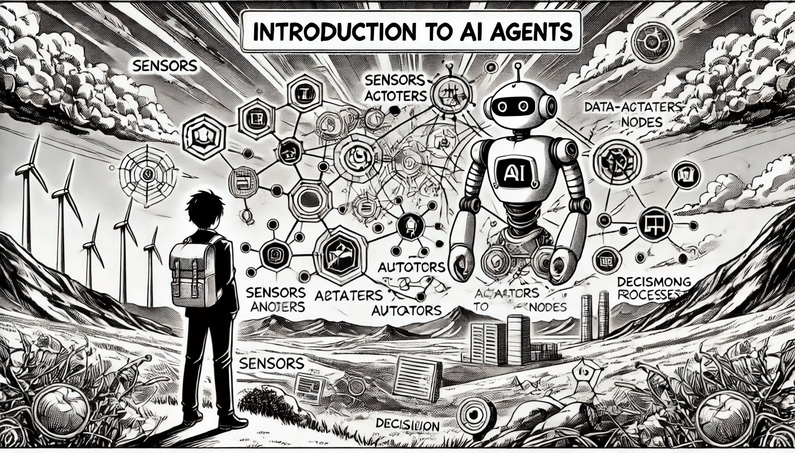

# Introduction to AI Agents

### What Exactly is an AI Agent?

In simple terms, an AI agent is a system that interacts with its environment through a cycle of sensing, deciding, and acting. Agents are everywhere — your smartphone, your thermostat, even your robot vacuum cleaner! These agents can vary widely, from simple devices to highly sophisticated systems like self-driving cars or virtual characters in video games.

<figure><figcaption>
Introduction to AI Agents
</figcaption></figure>

### Characteristics of AI Agents

While AI tools and agents are both designed to automate tasks, AI agents stand out due to their more advanced capabilities. An AI tool can be considered an agent when it possesses the following traits:

* Autonomy: AI agents operate independently, carrying out tasks without needing continuous human guidance or input.
* Perception: They have the ability to sense and interpret their surroundings using various sensors, such as cameras or microphones, to understand the environment they are working in.
* Reactivity: AI agents can evaluate their environment and respond in ways that help them achieve their objectives.
* Reasoning and Decision-making: These agents are equipped to analyze data, reason through problems, and make decisions to fulfill their goals, using algorithms and reasoning techniques to guide their actions.
* Learning: They can improve their performance over time by utilizing methods like machine learning, deep learning, and reinforcement learning.
* Communication: AI agents can interact with other agents or humans using methods like natural language understanding, speech recognition, and text-based communication.
* Goal-oriented: They are built to accomplish specific goals, which may either be predefined or developed through interaction with their environment.

### Different Categories of AI Agents

Not all agents are the same. They can be classified by their behavior:

* Reactive Agents: These are the quick responders, like your home thermostat that adjusts the temperature based on changes in the environment. They react immediately to stimuli but don’t think ahead.
* Proactive Agents: These agents go a step further, planning their actions in advance. For instance, a proactive agent might anticipate future traffic jams and reroute you before they happen.

The environment plays a crucial role too. It could be fixed (like a chessboard where rules don’t change) or dynamic (like real-world traffic, where conditions shift constantly).

### Single vs. Multi-Agent Systems (MAS)

Agents can work alone or team up. In single-agent systems, the agent only focuses on achieving its own goal. However, in multi-agent systems, agents cooperate or compete to reach a common objective, like swarms of drones working together in rescue missions or players in an online game coordinating strategies.

### How Do Agents Work?

Every agent, whether it’s a human, robot, or piece of software, follows a cycle of perceiving its surroundings, processing that information, and then acting.

* Human Agents: We rely on our senses — eyes, ears, touch — to perceive the world, and our bodies to act, like speaking or moving.
* Robotic Agents: Robots use cameras, infrared sensors, or even natural language processing (NLP) to “sense” their environment. They act using motors or other mechanisms.
* Software Agents: These digital agents, like spam filters or virtual assistants, use data (like keystrokes or file contents) to decide what actions to take, often displaying results on your screen.

### Why Are AI Agents Important?

AI agents are the backbone of many modern systems. In robotics, they help machines navigate and interact with the physical world. In gaming, they create dynamic opponents or teammates that respond to a player’s moves. AI agents are also at the heart of smart systems, from managing energy use in buildings to helping self-driving cars avoid accidents.

The beauty of AI agents lies in their autonomy — they don’t just follow a script. They learn, adapt, and make decisions, often improving as they interact more with their environment. Whether it’s your smartphone’s assistant predicting your next appointment or a robot completing a complex task, agents are changing the way we interact with technology, making it smarter, faster, and more efficient.
