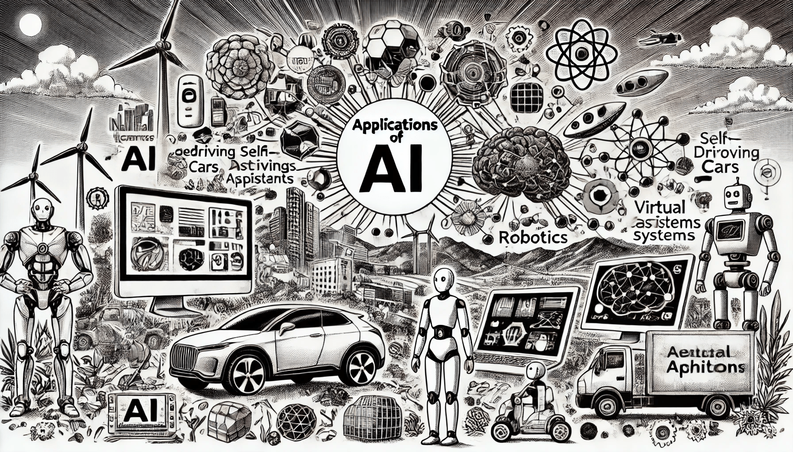

# Key Application of AI

Artificial Intelligence is transforming various industries by automating processes, improving decision-making, and unlocking new possibilities. Let's explore the fields where AI has made significant contributions:. We'll try to highlight real-world examples of AI applications in each sector, demonstrating how it enhances productivity and innovation.

<figure><figcaption>
Key Applications of AI
</figcaption></figure>

