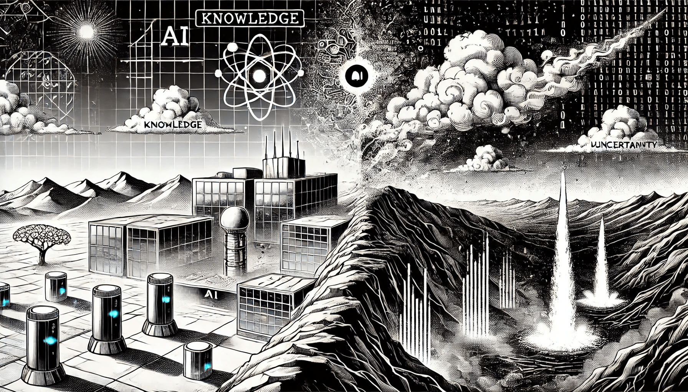

# Knowledge and Uncertainty in AI

AI systems thrive on knowledge—structured, unstructured, and everything in between. However, the real world is far from predictable, and uncertainty plays a significant role in how AI operates. Whether it’s interpreting ambiguous data, predicting future events, or making decisions with incomplete information, AI must balance its reliance on knowledge with strategies to manage uncertainty. This interplay between certainty and ambiguity is at the heart of advancements in AI and ML, shaping how these systems perceive, reason, and adapt in dynamic environments.

<figure><figcaption>
Knowledge and Uncertainty in AI
</figcaption></figure>

