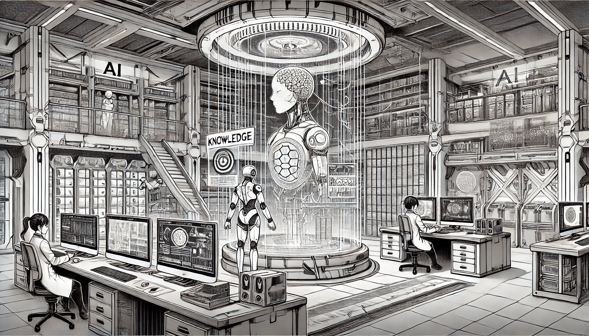

# Knowledge Representation

Artificial Intelligence and Machine Learning have transformed the way machines interact with the world, empowering them to perform tasks that once required human intelligence. At the core of this transformation lies a fundamental concept: **Knowledge Representation (KR)**. Knowledge Representation in AI refers to the methods by which artificial intelligence systems store, organize, and utilize knowledge to solve complex problems. It is a cornerstone of AI, enabling machines to mimic human understanding, reasoning, and decision-making processes.

<figure><figcaption>
Knowledge Representation
</figcaption></figure>

But why is knowledge representation so important? Humans possess a remarkable ability to understand, reason, and interpret the world around them. We process knowledge through experiences, logic, and intuition, allowing us to make informed decisions and take actions in real-world scenarios. For machines to exhibit similar intelligent behavior, they must be equipped with the ability to:

* **Understand the world**: Machines need to model real-world objects, events, and relationships in a way that reflects how humans perceive and interpret them.
* **Reason with information**: Knowledge must be processed logically to draw conclusions, make predictions, or solve problems effectively.
* **Learn and adapt**: AI systems must continuously refine their understanding based on new data and experiences, improving their performance over time.

This is where knowledge representation becomes indispensable. By creating structured and meaningful formats for representing information, machines can perform tasks such as diagnosing medical conditions, planning logistics, or even engaging in natural conversations with humans. Knowledge representation bridges the gap between raw data and actionable intelligence, allowing AI systems to operate with a level of sophistication that mirrors human thought processes.

In this section, we will explore the concept of knowledge representation in depth, examining its role in AI, the types of knowledge it encompasses, and how it enables machines to think, reason, and act intelligently. By understanding the principles of knowledge representation, we can better appreciate how AI systems transform data into meaningful insights and actions, paving the way for smarter, more capable technologies.
