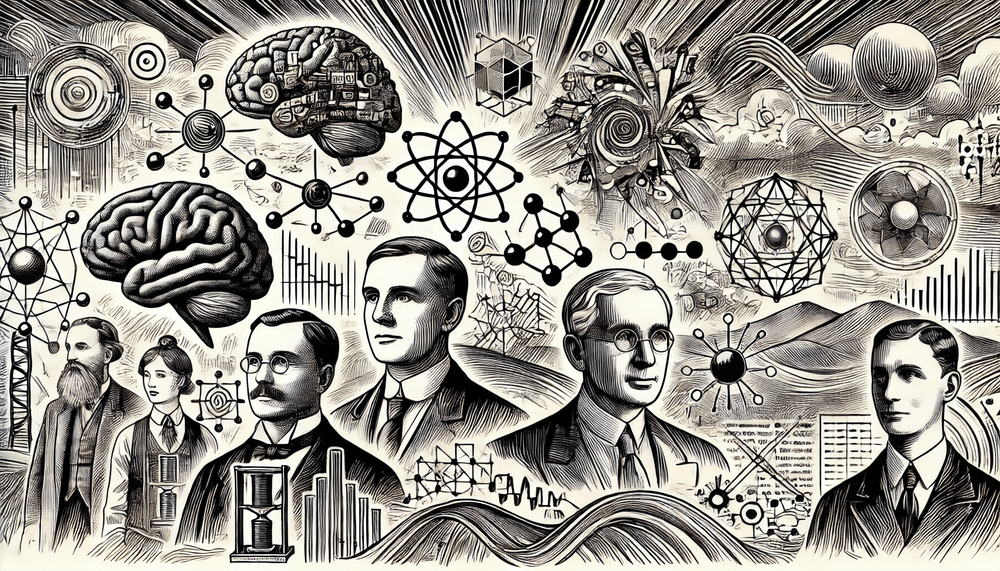

# History of AI

### From Myth to Modern Marvel

The idea of Artificial Intelligence isn’t new — its roots stretch back to ancient myths like those in Greek mythology, where the concept of intelligent machines was first imagined (read more in [History of ML](../../machine-learning/overview-of-ml/history-of-ml/)). But AI as we know it today started taking shape in the 1950s. This is when computer scientists began seriously considering whether machines could learn, solve problems, and even think like humans.

<figure><figcaption></figcaption></figure>

One of the trailblazers in this field was British mathematician Alan Turing. In 1950, he introduced the famous Turing test — a simple but powerful idea for assessing whether a machine could behave intelligently enough to fool a human into thinking it was also human. This sparked a huge wave of excitement and research, as scientists began trying to create machines that could do things like play chess, solve math problems, and understand human language.

Since then, AI has come a long way. The 1980s and 90s were all about expert systems, which aimed to replicate human decision-making. Fast forward to the 2000s, and the explosion of big data, combined with powerful computers, led to breakthroughs in machine learning, deep learning, and AI applications. Suddenly, machines were not just playing games or solving puzzles—they were recognizing faces, understanding speech, and even driving cars on their own.

### Key Contributions and Influential Figures

The field of Artificial Intelligence has been shaped by the contributions of both early pioneers who laid the groundwork and contemporary innovators who continue to push the boundaries of what’s possible. This article will explore the key figures in AI’s history, divided into two categories: pioneers and visionaries, and contemporary innovators.

### Pioneers and Visionaries

The early development of AI was fueled by the work of brilliant minds whose ideas laid the foundation for what the field has become today. These pioneers imagined a future where machines could think, learn, and adapt — an idea that was revolutionary for their time.

#### 1. Alan Turing

<figure><figcaption>
Alan Turing
</figcaption></figure>

Often referred to as the father of modern computer science, Alan Turing’s 1950 paper _“Computing Machinery and Intelligence”_ posed the famous question, “Can machines think?” In it, Turing introduced the concept of the Turing Test, a method for determining whether a machine can exhibit intelligent behavior indistinguishable from that of a human. Turing’s work laid the conceptual groundwork for AI by exploring the idea of machine learning and artificial reasoning.

#### 2. John McCarthyIn 1956, John McCarthy coined the term “Artificial Intelligence” during the Dartmouth Conference, which is considered the birth of AI as a distinct field of study. McCarthy’s contributions include the development of Lisp, a programming language widely used in AI research. His work in symbolic reasoning and problem-solving helped establish the core areas of early AI research, particularly in logic-based approaches.

#### 3. Marvin Minsky

<figure><figcaption>
Marvin Minsky
</figcaption></figure>

A co-founder of the MIT AI Laboratory, Marvin Minsky was another pioneer who made significant contributions to AI. His work focused on human cognition and the architecture of intelligence, exploring how machines could simulate human thought. Minsky believed that AI could be used to understand the nature of human intelligence and contributed to early developments in robotics and neural networks.

#### 5. John McCarthy

John McCarthy, often referred to as the "father of artificial intelligence," coined the term "artificial intelligence" in the mid-1950s. He was instrumental in the development of the Lisp programming language, which became essential for AI research. McCarthy believed in the potential of AI to solve complex problems and to emulate many aspects of human thought through computation, laying down the foundational concepts upon which the field is built.

#### 4. Herbert A. Simon and Allen Newell

<figure><figcaption>
Herbert A.Simon
</figcaption></figure>

Simon and Newell were instrumental in creating one of the first AI programs, the Logic Theorist, in 1955. Their work introduced the idea of heuristic problem-solving in machines, simulating human reasoning. They went on to develop the General Problem Solver, which could solve a wide range of problems through abstract reasoning, marking one of the first practical applications of AI.

<figure><figcaption>
Allen Newell
</figcaption></figure>

These early pioneers had the vision and courage to question what machines could achieve, laying the groundwork for future breakthroughs.

### Contemporary Innovators

While the early pioneers set the stage for AI, contemporary innovators have driven its rapid development in recent years. With the advent of more powerful computing and the rise of machine learning, AI has grown into a critical field impacting various industries, from healthcare to autonomous systems. Here are some of the leading figures behind this revolution.

#### 1. Geoffrey Hinton

Widely regarded as the “Godfather of Deep Learning,” Geoffrey Hinton’s work has been pivotal in the resurgence of neural networks. His development of backpropagation in the 1980s, along with more recent advances in deep learning, revolutionized the field of AI. Hinton’s work led to breakthroughs in speech recognition, computer vision, and natural language processing, and his research paved the way for the creation of AI models like deep neural networks and convolutional networks.

#### 2. Yann LeCun

Another key figure in deep learning, Yann LeCun is best known for his contributions to convolutional neural networks (CNNs), which have become essential in computer vision tasks. LeCun’s research helped make significant advances in object recognition and image classification. As a leading AI researcher and chief AI scientist at Meta (formerly Facebook), LeCun continues to push the boundaries of AI and machine learning applications.

#### 3. Andrew Ng

Co-founder of Google Brain and one of the most influential voices in AI education, Andrew Ng is a prominent figure in the AI community. His work on deep learning and its applications to large-scale problems has had a profound impact on both academia and industry. Ng is also known for democratizing AI education through online courses, making cutting-edge knowledge accessible to a global audience.

#### 4. Fei-Fei Li

Fei-Fei Li is a pioneer in the field of computer vision and the co-director of Stanford’s Human-Centered AI Institute. She led the development of ImageNet, a large-scale visual database that accelerated progress in deep learning. ImageNet’s success was instrumental in the creation of powerful AI models that excel at image recognition. Fei-Fei Li is also an advocate for ethical AI, emphasizing the importance of developing AI systems that align with human values.

#### 5. Demis Hassabis

As the co-founder and CEO of DeepMind, Demis Hassabis is at the forefront of AI research. DeepMind’s **AlphaGo**, which defeated a world champion Go player in 2016, showcased the potential of reinforcement learning and advanced AI capabilities. Hassabis continues to drive research in general AI and neural networks, pushing the limits of what AI can achieve, particularly in areas like healthcare, protein folding, and energy efficiency.

### Conclusion

From the visionary work of pioneers like Alan Turing and John McCarthy to the groundbreaking advancements by contemporary innovators like Geoffrey Hinton and Fei-Fei Li, the field of AI has been shaped by a diverse group of thought leaders. Each of these individuals has contributed to our understanding of intelligence — whether natural or artificial — and their work has driven AI from theoretical speculation to practical reality. As AI continues to evolve, these influential figures provide the inspiration and foundation for the next generation of innovations that will shape our future.
