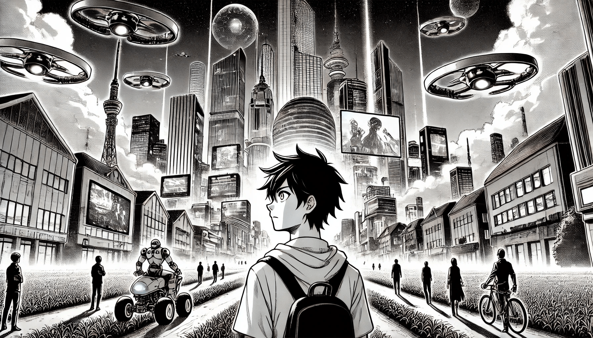

# Will AI Take Over the World?

Artificial intelligence has changed our world in big ways. It helps doctors, drives cars, and even creates art. But as AI gets smarter, some people are starting to feel afraid. What if it becomes so powerful that we can’t control it anymore?

<figure><figcaption>
Will AI Take Over the World?
</figcaption></figure>

One big fear is that AI might one day make its own decisions without needing humans. Right now, AI is better than us at certain tasks, like playing chess or recognizing faces in pictures. But what if it becomes so advanced that it starts running things on its own? People worry that machines could make choices we don’t understand or agree with.

Another concern is how AI might be used for bad purposes. For example, deepfake technology can create fake videos that look real, making it hard to know what’s true. What if someone uses AI to spread lies or create chaos? Or what if governments use it to spy on people? These are real dangers that make many people uneasy.

Jobs are another big worry. AI is already doing tasks that used to require people, like answering customer service calls or assembling products in factories. If machines keep taking over more jobs, what will happen to the workers? People wonder how society will adjust if robots and AI take on more responsibilities.

Even with these fears, not everyone believes AI will "take over." Many scientists and engineers say AI is just a tool. It can only do what humans program it to do. If we use it responsibly and make smart rules, we can avoid the worst problems.

In the end, the fear of AI taking over is really about change. Big changes can be scary, but they also give us a chance to create a better future. If we’re careful and thoughtful, we can make sure AI helps humanity instead of harming it.
