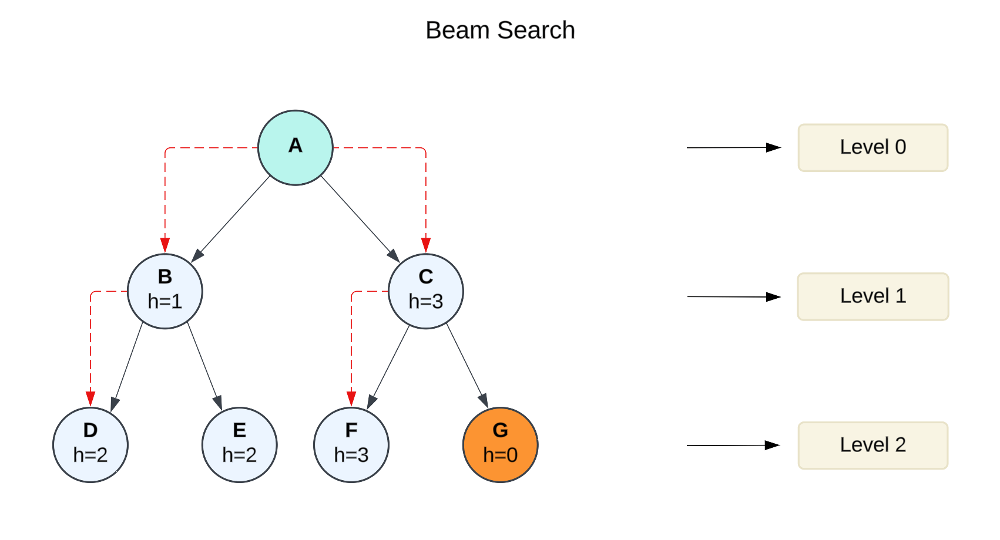
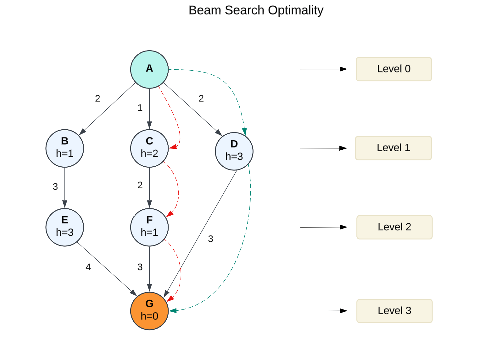

# Beam Search

Beam Search is a heuristic search algorithm designed to balance memory consumption and search efficiency in graph-based problems. It is an optimization of the best-first search algorithm, but with a key difference: it retains only a limited number of “best” nodes, referred to as the beam width (β), at each level of the search tree. While it sacrifices completeness and optimality, Beam Search is particularly effective in domains where memory limitations or large search spaces make exhaustive search impractical.

The algorithm works by employing a breadth-first search approach, expanding nodes level by level. At each level, it evaluates all successors of the current states, sorts them by a heuristic cost function, and retains only the top β nodes. This makes it a greedy algorithm, focusing only on the most promising paths at any given time.

Common applications of Beam Search include **machine translation**, **speech recognition**, and **sequence prediction** tasks, where it is essential to manage memory while exploring a vast number of possibilities.

### Key Characteristics

1. **Beam Width:**\
   The beam width (β) determines the number of nodes retained at each level of the search. A larger β increases the chance of finding an optimal solution but consumes more memory and computation time. With a beam width of infinity, the algorithm becomes equivalent to **breadth-first search**.
2. **Heuristic Evaluation:**\
   Beam Search relies heavily on a heuristic function to rank nodes. Nodes with the lowest heuristic costs are retained as potential candidates for further expansion. The quality of the heuristic function significantly impacts the algorithm’s efficiency and effectiveness.
3. **Memory Management:**\
   By limiting the number of nodes stored at each level, Beam Search has a linear memory consumption proportional to the beam width and the maximum depth of the search tree. This makes it suitable for exploring large search spaces.
4. **Pruning:**\
   Nodes not within the top β are pruned, meaning they are discarded and no longer considered. This pruning enables the algorithm to maintain tractability but can result in missed goal states or suboptimal solutions.
5. **Variants:**\
   Beam Search has several variants, including:
   * **Stochastic Beam Search**: Introduces randomness in selecting the next β states to avoid local maxima.
   * **Beam Stack Search**: Combines depth-first search with Beam Search to ensure completeness.
   * **Flexible Beam Search**: Adjusts beam width dynamically based on the problem’s complexity

### Advantages

1. **Memory Efficiency**:\
   Beam Search only stores a limited number of nodes (β) at each level, making it memory-efficient compared to exhaustive search algorithms like breadth-first search or A\*.
2. **Scalability to Large Search Spaces**:\
   By focusing on a subset of the most promising nodes, Beam Search can explore very large search spaces without being overwhelmed by memory or computational constraints.
3. **Faster Search Times**:\
   The pruning mechanism enables the algorithm to focus only on the most promising paths, reducing the time spent exploring less optimal options.
4. **Effective in Practice**:\
   Despite its theoretical limitations, Beam Search performs well in real-world applications, including:
   * Speech recognition (e.g., Harpy Speech Recognition System, CMU 1976)
   * Machine translation
   * Sequence prediction in machine learning tasks

### Disadvantages

1. **Incompleteness:**\
   Beam Search is not guaranteed to find a solution if one exists, as the goal state may be pruned during the search process.
2. **Suboptimal Solutions:**\
   The algorithm does not guarantee that the solution found is the best possible. This is especially true for small beam widths or inaccurate heuristic functions.
3. **Dependency on Heuristics:**\
   The success of Beam Search heavily depends on the quality of the heuristic function. Poor heuristics can lead the algorithm astray, resulting in wasted computation and suboptimal solutions.
4. **Beam Width Sensitivity:**\
   The choice of beam width is critical. A small beam width can result in excessive pruning, missing the goal state, while a large beam width increases memory consumption and slows down computation.
5. **Local Maxima Issues:**\
   Beam Search may become stuck in local maxima due to its greedy nature, particularly in complex search spaces.

### Example

#### Drawbacks of Beam Search

Here is a limitation of the Beam Search Algorithm, illustrated with an example:

Beam Search is inherently incomplete, meaning it does not always guarantee finding a solution, even when one exists. Despite this, the algorithm has proven effective in practical applications such as speech recognition, computer vision, planning, and machine learning.

One of its significant drawbacks is that it may fail to reach a goal or even identify an optimal solution, even with unlimited time and memory, if there is a valid path from the start node to the goal node. The algorithm terminates in one of two scenarios: either it successfully reaches a goal node, or it exhausts all possible nodes without finding a solution.

The chances of finding the goal can be improved by using a more accurate heuristic function and increasing the beam width. For instance, consider a scenario where the beam width $$\beta = 2$$. The following steps demonstrate how the algorithm may struggle to find the goal node under such conditions.

<div align="left"><figure><figcaption></figcaption></figure></div>

Step-by-step explanation:

1. Start at root node A
   * Initial beam B = {A}
   * H(A) doesn't matter as it's our only starting point
2. Expand A's children (B and C):
   * B: H=1
   * C: H=3
   * Since β=2, we keep both nodes
   * Current beam B = {B, C}
3. Expand B and C's children:
   * From B: D(H=2), E(H=2)
   * From C: F(H=3), G(H=0)
   * Candidates: D(H=2), E(H=2), F(H=3), G(H=0)
   * Sort by H value: F(3) > D(2) = E(2) > G(0)
   * Keep top β=2 nodes: F(H=3) and either D or E (H=2)
   * Let's say we choose D in case of tie
   * Current beam B = {F, D}
4. Since D and F are not leaf nodes, continue with F:
   * F has no children
   * D has no children
   * Current beam B = {F, D}
5. Search terminates as we can't expand further

Final path found would be:

* A → C → F (with H=3)
* A → B → D (with H=2)

Note that because of the beam width restriction ($$\beta = 2$$), we missed the optimal solution which would have been path A → C → G with H=0. This demonstrates a key limitation of beam search: it can miss optimal solutions due to the pruning of the search space, but it helps manage computational resources by not exploring all possible paths.


However, when the beam width is increased to β = 3 , the algorithm successfully finds the goal node. This highlights how adjusting the beam width can significantly impact the algorithm’s performance and its ability to reach a solution.


#### Beam Search Optimality

The Beam Search algorithm lacks completeness in certain scenarios, meaning it may not always find a solution, even if one exists. Additionally, it does not guarantee optimality, as it might fail to identify the best possible solution. This can occur due to the following reasons:

* A limited beam width combined with an inaccurate heuristic function might lead the algorithm to overlook the shortest path to the goal.
* Using a more accurate heuristic function and increasing the beam width can improve the likelihood of Beam Search finding the optimal path to the goal.

For instance, consider a tree with heuristic values as shown in the example below.

<div align="left"><figure><figcaption></figcaption></figure></div>

I'll explain how beam search works on this tree with a beam width (β) of 3. The image shows a tree with nodes A through G, where each node has an h-value and edges have different costs.

Step-by-step explanation:

1. Start at root node A
   * Initial beam B = {A}
2. Expand A's children (B, C, and D):
   * B: h=1, path cost=2
   * C: h=2, path cost=1
   * D: h=3, path cost=2
   * Since β=3, we keep all three nodes
   * Current beam B = {B, C, D}
3. Expand all nodes in the beam:
   * From B: E(h=3, total cost=2+3=5)
   * From C: F(h=1, total cost=1+2=3)
   * From D: G(h=0, total cost=2+3=5)
   * Total candidates: E(h=3), F(h=1), G(h=0)
   * Since β=3 and we only have 3 candidates, keep all
   * Current beam B = {E, F, G}
4. Expand remaining non-leaf nodes:
   * From E: G(h=0, total cost=5+4=9)
   * From F: G(h=0, total cost=3+3=6)
   * G from D is already a leaf (total cost=5)
   * Current candidates for beam: All paths leading to G
   * Via E: cost=9, h=0
   * Via F: cost=6, h=0
   * Via D: cost=5, h=0
   * Keep top β=3 paths, which are all the paths we found
5. Search terminates as we've reached the leaf node G through all possible paths

Final paths found (ordered by total cost):

1. A → D → G (cost=5)
2. A → C → F → G (cost=6)
3. A → B → E → G (cost=9)

In this case, because our beam width was large enough (β=3), we were able to find all possible paths to the goal node G. The best path is A → D → G with a total cost of 5. Note that even with a generous beam width, beam search still considers the heuristic values (h) at each level to determine which nodes to keep in the beam.

### Complexity, **Completeness** and Optimality

#### Time Complexity

The time complexity of Beam Search depends on the beam width ($$β$$) and the depth of the \
search tree ($$m$$):&#x20;

$$\text{Time Complexity} = O(\beta \cdot m)$$

Where:

* **β**: The beam width, i.e., the number of nodes expanded at each level.
* **m**: The maximum depth of the search tree.

In the worst case, Beam Search evaluates β nodes at each depth level, making it efficient for problems where β is small.

#### Space Complexity

The space complexity of Beam Search is linear, determined by the beam width and the depth of the tree: &#x20;

$$\text{Space Complexity} = O(\beta \cdot m)$$

Since Beam Search stores only β nodes at each level, its memory consumption is significantly lower than exhaustive algorithms like breadth-first search, making it ideal for memory-constrained environments.

#### Completeness

Beam Search is **not complete**, meaning it does not guarantee finding a solution even if one exists. This is because the algorithm prunes nodes that are not among the top β at each level, which could include paths leading to a solution.

#### Optimality

Beam Search is **not optimal**, as it does not guarantee finding the best solution. The algorithm focuses on heuristic evaluations to determine promising nodes but can miss the globally optimal path due to pruning and the greedy nature of the search

To improve completeness and optimality:

* A larger beam width can reduce the chances of pruning critical nodes, though this increases computational and memory requirements.
* A better heuristic function can guide the search toward more promising solutions.

### Conclusion

Beam Search is a powerful and efficient algorithm for tackling problems where memory constraints or large search spaces make exhaustive search impractical. By retaining only a limited number of the most promising nodes at each level, it strikes a balance between efficiency and tractability. However, its reliance on heuristics, sensitivity to beam width, and lack of completeness or optimality make it less suitable for problems requiring guaranteed solutions. Despite these drawbacks, Beam Search remains a popular choice in domains where practical efficiency often outweighs theoretical guarantees.

### Beam Search with PHP

In PHP  it can be written as a class `InformedSearchGraph` with implementation of a set of graph operations.

**Example of Use:**

```php
// Create the graph and add vertices with their levels
$graph = new InformedSearchGraph();

// Add vertices with their levels and heuristic values
// Format: vertex name, level, heuristic value
$graph->addVertex('A', 0, 0);  // Start node
$graph->addVertex('B', 1, 1);
$graph->addVertex('C', 1, 2);
$graph->addVertex('D', 1, 3);
$graph->addVertex('E', 2, 3);
$graph->addVertex('F', 2, 1);
$graph->addVertex('G', 3, 3);  // Goal node, h=0

// Add edges with their costs
// From level 0 to level 1
$graph->addEdge('A', 'B', 2.0);
$graph->addEdge('A', 'C', 1.0);
$graph->addEdge('A', 'D', 2.0);

// From level 1 to level 2
$graph->addEdge('B', 'E', 3.0);
$graph->addEdge('C', 'F', 2.0);

// From level 2 to level 3 (goal)
$graph->addEdge('E', 'G', 4.0);
$graph->addEdge('F', 'G', 3.0);
$graph->addEdge('D', 'G', 3.0);

// Try different beam widths
$beamWidths = [1, 2, 3];

// Perform greedy search from S to G
echo "Performing Beam Search from A to G:\n";
echo "------------------------------------\n\n";

// Init beam
$beam ??= 1;

foreach ($beamWidths as $width) {

    // Show only specified width
    if ($width != $beam){
        continue;
    }

    echo "Beam Search (width = $width):\n";
    echo "=========================\n";
    $path = $graph->beamSearch('A', 'G', $width);

    if ($path) {
        $graph->printPath($path);
    } else {
        echo "No path found!\n";
    }
    echo "\n";
}
```


To try this code yourself, install the example files from the official GitHub repository: [https://github.com/apphp/ai-with-php-examples](https://github.com/apphp/ai-with-php-examples)

