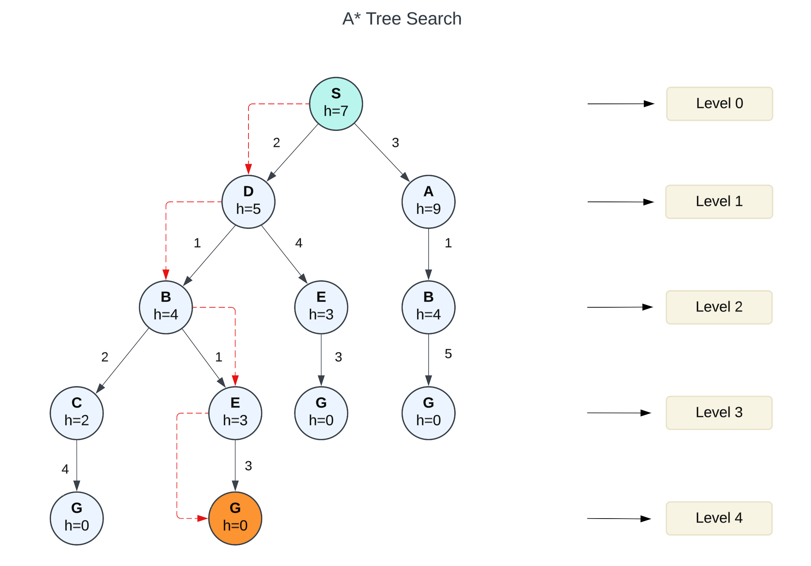

# A\* Tree Search

A\* Tree Search, commonly referred to as A\* Search, is a widely used pathfinding and graph traversal algorithm. It builds on the strengths of uniform-cost search and greedy search, offering a robust mechanism for finding the most cost-effective path from a starting node to a goal node.&#x20;

A\* uses a heuristic function, $$f(x) = g(x) + h(x)$$, where $$g(x)$$ is the cumulative cost to reach the current node, and $$h(x)$$ is an estimated cost to reach the goal from the current node. This balance between actual cost and estimated cost makes A\* one of the most efficient search algorithms in many applications, including game development, robotics, and network optimization.

### Key Characteristics

1. **Heuristic Function:** $$f(x) = g(x) + h(x)$$
   * **Backward Cost** $$g(x)$$**:** Represents the total cost from the start node to the current node.
   * **Forward Cost** $$h(x)$$: Estimates the cost from the current node to the goal node.
   * The function combines these values to prioritize nodes that are both promising and cost-effective.
2. **Admissibility**:\
   For A\* to be optimal, the heuristic $$h(x)$$ must be admissible. This means $$h(x)$$ should never overestimate the true cost $$h^*(x)$$ _to the goal:_ $$0 \leq h(x) \leq  h^*(x)$$.
3. **Strategy**:\
   The algorithm selects the node with the smallest $$f(x)$$ value from the fringe (set of nodes to be explored) and expands it.
4. **Flexibility**:\
   A\* adapts to different problems by customizing the heuristic function $$h(x)$$, making it suitable for various use cases.

### Advantages

1. **Optimality**:\
   When using an admissible heuristic, A\* guarantees finding the shortest path to the goal.
2. **Completeness**:\
   A\* will find a solution if one exists, provided the search space is finite.
3. **Efficiency**:\
   By balancing actual and estimated costs, A\* reduces the number of nodes explored compared to other algorithms like breadth-first search.
4. **Versatility**:\
   A\* is applicable to a wide range of problems, from AI in games to logistical planning in real-world systems.

### Disadvantages

1. **High Memory Usage**:\
   The algorithm keeps track of all generated nodes, which can consume significant memory in large or complex graphs.
2. **Heuristic Dependency**:\
   The efficiency of A\* heavily depends on the heuristic function. Poor heuristics can lead to inefficiency or even incorrect results.
3. **Computational Overhead**:\
   Calculating $$f(x)$$ for every node in the search fringe can be computationally expensive, especially in dense graphs.
4. **Performance in Complex Graphs**:\
   A\* may struggle with performance in graphs with many branches or misleading heuristics.

### **Example**

Find the path to reach from S to G using A\* search.

<div align="left"><figure><figcaption></figcaption></figure></div>

**Solution.** Starting from S, the algorithm computes $$g(x) + h(x)$$ for all nodes in the fringe at each step, choosing the node with the lowest sum. The entire work is shown in the table below. \
\
Note that in the fourth set of iterations, we get two paths with equal summed cost $$f(x)$$, so we expand them both in the next set. The path with a lower cost on further expansion is the chosen path.&#x20;

Let's explore the work of the search:

<table><thead><tr><th width="217">Path</th><th>h(x)</th><th>g(x)</th><th>f(x)</th></tr></thead><tbody><tr><td>S</td><td>7</td><td>0</td><td>7</td></tr><tr><td> </td><td> </td><td> </td><td> </td></tr><tr><td>S -> A</td><td>9</td><td>3</td><td>12</td></tr><tr><td>S -> D                         ✓</td><td>5</td><td>2</td><td>7</td></tr><tr><td> </td><td> </td><td> </td><td> </td></tr><tr><td>S -> D -> B                ✓</td><td>4</td><td>2 + 1 = 3</td><td>7</td></tr><tr><td>S -> D -> E</td><td>3</td><td>2 + 4 = 6</td><td>9</td></tr><tr><td> </td><td> </td><td> </td><td> </td></tr><tr><td>S -> D -> B -> C           ✓</td><td>2</td><td>3 + 2 = 5</td><td>7</td></tr><tr><td>S -> D -> B -> E        ✓</td><td>3</td><td>3 + 1 = 4</td><td>7</td></tr><tr><td> </td><td> </td><td> </td><td> </td></tr><tr><td>S -> D -> B -> C -> G</td><td>0</td><td>5 + 4 = 9</td><td>9</td></tr><tr><td><strong>S -> D -> B -> E -> G</strong>  ✓</td><td>0</td><td>4 + 3 = 7</td><td>7</td></tr></tbody></table>

Key points about this traversal:

* Each node shows: (step number), g-value, h-value, and f-value (g+h)
* A\* always expands the node with the lowest f-value
* When f-values are tied, we typically expand the most recently generated node
* Tree search explores all paths, even to previously visited states
* No duplicate detection means we explore multiple paths to the same state (B, E, and G nodes)

**Result**:

* Path: the sequence of nodes visited during traversal will be: $$S→D→B→E→G$$
* Cost: 7

### Complexity, **Completeness** and Optimality

#### Time Complexity

* Best Case:  $$O(b^d)$$, where $$b$$ is the branching factor and $$d$$ is the depth of the optimal solution.
* Worst Case: Exponential time complexity $$O(b^{m})$$, where $$m$$ is the maximum depth of the tree.
* Use Case: Routing and optimization problems, such as finding the shortest path in a weighted graph.

#### Space Complexity

A\* keeps all generated nodes in memory, making its space complexity $$O(b^d)$$ in the best case and exponential in the worst case.

#### Completeness

A\* is complete if the search space is finite and the step costs are non-negative. This ensures that the algorithm will always find a solution if one exists.

#### Optimality

A\* is optimal if the heuristic $$h(x)$$ is admissible (i.e.,  $$0 \leq h(x) \leq h^*(x)$$) and consistent (i.e., satisfies the triangle inequality: $$h(x) \leq c(x, y) + h(y)$$ ).

### Conclusion

A\* Tree Search remains a cornerstone of AI algorithms due to its ability to effectively combine precision and adaptability.&#x20;

### A\* Tree Search with PHP

In PHP  it can be written as a class `InformedSearchGraph` with implementation of a set of graph operations.

**Example of Use:**

```php
// Create the graph and add vertices with their levels
$graph = new InformedSearchGraph();

// Add vertices with their heuristic values (h)
$graph->addVertex('S', 0, 7.0); // Start node with h=7
$graph->addVertex('A', 1, 9.0); // h=9
$graph->addVertex('B', 2, 4.0); // h=4
$graph->addVertex('C', 3, 2.0); // h=2
$graph->addVertex('D', 1, 5.0); // h=5
$graph->addVertex('E', 2, 3.0); // h=3
$graph->addVertex('G', 4, 0.0); // Goal node with h=0

// Add edges with costs as shown in the image
$graph->addEdge('S', 'A', 3.0);
$graph->addEdge('S', 'D', 2.0);
$graph->addEdge('A', 'B', 1.0);
$graph->addEdge('B', 'G', 5.0);
$graph->addEdge('D', 'E', 4.0);
$graph->addEdge('D', 'B', 1.0);
$graph->addEdge('B', 'C', 2.0);
$graph->addEdge('B', 'E', 1.0);
$graph->addEdge('E', 'G', 3.0);
$graph->addEdge('C', 'G', 4.0);

// Run A* Tree Search
echo "Performing A* Tree Search from S to G:\n";
echo "-------------------------------------\n\n";

$path = $graph->aStarTreeSearch('S', 'G');
if ($path !== null) {
    $graph->printPath($path);
} else {
    echo "No path found!\n";
}
```


To try this code yourself, install the example files from the official GitHub repository: [https://github.com/apphp/ai-with-php-examples](https://github.com/apphp/ai-with-php-examples)

