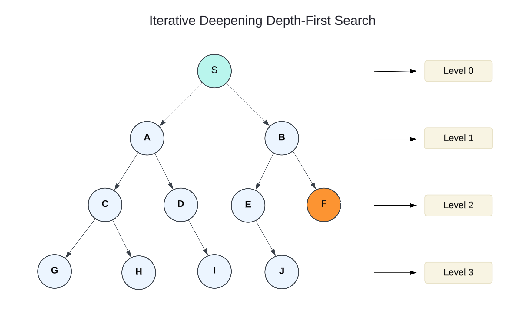

# Iterative Deepening Depth-First Search (IDDFS)

The Iterative Deepening Depth-First Search (IDDFS) algorithm combines the strengths of two fundamental search algorithms: Depth-First Search (DFS) and Breadth-First Search (BFS). This hybrid approach balances memory efficiency with optimality by progressively exploring deeper levels of the search space. Unlike traditional DFS, which dives to the maximum depth at once, or BFS, which requires significant memory to maintain a queue of explored nodes, IDDFS systematically increases the search depth, ensuring thorough exploration while minimizing resource usage.

IDDFS is particularly useful in uninformed search scenarios where the search space is vast, and the depth of the goal node is unknown. It ensures that every possible depth level is explored before moving deeper, making it both complete and optimal under uniform cost conditions.

### Key Characteristics

1. **Gradual Depth Expansion**: \
   IDDFS starts with a depth limit of zero and incrementally increases the limit after each iteration until the goal is found. Each iteration performs a depth-limited DFS.
2. **Combines BFS and DFS Benefits**:
   1. **From BFS**: \
      It ensures completeness and optimality by exploring all nodes at a given depth before proceeding to the next.
   2. **From DFS**: \
      It uses less memory, storing only the current path rather than the entire frontier.
3. **Backtracking Mechanism**: \
   Like DFS, IDDFS relies on backtracking to explore alternative paths when reaching the depth limit.
4. **Goal-Oriented Search**: \
   The algorithm terminates as soon as the goal node is found, avoiding unnecessary exploration of deeper levels.
5. **Simplicity**: \
   IDDFS builds upon the conventional DFS algorithm, making it straightforward to implement.

**Complexity**

Combines the advantages of BFS and DFS by performing DFS repeatedly with increasing depth limits.

* **Time Complexity**: $$O(b^d)$$.
* **Space Complexity**: $$O(b \times d)$$.
* **Use Case**: Solving problems where the goal depth is unknown.

### Advantages

1. **Memory Efficiency**: \
   IDDFS requires significantly less memory compared to BFS because it only maintains the current path and depth information, rather than storing all explored nodes.
2. **Optimality**: \
   For uniform cost edges, IDDFS guarantees finding the shortest path to the goal node.
3. **Completeness**: \
   The algorithm ensures that if a solution exists, it will be found, as it explores all depths systematically.
4. **Practicality in Large Search Spaces**: \
   IDDFS is especially useful when the search space is vast and the depth of the goal node is unknown, as it avoids premature depth constraints or memory overflows.
5. **Iterative Refinement**: \
   By revisiting earlier depths, the algorithm effectively balances thoroughness with the ability to explore deeper levels progressively.

### Disadvantages

1. **Repetition of Work**: \
   A key drawback of IDDFS is that it repeats the search from the root node for each increment of the depth limit, revisiting previously explored nodes multiple times.
2. **Higher Computational Cost**: \
   The iterative nature of the algorithm results in a higher cumulative computational effort compared to a single DFS or BFS traversal.
3. **Limited Optimization for Non-Uniform Costs**: \
   While IDDFS is optimal for uniform edge costs, it does not inherently handle scenarios where edge costs vary.

In conclusion, Iterative Deepening Depth-First Search is a powerful algorithm that combines the strengths of DFS and BFS. By balancing memory efficiency with search completeness and optimality, it is a valuable tool for exploring large and uncertain search spaces. However, its iterative nature requires careful consideration of computational overhead, making it most suitable for problems where memory constraints are more critical than processing time.

### Example

For example, consider the following tree structure to illustrate the Iterative Deepening Depth-First Search (IDDFS). The algorithm performs multiple iterations, gradually increasing the depth limit until the goal node is discovered. The iterations proceed as follows:

<div align="left"><figure><figcaption></figcaption></figure></div>

**Iterations in IDDFS:**

1. 1st Iteration → S
2. 2nd Iteration → S, A, B
3. 3rd Iteration → S, A, C, D, B, E, F

In the third iteration, the algorithm successfully finds the goal node.

### Complexity, **Completeness** and Optimality

**Completeness:**

The IDDFS algorithm is complete as long as the branching factor of the tree is finite. This ensures that if a solution exists, it will eventually be found.

**Time Complexity:**

Let $$b$$ represent the branching factor and $$d$$ denote the depth of the goal node. In the worst case, the time complexity of IDDFS is $$O(b^d)$$.

**Space Complexity**:

The space complexity of IDDFS is $$O(b \times d)$$ since it stores only the current path and the depth limit.

**Optimality**:

The IDDFS algorithm is optimal if the path cost is a non-decreasing function of the depth of the node, ensuring it finds the shortest path in uniform cost search scenarios.

### Iterative Deepening Depth-First Search with PHP

In PHP  it can be written as a class `UninformedSearchGraph` with implementation of a set of graph operations.

**Example of Use:**

```php
// Create the graph and add vertices with their levels
$graph = new UninformedSearchGraph();

// Add all vertices with their respective levels
$graph->addVertex('S', 0);  // Start node at level 0
$graph->addVertex('A', 1);
$graph->addVertex('B', 1);
$graph->addVertex('C', 2);
$graph->addVertex('D', 2);
$graph->addVertex('E', 2);
$graph->addVertex('F', 2);  // Target node
$graph->addVertex('G', 3);
$graph->addVertex('H', 3);
$graph->addVertex('I', 3);
$graph->addVertex('J', 3);

// Add edges based on the graph structure
$graph->addEdge('S', 'A');
$graph->addEdge('S', 'B');
$graph->addEdge('A', 'C');
$graph->addEdge('A', 'D');
$graph->addEdge('B', 'E');
$graph->addEdge('B', 'F');
$graph->addEdge('C', 'G');
$graph->addEdge('C', 'H');
$graph->addEdge('D', 'I');
$graph->addEdge('E', 'J');

// Perform IDDFS to find node 'F'
echo "Performing IDDFS to find node 'F':\n";
$result = $graph->iddfs('S', 'F');

// Output the DFS traversal
echo "\nSearch Results:\n";
echo "Target found: " . ($result['success'] ? "Yes" : "No") . "\n";
echo "Final depth: " . $result['final_depth'] . "\n\n";

// Print paths explored at each depth
foreach ($result['paths'] as $depthResult) {
    echo "Depth " . $depthResult['depth_limit'] . ":\n";
    foreach ($depthResult['path'] as $node) {
        echo sprintf("  Node: %s (Level %d)\n",
            $node['vertex'],
            $node['level']
        );
    }
    echo "  Found: " . ($depthResult['found'] ? "Yes" : "No") . "\n\n";
}
```


To try this code yourself, install the example files from the official GitHub repository: [https://github.com/apphp/ai-with-php-examples](https://github.com/apphp/ai-with-php-examples)

