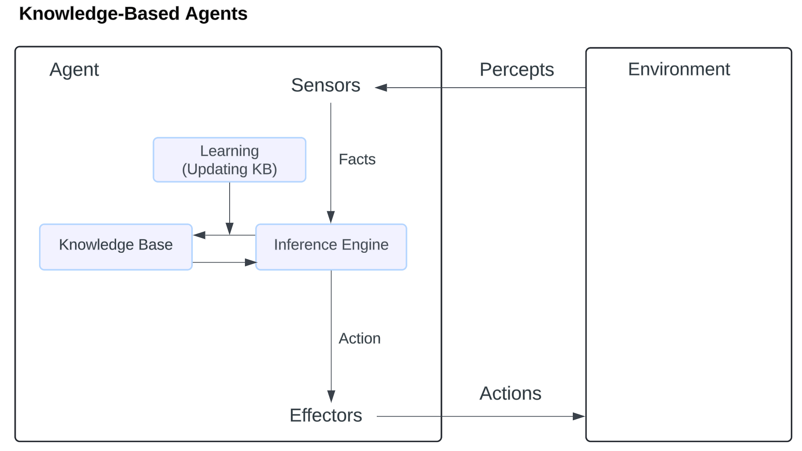

# Knowledge-Based Agents

Humans have long claimed that intelligence is achieved not solely through reflex mechanisms but by reasoning processes operating on internal representations of knowledge. This foundational principle has inspired the development of knowledge-based agents in artificial intelligence. These agents possess the ability to represent, reason about, and act upon knowledge effectively.

### What is a Knowledge-Based System?

A knowledge-based system (KBS) uses artificial intelligence techniques to store, manipulate, and reason with knowledge. The knowledge is typically represented in the form of rules or facts, enabling the system to draw conclusions or make decisions.

A knowledge-based system consists of two primary components. The first is the Knowledge Base (KB), which serves as a repository for storing real-world facts, typically expressed in a formal knowledge representation language. The second is the Inference Engine (IE), a reasoning mechanism that applies logical rules to the knowledge base to deduce new facts or make decisions.

These systems offer several benefits. One advantage is automated decision-making, which allows the system to streamline complex processes, such as diagnosing medical conditions or troubleshooting technical issues. Another key benefit is explainability. By referencing its stored rules and facts, a knowledge-based system can provide explanations for its decisions, making it particularly valuable in areas like customer service and expert systems.

Knowledge-based systems have been successfully implemented in areas such as medical diagnosis, expert systems, and decision-support systems.

### Knowledge-Based Agents in Artificial Intelligence

To act efficiently, an intelligent agent requires knowledge about the real world. Knowledge-based agents (KBA) are designed with capabilities that include maintaining an internal knowledge state, reasoning over this knowledge, updating it based on observations, and taking appropriate actions.

<div align="left"><figure><figcaption><p>Knowledge-Based Agents</p></figcaption></figure></div>

#### Key Components of a Knowledge-Based Agent:

1. **Knowledge Base (KB):** A structured collection of sentences representing facts and rules about the world.
2. **Inference System:** A mechanism that derives new information from existing knowledge using logical rules.

#### Functions of a Knowledge-Based Agent:

A knowledge-based agent must be able to:

* Represent states, actions, and goals.
* Incorporate new percepts (observations).
* Update its internal representation of the world.
* Deduce the current state of the world.
* Determine appropriate actions based on its knowledge.

#### Operations Performed by a Knowledge-Based Agent:

1. **TELL:** Updates the knowledge base with new observations.
2. **ASK:** Queries the knowledge base to decide on an action.
3. **Perform:** Executes the chosen action.

**Example Algorithm (pseudo code):**

```
function KB_AGENT(percept)  
  TELL(KB, MAKE-PERCEPT-SENTENCE(percept, t))  
  action = ASK(KB, MAKE-ACTION-QUERY(t))  
  TELL(KB, MAKE-ACTION-SENTENCE(action, t))  
  t = t + 1  
  return action  
```

Each time the agent receives a percept, it:

* Updates the knowledge base with the percept (TELL).
* Queries the knowledge base for the best action (ASK).
* Updates the knowledge base to reflect the chosen action (TELL).

#### Example of Code in PHP

<details>

<summary>Code Example in PHP</summary>

```php
class KnowledgeBase {
    private $facts = [];
    
    public function tell($sentence) {
        $this->facts[] = $sentence;
    }
    
    public function ask($query) {
        // Simple implementation - could be enhanced with more complex inference
        foreach ($this->facts as $fact) {
            if ($this->matches($query, $fact)) {
                return $fact;
            }
        }
        return null;
    }
    
    private function matches($query, $fact) {
        // Simple pattern matching - could be enhanced with logical inference
        return strpos($fact, $query) !== false;
    }
}

class KBAgent {
    private $kb;
    private $t;
    
    public function __construct() {
        $this->kb = new KnowledgeBase();
        $this->t = 0;
    }
    
    public function makePerceptSentence($percept, $t) {
        return "At time {$t}, perceived: " . json_encode($percept);
    }
    
    public function makeActionQuery($t) {
        return "action_at_time_{$t}";
    }
    
    public function makeActionSentence($action, $t) {
        return "At time {$t}, performed action: " . json_encode($action);
    }
    
    public function process($percept) {
        // Tell KB about the percept
        $this->kb->tell($this->makePerceptSentence($percept, $this->t));
        
        // Ask KB what action to take
        $action = $this->kb->ask($this->makeActionQuery($this->t));
        
        // If no action found, use default action
        if ($action === null) {
            $action = $this->defaultAction($percept);
        }
        
        // Tell KB about the action taken
        $this->kb->tell($this->makeActionSentence($action, $this->t));
        
        // Increment time step
        $this->t++;
        
        return $action;
    }
    
    private function defaultAction($percept) {
        // Implement default behavior when no matching rule is found
        return ["type" => "default_action", "percept" => $percept];
    }
}

// Example usage:
$agent = new KBAgent();
$percept = ["temperature" => 25, "humidity" => 60];
$action = $agent->process($percept);
```


</details>

Possible output:

<details>

<summary>Code Example Output</summary>

```
Step 1: Initial State
--------------------
Time step: 0
Percept received: {"temperature":25,"humidity":60}

Step 2: Percept Sentence Created
--------------------
At time 0, perceived: {"temperature":25,"humidity":60}

Step 3: Action Generated
--------------------
Action: {"type":"default_action","percept":{"temperature":25,"humidity":60}}

Step 4: Final Knowledge Base State
--------------------
Time step incremented to: 1
Action recorded in KB: At time 0, performed action: 
{"type":"default_action","percept":{"temperature":25,"humidity":60}}
```

</details>

#### Levels of Knowledge-Based Agents:

1. **Knowledge Level:** Specifies what the agent knows and its goals. For example, an automated taxi agent knows the route from station A to station B.
2. **Logical Level:** Focuses on how knowledge is represented and stored, using logical encoding of sentences.
3. **Implementation Level:** The physical execution of logic and actions based on the knowledge and reasoning.

### Approaches to Building a Knowledge-Based Agent

1. **Declarative Approach:**
   * Starts with an empty knowledge base.
   * Knowledge is added incrementally using sentences.
   * Allows flexibility in updating the agent’s knowledge.
2. **Procedural Approach:**
   * Directly encodes desired behavior into program code.
   * More efficient but less flexible than the declarative approach.

In practice, combining both approaches yields the best results. Declarative knowledge can often be converted into procedural code for efficiency.

### Why Use a Knowledge Base?

A knowledge base enables agents to:

* Learn from experiences by updating their knowledge.
* Take informed actions based on existing and newly inferred knowledge.

#### Inference in Knowledge-Based Systems:

Inference derives new sentences from existing ones. The system can add new knowledge to the KB using two main methods:

1. **Forward Chaining:** Starts with known facts and applies inference rules to extract new information.
2. **Backward Chaining:** Starts with a goal and works backward to determine if the known facts support the goal.

#### Example: Automated Taxi Agent

* **Knowledge Level:** The agent knows the route from station A to station B.
* **Logical Level:** The route information is encoded in logical sentences.
* **Implementation Level:** The agent uses the route information to navigate from A to B.

### Conclusion

Knowledge-based agents are a cornerstone of artificial intelligence, enabling systems to reason, learn, and act intelligently. By leveraging a structured knowledge base and inference mechanisms, these agents can make decisions, learn from observations, and perform actions effectively. Their ability to combine reasoning and action makes them essential for applications like expert systems and autonomous vehicles.
