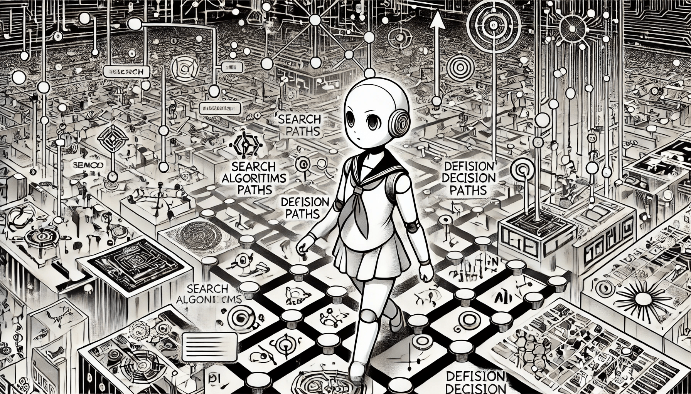

# Problem Solving in AI

Search algorithms in AI are designed to assist in identifying the best solution to a problem. A search problem typically consists of a search space, an initial state, and a goal state. By simulating various scenarios and exploring alternatives, these algorithms enable AI agents to determine the optimal state to accomplish a given task.

<figure><figcaption>
Search Algorithms in AI
</figcaption></figure>

