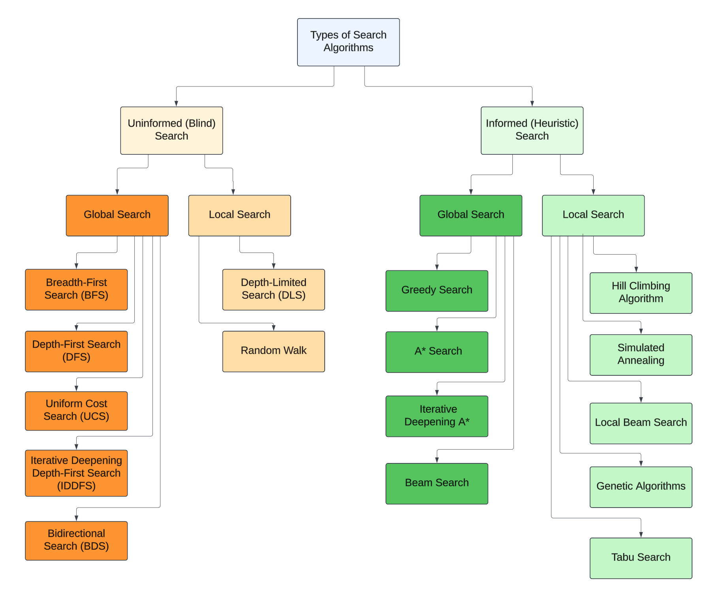

# Types of Search Algorithms

Search algorithms are essential tools in artificial intelligence, enabling agents to systematically explore a problem space to find solutions.

Search algorithms can be broadly categorized based on the nature of the problem and the availability of information into two main types: **Uninformed (Blind) Search** and **Informed (Heuristic) Search**. Additionally, they can also be classified as **Local Search** and **Global Search** depending on the scope of their exploration.

**Key Distinctions**

* **Uninformed Search**: Requires no additional information beyond the problem definition.
* **Informed Search**: Utilizes heuristics or additional knowledge to improve efficiency.
* **Global Search**: Explores the entire problem space systematically or with guidance (e.g., BFS, A\*). These algorithms are more exhaustive but computationally expensive.
* **Local Search**: Focuses on improving solutions in a specific area without exploring the entire space (e.g., Hill Climbing, Simulated Annealing). These algorithms are more efficient for large spaces but may miss the optimal solution.

<figure><figcaption></figcaption></figure>

Understanding the types of search algorithms in AI is crucial for selecting the right approach for a given problem. Uninformed search offers a straightforward, brute-force methodology suitable for simpler tasks, while informed search leverages domain knowledge to efficiently tackle complex challenges. Beyond these, advanced techniques open doors to solving real-world problems in diverse domains, from robotics to optimization and decision-making systems.
