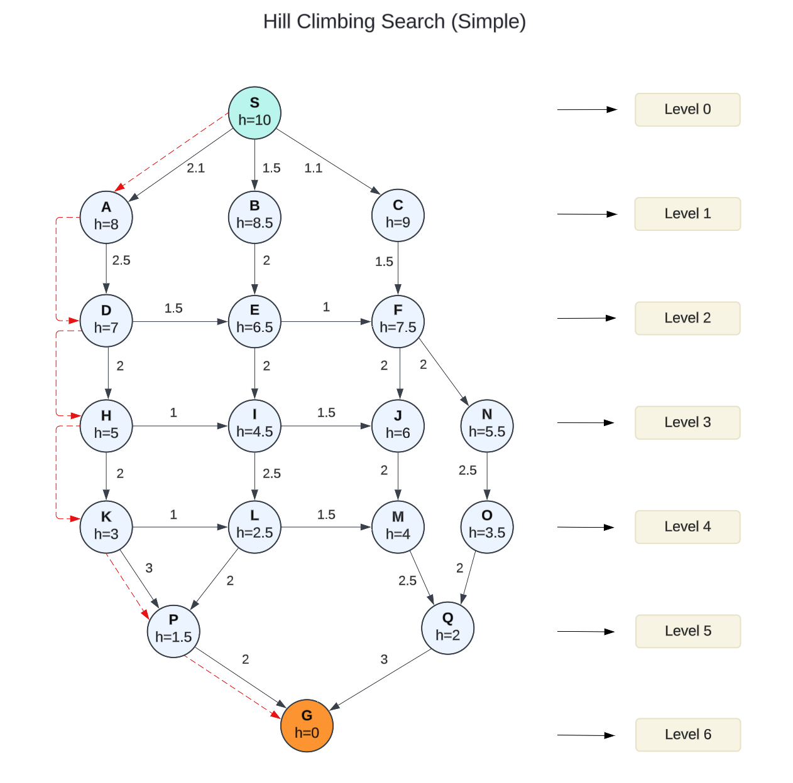

# Implementation in PHP

### Types of Hill Climbing in Artificial Intelligence <a href="#types-of-hill-climbing-in-artificial-intelligence" id="types-of-hill-climbing-in-artificial-intelligence"></a>

#### **1. Simple Hill Climbing Algorithm** <a href="#id-1-simple-hill-climbing-algorithm" id="id-1-simple-hill-climbing-algorithm"></a>

**Simple Hill Climbing** is the most basic form of the hill climbing algorithm. It works by evaluating each neighboring state **one at a time** and moves to the **first neighbor** that provides an improvement over the current state.

**Explanation**:

* Starts with an initial state
* In each iteration:
  * Generates neighboring states
  * Evaluates each neighbor one by one
  * Takes the first neighbor that shows any improvement over current state
  * If no better neighbor is found, stops (potential local maximum)
* Key characteristic: It's "greedy" and takes the first improvement it finds, not necessarily the best one.

#### Example:

<div align="left"><figure><figcaption></figcaption></figure></div>

#### 2. Steepest Ascent Hill Climbing

**Steepest-Ascent Hill Climbing** is an advanced variation of the simple hill climbing algorithm. Unlike simple hill climbing, which moves to the first neighboring state that shows improvement, steepest-ascent hill climbing evaluates **all neighboring states** and selects the one that offers the **most significant improvement** (the steepest ascent).

**Explanation**:

* Starts with an initial state
* In each iteration:
  * Generates all neighboring states
  * Evaluates ALL neighbors
  * Selects the neighbor with the highest improvement (the steepest ascent)
  * If no better neighbor exists, stops
* Key characteristic: More thorough than simple hill climbing as it always picks the best available move

#### Example:


#### 3. Stochastic Hill Climbing

\>>>>>>>>>>>>

Stochastic Hill Climbing introduces randomness into the search process to help escape local optima. Instead of always selecting the best neighbor or the first better neighbor, it probabilistically selects neighbors based on how much improvement they offer. Here's an implementation:

Explanation:\


* Starts with an initial state
* In each iteration:
  * Generates neighboring states
  * Randomly selects one neighbor
  * Uses a probability function to decide whether to move to that neighbor:
    * If neighbor is better, always moves to it (probability = 1.0)
    * If neighbor is worse, might still move to it based on:
      * How much worse it is
      * The temperature parameter (higher temperature = more likely to accept worse moves)
  * Keeps track of the best state found so far
* Key characteristic: Can escape local optima by occasionally accepting worse moves, making it more robust than the other two methods


The main difference between these algorithms is how they select the next state:

* Simple: Takes first improvement
* Steepest: Takes best improvement
* Stochastic: Takes probabilistic moves, allowing occasional "downhill" steps


### Handling Common Challenges

#### Local Maxima

A local maximum occurs when all neighboring states have worse values than the current state. Since Hill Climbing uses a greedy approach, it will not move to a worse state, causing the algorithm to terminate even though a better solution may exist further along.

One of the main challenges with hill climbing is getting stuck in local maxima. Here's an implementation that uses random restarts to address this:

<details>

<summary>Example with Explanation</summary>

```php
public function hillClimbingWithRandomRestarts($maxRestarts = 10) {
    $bestState = null;
    $bestValue = PHP_FLOAT_MIN;
    
    for ($i = 0; $i < $maxRestarts; $i++) {
        $initialState = $this->generateRandomState();
        $result = $this->climb($initialState);
        
        if ($result['value'] > $bestValue) {
            $bestState = $result['state'];
            $bestValue = $result['value'];
        }
    }
    
    return [
        'state' => $bestState,
        'value' => $bestValue
    ];
}
```

This function implements **Hill Climbing with Random Restarts**, an optimization algorithm used to find the best possible solution in a given search space. It repeatedly performs hill climbing from different randomly generated starting points and keeps track of the best solution found.

The function initializes variables to store the best state and value. It then iterates up to a specified number of restarts (`$maxRestarts`), generating a new random initial state each time. It applies a `climb()` function (which likely performs standard hill climbing to find a local optimum from that starting point) and compares the result with the current best-known solution. If the new result is better, it updates the best state and value.

After all restarts, the function returns the best state and value found across all iterations. This approach helps mitigate the issue of getting stuck in local optima by exploring multiple random starting points.

</details>

#### Plateaus

\>>>>>>>>>>>>>

A plateau is a flat region in the search space where all neighboring states have the same value. This makes it difficult for the algorithm to choose the best direction to move forward.

To handle plateaus (flat regions in the search space), we can implement sideways moves:

```php
public function hillClimbingWithSidewaysMoves($initialState, $maxSideways = 100) {
    $currentState = $initialState;
    $currentValue = ($this->evaluationFunction)($currentState);
    $sidewaysMoves = 0;
    
    while (true) {
        $neighbors = ($this->neighborGenerator)($currentState);
        $bestNeighbor = null;
        $bestValue = $currentValue;
        
        foreach ($neighbors as $neighbor) {
            $neighborValue = ($this->evaluationFunction)($neighbor);
            if ($neighborValue >= $bestValue) {
                $bestNeighbor = $neighbor;
                $bestValue = $neighborValue;
            }
        }
        
        if ($bestValue < $currentValue) {
            break;
        }
        
        if ($bestValue == $currentValue) {
            $sidewaysMoves++;
            if ($sidewaysMoves >= $maxSideways) {
                break;
            }
        } else {
            $sidewaysMoves = 0;
        }
        
        $currentState = $bestNeighbor;
        $currentValue = $bestValue;
    }
    
    return $currentState;
}
```

#### Ridge Problem <a href="#ridge-problem" id="ridge-problem"></a>

A ridge is a region where movement in all possible directions seems to lead downward, resembling a peak. As a result, the Hill Climbing algorithm may stop prematurely, believing it has reached the optimal solution when, in fact, better solutions exist.


### Hill Climbing Search with PHP

In PHP  it can be written as a class `InformedSearchGraph` with implementation of a set of graph operations.

**Example of Use:**

```php
// Create the graph and add vertices with their levels
$graph = new InformedSearchGraph();

// Add all vertices with their heuristic values
// First parameter is vertex name, second is level (optional), third is heuristic value
$graph->addVertex('S', 0, 10.0);  // Start node
$graph->addVertex('A', 1, 8.5);
$graph->addVertex('B', 1, 8.0);
$graph->addVertex('C', 1, 9.0);
$graph->addVertex('D', 2, 7.0);
$graph->addVertex('E', 2, 6.5);
$graph->addVertex('F', 2, 7.5);
$graph->addVertex('H', 3, 5.0);
$graph->addVertex('I', 3, 4.5);
$graph->addVertex('J', 3, 6.0);
$graph->addVertex('K', 4, 3.0);
$graph->addVertex('L', 4, 2.5);
$graph->addVertex('M', 4, 4.0);
$graph->addVertex('N', 3, 5.5);
$graph->addVertex('O', 4, 3.5);
$graph->addVertex('P', 5, 1.5);
$graph->addVertex('Q', 5, 2.0);
$graph->addVertex('G', 6, 0.0);  // Goal node

// Add all edges with their costs
// Main paths
$graph->addEdge('S', 'A', 1.5);
$graph->addEdge('S', 'B', 2.1);
$graph->addEdge('S', 'C', 1.1);
$graph->addEdge('A', 'D', 2.5);
$graph->addEdge('B', 'E', 2.0);
$graph->addEdge('C', 'F', 1.5);
$graph->addEdge('D', 'H', 2.0);
$graph->addEdge('E', 'I', 2.0);
$graph->addEdge('F', 'J', 2.0);
$graph->addEdge('H', 'K', 2.0);
$graph->addEdge('I', 'L', 2.5);
$graph->addEdge('J', 'M', 2.0);
$graph->addEdge('K', 'P', 3.0);
$graph->addEdge('L', 'P', 2.0);
$graph->addEdge('M', 'Q', 2.5);
$graph->addEdge('P', 'G', 2.0);
$graph->addEdge('Q', 'G', 3.0);

// Cross connections
$graph->addEdge('D', 'E', 1.5);
$graph->addEdge('E', 'F', 1.0);
$graph->addEdge('H', 'I', 1.0);
$graph->addEdge('I', 'J', 1.5);
$graph->addEdge('K', 'L', 1.0);
$graph->addEdge('L', 'M', 1.5);
$graph->addEdge('F', 'N', 2.0);
$graph->addEdge('N', 'O', 2.5);
$graph->addEdge('O', 'Q', 2.0);

// Perform hill climbing search from S to G
echo "Performing Hill Climbing Search from S to G:\n";
echo "-------------------------------------------\n\n";

$searchResult = match ($searchType ?? 'simple') {
    'stochastic' => $graph->stochasticHillClimbing('S', 'G'),
    'steepest'   => $graph->steepestAscentHillClimbing('S', 'G'),
    default      => $graph->simpleHillClimbing('S', 'G'),
};

if ($searchResult === null) {
    echo "No path found!\n";
} else {
    echo "[!] Path found using Hill Climbing Search:\n";
    echo "\n\nSearch Analysis:\n";
    echo "---------------\n";
    $graph->searchAnalysis($searchResult);
}
```


To try this code yourself, install the example files from the official GitHub repository: [https://github.com/apphp/ai-with-php-examples](https://github.com/apphp/ai-with-php-examples)

