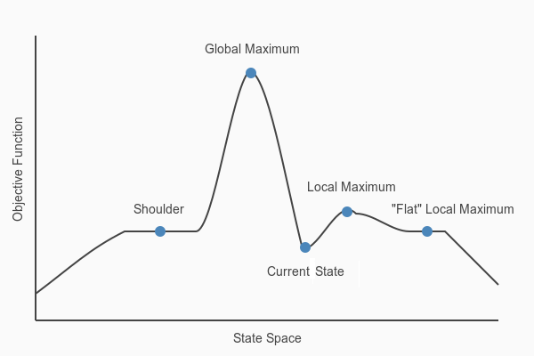

# Introduction

Hill climbing is an iterative optimization technique that attempts to find the best solution by making incremental changes to a given solution, similar to climbing up a hill to reach its peak. The algorithm starts with an initial solution and continuously moves toward better solutions until no further improvements can be made.

### Algorithm Characteristics

Hill climbing is a local search algorithm that iteratively moves to neighboring nodes with better heuristic values. Here are its key characteristics:

* **Time Complexity**: $$O(n)$$, where  is the number of nodes in the search space
* **Space Complexity**: $$O(1)$$, as it only needs to store the current state and its neighbors
* **Advantages**:
  * Simple implementation and intuitive approach
  * Uses minimal memory since it only maintains the current state
  * Efficient for finding local optima in smooth search spaces
* **Disadvantages**:
  * Prone to getting stuck in local optima
  * May not find the global optimal solution
  * Performance heavily depends on the initial state
* **Use Cases**:
  * Optimization tasks in machine learning (parameter tuning)
  * Local search problems with smooth search spaces
  * Problems where finding a good solution quickly is more important than finding the optimal solution

### Fundamental Concepts of Hill Climbing Algorithms

Hill climbing operates through the following key steps:

1. **Initial State**: Begin with a random or arbitrary solution (the initial state).
2. **Neighboring States**: Identify neighboring solutions by making small changes (mutations or tweaks) to the current state.
3. **Move to Neighbor**: Transition to a neighboring state if it offers an improved solution based on a defined evaluation function.
4. **Termination**: Repeat the process until no neighboring state yields a better solution. At this stage, the algorithm has reached a local maximum or minimum, depending on whether the goal is to maximize or minimize the objective.

### Hill Climbing in Mathematical Optimization

The Hill Climbing algorithm is widely used for mathematical optimization problems in AI. By leveraging a heuristic function and exploring a broad input space, the algorithm can identify a sufficiently good solution within a reasonable timeframe, even if it doesn’t always guarantee a globally optimal result.

In optimization scenarios, Hill Climbing is often employed to either maximize or minimize a function. For instance, in the **Traveling Salesman Problem**, the objective is to minimize the total distance traveled while visiting all cities.

#### What is a Heuristic Function?

A **heuristic function** evaluates and ranks potential alternatives at each decision point in a search algorithm. It guides the algorithm by selecting the most promising path, enabling efficient navigation toward a good solution.

#### Features of the Hill Climbing Algorithm

1.  **Variant of Generating and Testing**:\
    Hill Climbing is a specialized form of the generating and testing methodology:

    * **Generate**: Create potential solutions within the search space.
    * **Test**: Evaluate each solution to determine if it meets the desired criteria.
    * **Iterate**: If no satisfactory solution is found, return to the generation step and refine the search.

    This feedback loop allows the algorithm to iteratively improve its search based on prior evaluations.
2. **Greedy Approach**:\
   Hill Climbing adopts a **greedy strategy**, always choosing the best immediate option to optimize the objective function. While this approach aims for efficiency, it focuses on local improvements and doesn’t account for the global context, which may lead to suboptimal solutions (local optima).

### State-Space Diagram in Hill Climbing: Key Concepts and Regions

In the Hill Climbing algorithm, the **state-space diagram** visually represents all possible states the algorithm can explore, plotted against the values of the **objective function** (the function being maximized or minimized).

#### **Components of the State-Space Diagram:**

* **X-Axis**: Represents the state space, encompassing all possible states or configurations that the algorithm can reach.
* **Y-Axis**: Represents the objective function values corresponding to each state.

The **optimal solution** is depicted as the state where the objective function reaches its highest value, referred to as the **global maximum**.

<figure><figcaption></figcaption></figure>

#### Key Regions in the State-Space Diagram

1. **Local Maximum**:
   * A state that is better than its immediate neighbors but not the best overall.
   * The algorithm might stop here, believing it has found the optimal solution, even though a **global maximum** exists elsewhere.
2. **Global Maximum**:
   * The highest point in the state-space diagram, where the objective function achieves its maximum value.
   * This is the ultimate goal of the algorithm.
3. **Plateau (Flat Region)**:
   * A flat area where all neighboring states have the **same objective function value**.
   * This makes it challenging for the algorithm to determine the best direction to move, potentially stalling progress.
4. **Ridge**:
   * A sloped, elevated region that resembles a peak.
   * The algorithm may prematurely stop on a ridge, missing out on better solutions nearby.
5. **Current State**:
   * The algorithm’s current position in the state space as it searches for the optimal solution.
6. **Shoulder**:
   * A plateau with an **uphill edge**, providing an opportunity for the algorithm to climb toward better solutions if it continues exploring beyond the flat region.

By understanding these regions, you can better analyze the behavior and limitations of the Hill Climbing algorithm when navigating the state-space diagram to find an optimal solution.

