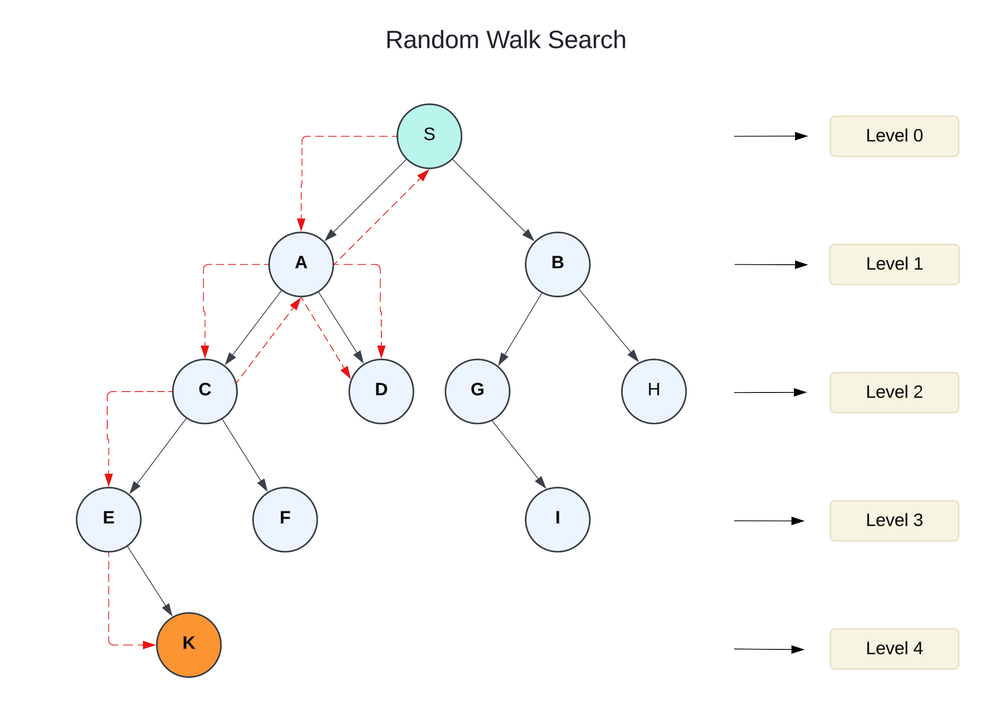

# Random Walk Search (RWS)

The Random Walk Search (RWS), also known as a drunkard's walk - algorithm is a fundamental search strategy where a search agent randomly selects and moves to a neighboring node without maintaining a history of past states. This approach is often used in scenarios where structured search methods are either infeasible or inefficient due to an unknown or highly complex search space.

### Key Characteristics

1. **Stochastic Nature:**\
   The search progresses randomly, choosing one of the available neighbors at each step without a deterministic pattern.
2. **No Backtracking:**\
   Unlike systematic search algorithms, Random Walk does not revisit past nodes explicitly unless reached randomly again.
3. **Application in Exploration:**\
   Useful in cases where heuristic or exhaustive search strategies are not practical, such as when dealing with unknown graphs or networks.

**Complexity**

* **Time Complexity:** Highly variable, dependent on the structure of the search space and the probability of reaching a goal node.
* **Space Complexity:** $$O(1)$$, as only the current state is stored, making it extremely memory efficient.

**Use** **Case**

* Exploring large or infinite state spaces where exhaustive search is computationally prohibitive.
* Simulating diffusion processes or random behavior in probabilistic models.
* Generating diverse solutions in optimization problems.

### Advantages

1. **Memory Efficiency:**\
   Requires minimal memory as it does not store visited nodes.
2. **Simplicity:**\
   Easy to implement with minimal computational overhead.
3. **Works in Unknown Environments:**\
   Suitable for exploration where no prior knowledge of the structure is available.

### Disadvantages

1. **Inefficiency:**\
   Can take an extremely long time to find a solution, especially in large or complex graphs.
2. **Non-Optimal Solutions:**\
   Does not guarantee the shortest or best solution, as movements are random.
3. **No Guarantee of Termination:**\
   In some cases, the search may not converge to a solution within a practical timeframe.

Random Walk Search is a simple yet powerful approach for exploring unknown search spaces. While it is highly memory-efficient and easy to implement, it lacks efficiency and guarantees. It is best used in exploratory tasks, probabilistic simulations, or as a component in hybrid search strategies where exhaustive or heuristic-based searches are impractical.

### Example

In the search tree below, the flow of the random walk search can be following this order:

$$S→A→S→A→C→A→S→A→D→A→C→E→K$$

The algorithm starts at the root node **S** (depth 0). It explores node **A** (depth 1), then moves back to **S** (depth 0), then again to **A** (depth 1). After that it goes to node **C** (depth 2)**,** then back to A (depth 1) and again to S (depth 0). Next it walks to node **A** (depth 1), then to node **D** (depth 2) and again back to **A** (depth 1). Then it goes to node **C** (depth 2), explorers it's children and goes to node **E** (depth 3) and finally reaches the goal node **K** (depth 4).

```
Total steps taken: 12
```

<div align="left"><figure><figcaption></figcaption></figure></div>

### Complexity, **Completeness** and Optimality

**Completeness:**

The algorithm is **incomplete** as it does not guarantee finding the goal, especially in large graphs with dead-ends.

**Time Complexity:**

In the worst case, it may take exponential time or even fail to find the goal.

**Space Complexity:**

$$O(1)$$ as only the current state is stored.

**Optimality:**

Random Walk does not guarantee the shortest or most efficient path to the goal.

### Random Walk Search with PHP

In PHP it can be written as a class `UninformedSearchGraph` with implementation of a set of graph operations.

**Example of Use:**

```php
// Create new graph instance
$graph = new UninformedSearchGraph();

// Add vertices with their levels
$graph->addVertex('S', 0);  // Start node (level 0)
$graph->addVertex('A', 1);  // Level 1
$graph->addVertex('B', 1);  // Level 1
$graph->addVertex('C', 2);  // Level 2
$graph->addVertex('D', 2);  // Level 2
$graph->addVertex('G', 2);  // Level 2
$graph->addVertex('H', 2);  // Level 2
$graph->addVertex('E', 3);  // Level 3
$graph->addVertex('F', 3);  // Level 3
$graph->addVertex('I', 3);  // Level 3
$graph->addVertex('K', 4);  // Level 4 (target node)

// Add edges to create the graph structure
$graph->addEdge('S', 'A');  // S -> A
$graph->addEdge('S', 'B');  // S -> B
$graph->addEdge('A', 'C');  // A -> C
$graph->addEdge('A', 'D');  // A -> D
$graph->addEdge('B', 'G');  // B -> G
$graph->addEdge('B', 'H');  // B -> H
$graph->addEdge('C', 'E');  // C -> E
$graph->addEdge('C', 'F');  // C -> F
$graph->addEdge('G', 'I');  // G -> I
$graph->addEdge('E', 'K');  // E -> K

echo "RWS traversal starting from vertex 'S':\n";
echo "--------------------------------------\n";

// Perform random search from S to K - 100 steps maximum
$searchResult = $graph->rws('S', 'K', 100);
$graph->printRwsPath($searchResult);
```


To try this code yourself, install the example files from the official GitHub repository: [https://github.com/apphp/ai-with-php-examples](https://github.com/apphp/ai-with-php-examples)


####
