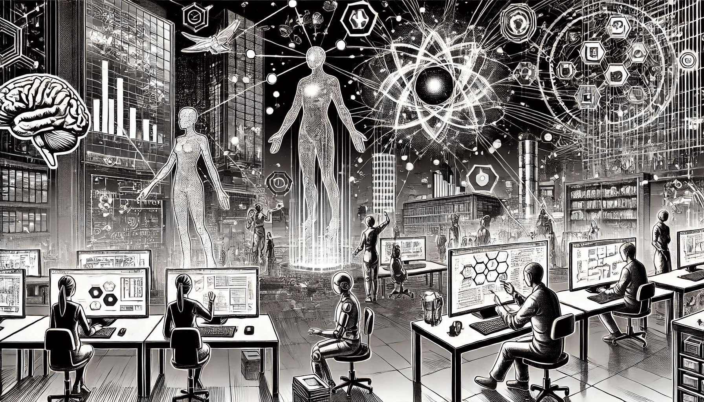

# Overview of CC

Cognitive Computing (CC) is a branch of computer science that tries to simulate human thought processes in a computerized model. It combines elements of artificial intelligence, machine learning, natural language processing, reasoning, and human-computer interaction. The goal is to build systems that can learn, adapt, and interact with humans in a natural way.

Developers design cognitive computing systems to solve complex problems without needing to program every scenario explicitly. These systems learn from experience, identify patterns in data, and make decisions based on that knowledge. Rather than replacing human intelligence, they aim to support people by processing and analyzing large amounts of data faster and more accurately than humans can.

<figure><figcaption>
Overview of CC
</figcaption></figure>

### What Is Cognitive Computing?

Cognitive computing refers to technologies that enable machines to understand, interpret, and respond to information in a way that is similar to human cognition. Unlike traditional computers that follow strict rules and algorithms, cognitive systems can learn from data, reason about the context, and improve over time. This makes them highly flexible and useful in environments where conditions change quickly or where there is a lot of unstructured data, such as emails, articles, or spoken conversations.

A typical cognitive computing system includes the following capabilities:

* **Learning**: It can improve its performance by studying data and past decisions.
* **Reasoning**: It can understand context and make logical inferences.
* **Natural Language Understanding**: It can interpret human language in both spoken and written forms.
* **Human Interaction**: It can communicate with users in a natural and intuitive way.

These core abilities allow cognitive computing systems to behave more like human partners in problem-solving.

#### Diagram: Components of a Cognitive Computing System

This simplified diagram shows how data flows through a cognitive system, from input to intelligent interaction.

### Why Do We Need Cognitive Computing?

In today's world, we are surrounded by massive amounts of data. Most of this data is unstructured and difficult to process using traditional methods. Organizations need tools that help them make sense of this information and support better decision-making.

Cognitive computing is important because it can analyze and understand information much faster than a human. It finds connections, spots trends, and delivers insights that would otherwise take a long time to discover. In fields like healthcare, finance, education, and cybersecurity, CC offers support by recommending actions, detecting anomalies, or personalizing services.

For example, in healthcare, a cognitive system can read medical literature, analyze patient records, and suggest possible diagnoses or treatments. In customer service, it can understand customer questions and provide accurate answers. These real-world applications highlight the value of cognitive computing in modern industries.

### Importance of Cognitive Computing

Cognitive computing changes the way we interact with computers. Instead of giving exact instructions, users can engage in more natural conversations with machines. This opens new possibilities for automation, decision support, and enhanced user experience.

One key advantage is adaptability. As it gathers more data, a cognitive system becomes better at understanding and responding to new situations. This is especially helpful in dynamic environments where conditions shift quickly.

Cognitive computing also increases organizational efficiency. It reduces research time, improves result accuracy, and lowers the risk of errors in decision-making. By blending human creativity with machine intelligence, companies can innovate faster and stay competitive.

However, it's also important to recognize the limitations. Cognitive systems require large amounts of high-quality data to function well. They can inherit biases from data, and explaining how they reach certain conclusions can be difficult. Developers must address these challenges carefully.

### Where is Cognitive Computing Used?

Cognitive computing is used in many industries and sectors where data analysis and decision-making are essential. It helps improve services, reduce costs, and increase productivity by offering smarter solutions.

In healthcare, cognitive systems assist doctors in diagnosing diseases, personalizing treatment plans, and predicting patient outcomes based on medical history and research.

In finance, banks and insurance companies use cognitive tools to detect fraud, assess risks, automate customer service, and offer financial advice tailored to individual needs.

In education, cognitive computing enables adaptive learning platforms that respond to each student’s progress and needs. It also supports teachers by analyzing learning patterns and helping to improve teaching methods.

In retail, businesses use cognitive systems to understand customer behavior, manage inventory, and offer personalized shopping experiences both online and in stores.

In manufacturing, cognitive computing improves quality control, predictive maintenance, and supply chain management by analyzing data from machines and sensors in real time.

In government and public services, cognitive systems help in managing large volumes of data, improving citizen services, and making better policy decisions based on real-world insights.

These examples show that cognitive computing is not limited to one area. It is becoming a vital tool in many fields where intelligence, adaptability, and data-driven decisions are essential.

#### Case Study: IBM Watson in Oncology

IBM Watson is one of the most well-known cognitive computing systems. In partnership with medical institutions, Watson for Oncology was developed to help doctors diagnose and treat cancer more accurately. The system analyzes patient data and matches it with millions of medical articles, clinical trial results, and treatment guidelines.

Doctors receive ranked treatment options with supporting evidence. Watson doesn’t make decisions for them, but it enhances their ability to choose the best plan. Studies have shown that Watson’s suggestions align with expert recommendations in many cases, saving time and improving patient outcomes.

### Cognitive Computing vs. Artificial Intelligence

Although cognitive computing is part of the broader field of AI, the two concepts are not exactly the same. AI focuses on making machines smart, often by performing tasks without human help. Cognitive computing, on the other hand, focuses on assisting humans, not replacing them. The goal is to support human thinking, not automate it entirely.

In summary, AI often aims to take action, while cognitive computing aims to provide insight and support. This distinction is important when designing systems that must interact with humans and handle complex decision-making tasks.

### Future of Cognitive Computing

Cognitive computing is still developing, but its potential is enormous. As technologies improve and more data becomes available, cognitive systems will become more powerful and widespread. They will play a major role in digital transformation across many industries.

In the future, we can expect cognitive computing to become more integrated into everyday tools and platforms. It will help with personal assistants, business analytics, smart devices, and even autonomous systems. As this happens, it will be important to ensure that these systems are transparent, ethical, and aligned with human values.

Cognitive computing is not just a technology trend. It represents a major step toward more human-like interaction with machines and better use of the vast information around us. For anyone working in AI or ML, understanding cognitive computing is essential for shaping the intelligent systems of tomorrow.
