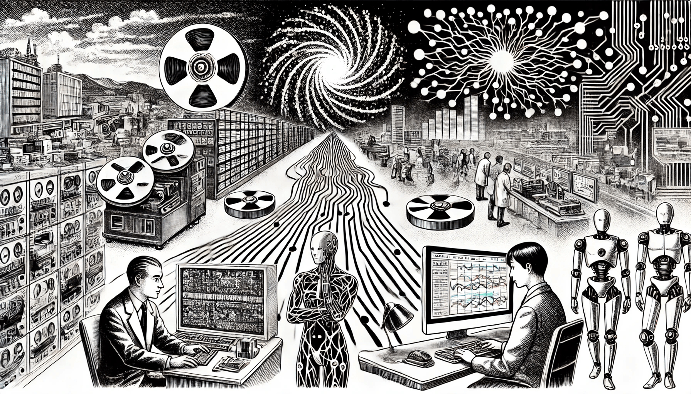

# History of CC

Cognitive Computing combines different fields such as AI, machine learning, natural language processing, psychology, and neuroscience. The goal is to create machines that can learn, reason, and understand the world like humans. In this chapter, we will explore how CC evolved, the important milestones in its development, and some of the modern trends that are shaping its future.

<div align="left"><figure><figcaption><p>History of CC</p></figcaption></figure></div>

### Early Ideas and Academic Foundations

The idea of Cognitive Computing started long before computers existed. In the 1800s, thinkers like **George Boole** and **Charles Babbage** imagined machines that could think like people. Boole wrote a book in 1854 about how logic could be used for thinking, and Babbage designed a machine called the Analytical Engine that could do calculations like a brain.

\>>>>>>>>>>>>>>>

In 1950, a British scientist named Alan Turing asked, "Can machines think?" He created the Turing Test to find out if a machine could act like a human in a conversation. In 1956, the term "Artificial Intelligence" (AI) was introduced during a workshop at Dartmouth College. AI was described as the science of making smart machines. That same year, early AI programs were created, like one that played checkers and another that could solve math problems.

This period marked the beginning of CC as a field that combined many subjects. These included mathematics, logic, psychology, and computer science. mathematics, logic, psychology, and computer science. In the 1950s and 1960s, the "cognitive revolution" happened. Researchers started to study the mind as if it were a machine that processes information. Psychologists like George Miller and Ulric Neisser focused on how the mind works inside, not just on how people behave.

Meanwhile, neuroscience — the study of the brain — helped AI scientists create simple models of brain cells, called artificial neurons. One example is the Perceptron, developed in 1958, which could learn basic tasks. These efforts aimed to make machines that can reason, learn, and understand like people.

### Key Achievements in Cognitive Computing

**Timeline of Key AI Milestones**

```
1956 - Term "AI" introduced
1966 - ELIZA chatbot created
1975 - Minsky's 'frames' concept
1986 - Backpropagation for neural networks
1997 - Deep Blue beats Kasparov
2011 - IBM Watson wins Jeopardy!
2016 - AlphaGo defeats Go champion
2020 - GPT-3 launches
```

This timeline highlights major events that helped shape cognitive computing. Each event shows progress in how machines learn, reason, or interact with humans.

In the 1960s and 70s, computers became more powerful. Scientists used them to do more complex tasks. A famous program called ELIZA, created in 1966, could talk like a therapist by following simple rules. In 1975, Marvin Minsky introduced "frames," a way for computers to remember information based on context.

Another major step was expert systems, like MYCIN, which was important because it showed how rules could be used to copy expert thinking in a computer program, built in the 1970s. MYCIN helped doctors by suggesting treatments for infections. It used rules to mimic how doctors think.

In the 1980s, researchers developed full models of how the mind works, like Soar and ACT-R. These models helped scientists understand how people solve problems and how computers might do the same.

The 1980s also brought a big change: machine learning. Scientists like Judea Pearl introduced statistical methods so that computers could learn from data. Neural networks, which were inspired by the brain, also became more useful because of a method called backpropagation. This method allowed machines to improve their performance by learning from mistakes.

One exciting moment came in the 1990s when IBM created TD-Gammon, a program that learned to play backgammon very well using reinforcement learning — a technique where the system learns from rewards.

In 1997, IBM's Deep Blue beat the world chess champion Garry Kasparov, which was a turning point for public interest in AI. It proved that machines could compete with the best human minds in strategy and logic, and it brought AI into the spotlight for people around the world. Garry Kasparov. This was a huge moment for AI. While Deep Blue didn’t think like a human, it showed how strong AI could be in complex tasks.

By the 2000s, more breakthroughs followed.

### **Some Important Examples**

Watson was used to help doctors treat cancer patients. It could read thousands of medical research papers and compare them with a patient's history. Then, it suggested possible treatments. In some hospitals, Watson helped reduce time spent on case reviews and improved confidence in choosing the right therapy. In 2005, a robot car from Stanford University won a race across the desert without a driver. Then in 2011, IBM’s Watson won the quiz show Jeopardy! by answering tricky questions better than human champions. Watson used many AI tools at once — understanding language, finding information, and learning from data.

In 2016, another milestone happened. Google DeepMind’s AlphaGo defeated a world champion in the game of Go, which is much harder than chess. AlphaGo used deep learning, reinforcement learning, and search algorithms to win. This showed that AI could now handle tasks that once needed human intuition and creativity.

Later, AI systems also beat humans in poker and video games. By the late 2010s, computers could recognize speech and images very well, and they could even create text, images, and music. This showed that machines were getting closer to human-level thinking.

### From Research to Real Products

Cognitive computing also grew in the business world. IBM Watson became the most famous example. After winning Jeopardy! in 2011, IBM turned Watson into a product. In 2014, IBM invested a lot of money to build a Watson team. Watson was used in healthcare, finance, and customer service. It helped doctors suggest treatments and helped banks answer customer questions.

Other tech companies joined in. Apple launched Siri in 2011, a voice assistant that could understand natural speech. Amazon followed with Alexa in 2014, which made smart home devices more popular. Google released Google Assistant soon after. These tools showed people how AI could help in everyday life.

Microsoft joined too. In 2016, it launched Azure Cognitive Services, giving developers easy access to AI tools like face recognition and language translation. These services made it easier for businesses to use AI, even without expert knowledge.

AI also entered other areas, like customer service, online shopping, and even robots that help with public speaking. For example, IBM’s Project Debater could argue with human experts by using facts and logic. These tools didn’t replace people — they helped people work better. This idea is called "augmented intelligence," where AI supports humans rather than taking over.

By the end of the 2010s, cognitive computing was everywhere: in apps, websites, cars, and homes. This widespread use changed how people interact with technology every day and showed that AI had moved from labs into real life, helping people with tasks big and small. in apps, websites, cars, and homes. Most people now use AI every day without even realizing it.

### New Trends in the 2020s

In the 2020s, cognitive computing advanced very fast. One big change was the rise of generative AI. In 2020, OpenAI launched GPT-3, a language model that could write essays, code, and answer questions like a human. It was trained on a huge amount of text from the internet.

GPT-3 led to tools like ChatGPT, which marked a big improvement over earlier systems like ELIZA or Siri. While older systems followed strict rules or had limited conversation abilities, ChatGPT can hold rich, flexible conversations and respond with more context and understanding, a chatbot that talks like a person. Millions of people started using it. These systems learn from data, not from direct instruction. They can understand and generate language in a way that feels very natural.

These tools are being added to bigger systems, such as tools for doctors or lawyers. For example, they can read clinical notes and explain suggestions in plain English. However, they also raise concerns — what if they make a mistake or say something biased? These are ongoing research challenges.

Another big development is real-time decision-making. Some AI systems now make decisions in seconds, which is important for things like self-driving cars or fraud detection. New computer chips and software help AI run very fast, even on small devices like phones.

Edge computing is another trend. This means that data is processed on the device itself (like a phone or smart camera) instead of being sent to a distant server. It makes AI faster and more private because everything happens close to the source. This means processing data locally on a device instead of sending it to the cloud. This helps with speed and privacy. AI is now used in many places like websites that adjust instantly, or supply chains that react to changes in weather.

Cognitive computing is also becoming more focused on teamwork between humans and machines. This collaboration allows people to make better decisions faster, as AI can quickly analyze data while humans provide context and judgment. Many tools now support this. For example, GitHub Copilot helps programmers write code. Doctors use AI tools to double-check diagnoses. AI helps businesspeople find patterns in data.

These systems aim to help, not replace, people. That’s why many AI platforms include explainable AI, which tells users how the system made its decisions. AI also helps people communicate better, like translating languages in real time or helping to schedule meetings.

Researchers now talk about "hybrid intelligence" — a mix of human and machine strengths. Studies show that when people and AI work together, they often get better results than either alone. This is shaping the future of cognitive computing.

### Conclusion

Cognitive computing has come a long way. As we continue to improve and use these technologies, we should ask ourselves: how can we make sure they benefit everyone fairly and safely? It started as a dream in math and science, turned into research in AI and psychology, and is now part of daily life. Big steps like beating chess and Go champions, or helping doctors and developers, show how powerful these tools have become.

Today, cognitive computing is all around us — in our phones, our homes, and our jobs. The field keeps moving forward with new tools like GPT and real-time AI systems. The focus is now on helping humans work better, smarter, and faster.

The future of CC looks bright. As our tools get smarter, we are building a new kind of partnership between people and machines — one that could change how we think, learn, and live.
