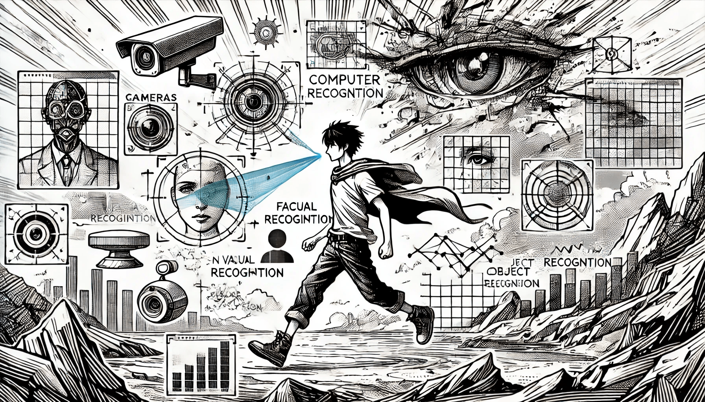

# Introduction

<figure><figcaption>
Introduction to Computer Vision
</figcaption></figure>

**Computer Vision (CV)** is a part of artificial intelligence that helps machines understand and work with visual information, such as photos or videos. It allows computers to “see” the world around them and make decisions based on what they see — similar to how the human eye and brain work, but often much faster and more accurate.

At its core, computer vision is about teaching computers to understand digital images. This includes recognizing objects, people, or scenes, and deciding what to do with that information. It is used in many modern technologies, such as facial recognition, automatic photo tagging, and quality checks in factories.

The process of computer vision usually includes several important steps:

* **Image acquisition**: This is the first step, where an image is taken using a camera or uploaded from a digital file. Without a clear image, the computer cannot begin to analyze anything.
* **Preprocessing**: The image may need to be improved before analysis. This step involves changing the image to make key details clearer. For example, the computer might adjust the brightness, remove noise, or convert the image to black and white to focus on shapes and edges.
* **Analysis**: Once the image is ready, the system uses special algorithms or machine learning models to look for patterns. It might try to find specific objects, such as a face or a car, or detect unusual features that could show a problem.
* **Decision-making**: After analyzing the image, the system decides what to do. For example, it might highlight an item that looks suspicious, send a warning, or organize the image into a certain category.

Computer vision is the technology behind many tools we use every day — even if we don’t realize it. It helps unlock smartphones with our face, scan QR codes at a restaurant, or read handwritten notes. As technology grows, computer vision is becoming even more powerful, helping industries like healthcare, security, retail, and transportation.

In short, computer vision allows machines to understand visual information in a smart and useful way, opening the door to a wide range of exciting applications.
