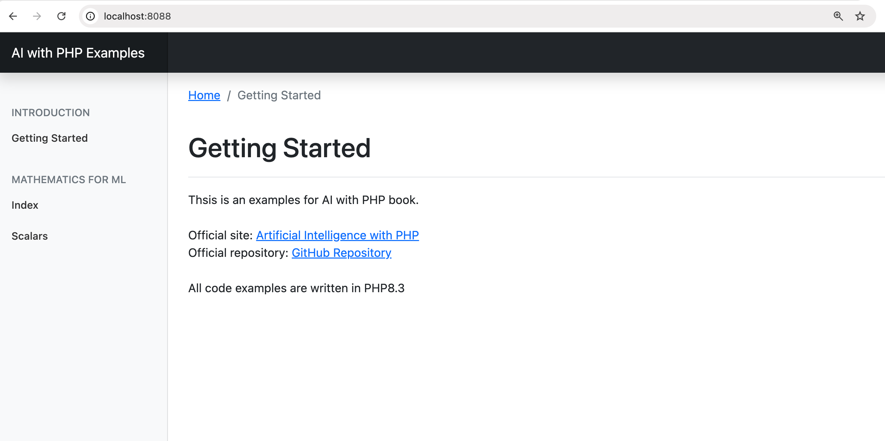
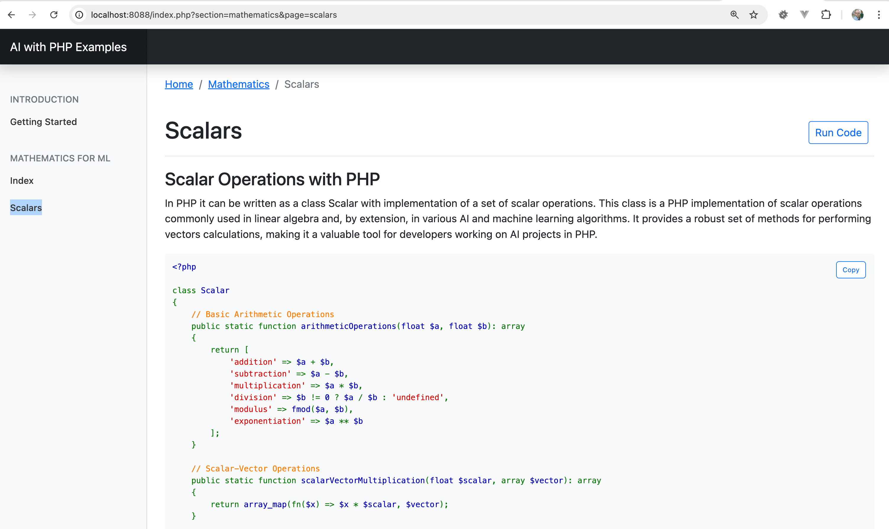

# How to Read This Book

Understanding how to approach this book will enhance your learning experience and help you effectively absorb the concepts of building AI with PHP. This book is designed for two main reading methods: _normal reading_ and _reading while running examples_. Each approach serves a unique purpose and can be used individually or in combination for a comprehensive understanding.

### 1. Normal Reading

_Normal reading_ involves going through the chapters sequentially, focusing on understanding the theories, methodologies, and concepts behind AI and how PHP can be used as a tool to implement them. Here’s how to make the most of this reading method:

#### Benefits of Normal Reading

* **Conceptual Clarity**: This approach helps in building a strong foundation by thoroughly understanding the theoretical aspects.
* **Flexible Pace**: You can read at your own speed, taking time to reflect on complex topics without the pressure of executing code.
* **Note-Taking**: As you read, take notes on key concepts, terminology, and strategies, which will be helpful for quick reviews.

#### Tips for Effective Normal Reading

* **Highlight Important Sections**: Use bookmarks or digital highlights to mark essential points that you may want to revisit.
* **Jot Down Questions**: If you come across something unclear, write it down to investigate further or look up while running code examples.
* **Pause for Thought**: Spend time thinking about how you might apply these concepts to your own projects or real-world scenarios.

### 2. Reading While Running Examples

For those who prefer a more hands-on learning experience, _reading while running examples_ is an interactive approach where you read sections of the book while simultaneously working with the code provided in the GitHub repository. This approach bridges the gap between theory and practical application.

#### Benefits of Reading with Examples

* **Immediate Practice**: Reinforces learning by letting you see concepts in action.
* **Troubleshooting Skills**: Helps you develop problem-solving skills by working through code issues that may arise.
* **Better Retention**: Studies have shown that combining reading with active practice enhances memory and understanding.

#### How to Get Started

1. **Set Up Your Environment**:
   * Ensure you have local environment ready. To start work with examples you need Git and Docker are running on your machine.
     * Read more about GitHub: [https://git-scm.com/book/en/v2/Getting-Started-Installing-Git](https://git-scm.com/book/en/v2/Getting-Started-Installing-Git)
     * Read more about Docker: [https://www.docker.com/products/docker-desktop/](https://www.docker.com/products/docker-desktop/)
   *   Clone the GitHub repository linked in the book:

       ```bash
       git clone https://github.com/apphp/ai-with-php-book
       ```
   *   Navigate to the project directory:

       ```bash
       cd ai-with-php-book
       ```
   *   Run following command. It will prepare and run docker containers with all required applications.

       ```bash
       make init
       ```
   * After installation is complete, type in your browser: [http://localhost:8088/](http://localhost:8088/)
   *   If everything is OK, you should see the website with examples of code:\


       <figure><figcaption></figcaption></figure>
2. **Follow Along with the Chapters**:
   *   As you read a section, locate the corresponding example in the repository (e.g., if you're on Scalars in Mathematics for ML section, check the same section in the side menu).\


       <div align="left"><figure><figcaption></figcaption></figure></div>
   * To run the example, simply click the "Run Code" button on the top-right corner.
3. **Experiment and Modify**:
   * Modify the example code to test different scenarios or tweak parameters to see how changes affect the output. This experimentation strengthens your understanding.

#### Tips for Combining Reading and Practice

* **Split Your Screen**: If possible, use a split-screen setup so you can read the book on one side and have your code editor/terminal on the other.
* **Review the Code**: Before running, read through the example code provided to understand how it aligns with the chapter’s content.
* **Take Notes on Findings**: Document any insights, errors encountered, and their solutions. This will create a personalized reference for future projects.

### Summary

Choose _normal reading_ when you want to focus on understanding theory or when you’re on the go and don’t have your coding setup handy. Opt for _reading with examples_ when you’re ready to immerse yourself in practical learning. Combining both approaches offers the most holistic learning experience, allowing you to gain a deep conceptual understanding and practical skills that you can apply immediately.
