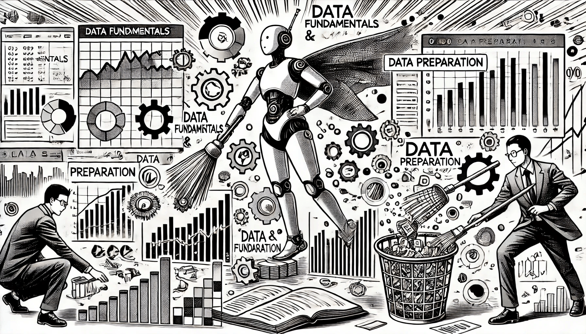

# Data Fundamentals

### Data Fundamentals and Preparation

This chapter explains the basics of data, including different types of data, where to find it, and why good-quality data is crucial. It highlights the importance of data preparation, which means cleaning, changing, and organizing data to make sure it’s ready for analysis and modeling. Readers will discover common techniques for preparing data, such as filling in missing values, converting categories into numbers, and scaling data to a similar range.

<figure><figcaption>
Data Fundamentals
</figcaption></figure>

Data is the foundation of machine learning, so it’s important to understand it well to build effective models.
