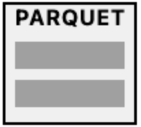

# Structured Data Formats

When working with AI in PHP, understanding various data formats is crucial for efficient data processing, storage, and analysis. This section covers both structured data formats commonly used in AI applications.

### Structured Data Formats

Structured data formats organize information in a predefined manner, making it easy to process and analyze. Here are some popular structured data formats used in AI applications:

#### CSV (Comma-Separated Values)&#x20;

<div align="left"><figure><figcaption></figcaption></figure></div>

CSV is a simple, tabular format where data is separated by commas.

Pros:

* Easy to read and write
* Supported by most spreadsheet applications
* Compact file size

Cons:

* Limited support for complex data structures
* No standardized way to represent data types

Example:

```
name,age,city
John,30,New York
Alice,25,London
```

PHP example:

```php
$csv = array_map('str_getcsv', file('data.csv'));
```

<details>

<summary>Result</summary>

```
Array
(
    [0] => Array
        (
            [0] => name
            [1] => age
            [2] => city
        )

    [1] => Array
        (
            [0] => John
            [1] => 30
            [2] => New York
        )

    [2] => Array
        (
            [0] => Alice
            [1] => 25
            [2] => London
        )
)
```

</details>

#### JSON (JavaScript Object Notation)&#x20;

<div align="left"><figure><figcaption></figcaption></figure></div>

JSON is a lightweight, human-readable format that's easy for machines to parse and generate.

Pros:

* Supports complex data structures
* Wide language support
* Easy to read and write

Cons:

* Can be less compact than binary formats
* Parsing large JSON files can be memory-intensive

Example:

```json
{
  "users": [
    {"name": "John", "age": 30, "city": "New York"},
    {"name": "Alice", "age": 25, "city": "London"}
  ]
}
```

PHP example:

```php
$json_data = file_get_contents('data.json');
$data = json_decode($json_data, true);
```

<details>

<summary>Result</summary>

```
Array
(
    [users] => Array
        (
            [0] => Array
                (
                    [name] => John
                    [age] => 30
                    [city] => New York
                )

            [1] => Array
                (
                    [name] => Alice
                    [age] => 25
                    [city] => London
                )
        )
)
```

</details>

#### XML (eXtensible Markup Language)&#x20;

<div align="left"><figure><figcaption></figcaption></figure></div>

XML is a versatile markup language that defines a set of rules for encoding documents.

Pros:

* Highly flexible and extensible
* Supports complex data structures
* Self-descriptive

Cons:

* Verbose, leading to larger file sizes
* Can be more complex to parse than JSON

Example:

```xml
<users>
  <user>
    <name>John</name>
    <age>30</age>
    <city>New York</city>
  </user>
  <user>
    <name>Alice</name>
    <age>25</age>
    <city>London</city>
  </user>
</users>
```

PHP example:

```php
$xml = simplexml_load_file('data.xml');
```

<details>

<summary>Result</summary>

```
SimpleXMLElement Object
(
    [user] => Array
        (
            [0] => SimpleXMLElement Object
                (
                    [name] => John
                    [age] => 30
                    [city] => New York
                )

            [1] => SimpleXMLElement Object
                (
                    [name] => Alice
                    [age] => 25
                    [city] => London
                )
        )
)
```

</details>

#### Parquet

<div align="left"><figure><figcaption></figcaption></figure></div>

Parquet is a columnar storage file format, optimized for use with big data processing frameworks.

Pros:

* Highly efficient for analytical queries
* Supports complex nested data structures
* Excellent compression

Cons:

* Not human-readable
* Requires specialized libraries for reading/writing

PHP example (using third-party library):

```php
// Note: This requires a PHP extension or library for Parquet support
// Like: apache/parquet

require 'vendor/autoload.php'; 

use Parquet\Reader;

// Create a ParquetReader instance
$reader = new Reader('data.parquet');

// Read the data
$data = $reader->read();

// Display the data
foreach ($data as $row) {
    echo "Name: " . $row['name'] . "\n";
    echo "Age: " . $row['age'] . "\n";
    echo "City: " . $row['city'] . "\n";
}
```

<details>

<summary>Result</summary>

```
Name: John
Age: 30
City: New York
Name: Alice
Age: 25
City: London
```

</details>

#### HDF5 (Hierarchical Data Format version 5)&#x20;

<div align="left"><figure><figcaption></figcaption></figure></div>

HDF5 is a file format designed to store and organize large amounts of numerical data.

Pros:

* Excellent for large, complex datasets
* Supports parallel I/O
* Hierarchical structure

Cons:

* More complex to use than simpler formats
* Requires specialized libraries

PHP example (using third-party library):

```php
// Note: This requires a PHP extension or library for HDF5 support
$file = new HDF5File('data.h5', 'r');
$dataset = $file->getDataset('mydata');
```

#### ARFF (Attribute-Relation File Format)

ARFF  is a text-based file format used to represent structured data, primarily for use in machine learning experiments. It was developed for the Weka data mining software and is widely used in AI and ML to store datasets that contain both metadata and actual data instances.

Pros of ARFF:

* Easy to read and write: Being a text-based format, ARFF is simple to understand and edit manually.
* Metadata support: ARFF files provide information about both the data and its attributes, making them highly interpretable.
* Integration with Weka: ARFF is the default format for Weka, one of the most popular machine learning tools for academic research.

Cons of ARFF:

* Limited to structured data: ARFF is only suited for structured datasets, not for handling unstructured data like images or text.
* Less efficient for large datasets: Because ARFF is a text-based format, it can be slower to read and write compared to binary formats like Parquet or HDF5.

Structure of ARFF:

An ARFF file consists of two main sections:

1\. Header: Defines the dataset’s structure, including attributes (features) and their types.

2\. Data: Contains the actual data instances that correspond to the defined attributes.

Key Sections:

1\. @RELATION: Specifies the name of the dataset (e.g., “weather”).

2\. @ATTRIBUTE: Defines each feature or attribute in the dataset. The attribute name is followed by its type, which can be either nominal (a set of predefined values, e.g., {sunny, overcast, rainy}) or numeric (e.g., “NUMERIC”).

3\. @DATA: This section holds the actual records that align with the attribute definitions in the header. Each row represents a data instance.

```arff
@RELATION weather

@ATTRIBUTE outlook {sunny, overcast, rainy}
@ATTRIBUTE temperature NUMERIC
@ATTRIBUTE humidity NUMERIC
@ATTRIBUTE windy {TRUE, FALSE}
@ATTRIBUTE play {yes, no}

@DATA
sunny, 85, 85, FALSE, no
sunny, 80, 90, TRUE, no
overcast, 83, 78, FALSE, yes
rainy, 70, 96, FALSE, yes
```

PHP example (Reading ARFF File):

```php
<?php

class ARFFParser {
    private $relation;
    private $attributes = [];
    private $data = [];
    
    public function __construct($filePath) {
        $this->parseARFF($filePath);
    }
    
    private function parseARFF($filePath) {
        $file = fopen($filePath, 'r');
        if (!$file) {
            throw new Exception("Unable to open ARFF file: $filePath");
        }
        
        $inDataSection = false;
        
        while (($line = fgets($file)) !== false) {
            $line = trim($line);
            
            // Skip comments and empty lines
            if (empty($line) || $line[0] == '%') {
                continue;
            }

            if (stripos($line, '@RELATION') === 0) {
                $this->relation = trim(substr($line, 10));
            } elseif (stripos($line, '@ATTRIBUTE') === 0) {
                $this->attributes[] = $this->parseAttribute($line);
            } elseif (stripos($line, '@DATA') === 0) {
                $inDataSection = true;
            } elseif ($inDataSection) {
                $this->data[] = $this->parseDataLine($line);
            }
        }
        
        fclose($file);
    }
    
    private function parseAttribute($line) {
        $parts = preg_split('/\s+/', $line, 3);
        return [
            'name' => $parts[1],
            'type' => $parts[2]
        ];
    }

    private function parseDataLine($line) {
        return str_getcsv($line);
    }
    
    public function getRelation() {
        return $this->relation;
    }

    public function getAttributes() {
        return $this->attributes;
    }

    public function getData() {
        return $this->data;
    }
}

// Usage example
try {
    $arffParser = new ARFFParser('weather.arff');
    // Print relation
    echo "Relation: " . $arffParser->getRelation() . PHP_EOL;
    // Print attributes
    echo "Attributes: " . print_r($arffParser->getAttributes(), true) . PHP_EOL;
    // Print data
    echo "Data: " . print_r($arffParser->getData(), true) . PHP_EOL;
} catch (Exception $e) {
    echo "Error: " . $e->getMessage();
}
```

<details>

<summary>Result</summary>

```
Relation: weather
Attributes: Array
(
    [0] => Array
        (
            [name] => outlook
            [type] => {sunny, overcast, rainy}
        )

    [1] => Array
        (
            [name] => temperature
            [type] => NUMERIC
        )

    [2] => Array
        (
            [name] => humidity
            [type] => NUMERIC
        )

    [3] => Array
        (
            [name] => windy
            [type] => {TRUE, FALSE}
        )

    [4] => Array
        (
            [name] => play
            [type] => {yes, no}
        )
)

Data: Array
(
    [0] => Array
        (
            [0] => sunny
            [1] => 85
            [2] => 85
            [3] => FALSE
            [4] => no
        )

    [1] => Array
        (
            [0] => sunny
            [1] => 80
            [2] => 90
            [3] => TRUE
            [4] => no
        )

    [2] => Array
        (
            [0] => overcast
            [1] => 83
            [2] => 78
            [3] => FALSE
            [4] => yes
        )
)
```

</details>

#### SQL Tables&#x20;

<div align="left"><figure><figcaption></figcaption></figure></div>

While not a file format per se, SQL tables in relational databases are a common way to store structured data.

Pros:

* Efficient for relational data
* Supports complex queries and indexing
* ACID compliance

Cons:

* Schema must be predefined
* Can be less flexible for rapidly changing data structures

PHP example:

```php
$pdo = new PDO('mysql:host=localhost;dbname=mydb', 'username', 'password');
$stmt = $pdo->query('SELECT * FROM users');
$users = $stmt->fetchAll(PDO::FETCH_ASSOC);
print_r($users);
```

<details>

<summary>Result</summary>

```
Array
(
    [0] => User Object
        (
            [id] => 1
            [name] => John
        )
    [1] => User Object
        (
            [id] => 2
            [name] => Alice
        )
    [2] => User Object
        (
            [id] => 3
            [name] => Bob
        )
)
```

</details>

### Common Data Formats Compared

Let's look at the same data represented in different formats. We'll use a simple example of book information.

#### JSON (JavaScript Object Notation)

```json
{
  "books": [
    {
      "title": "The Great Gatsby",
      "author": "F. Scott Fitzgerald",
      "year": 1925,
      "genres": ["Fiction", "Classic"],
      "available": true
    },
    {
      "title": "1984",
      "author": "George Orwell",
      "year": 1949,
      "genres": ["Fiction", "Dystopian"],
      "available": false
    }
  ]
}
```

#### XML (eXtensible Markup Language)

```xml
<?xml version="1.0" encoding="UTF-8"?>
<books>
    <book>
        <title>The Great Gatsby</title>
        <author>F. Scott Fitzgerald</author>
        <year>1925</year>
        <genres>
            <genre>Fiction</genre>
            <genre>Classic</genre>
        </genres>
        <available>true</available>
    </book>
    <book>
        <title>1984</title>
        <author>George Orwell</author>
        <year>1949</year>
        <genres>
            <genre>Fiction</genre>
            <genre>Dystopian</genre>
        </genres>
        <available>false</available>
    </book>
</books>
```

#### CSV (Comma-Separated Values)

```csv
title,author,year,genres,available
"The Great Gatsby","F. Scott Fitzgerald",1925,"Fiction,Classic",true
"1984","George Orwell",1949,"Fiction,Dystopian",false
```

#### YAML (YAML Ain't Markup Language)

```yaml
books:
  - title: The Great Gatsby
    author: F. Scott Fitzgerald
    year: 1925
    genres:
      - Fiction
      - Classic
    available: true
  - title: 1984
    author: George Orwell
    year: 1949
    genres:
      - Fiction
      - Dystopian
    available: false
```
