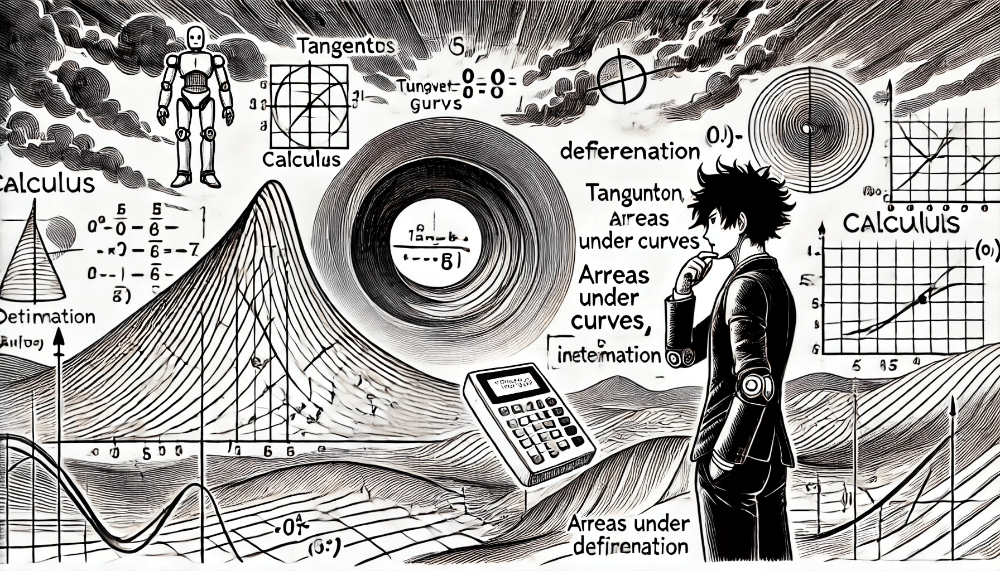

# Calculus

<figure><figcaption>
Calculus
</figcaption></figure>

* Functions and Limits
* Derivatives
* Basic differentiation rules
* Partial derivatives and gradient vectors
* Optimization
* Finding minima and maxima of functions
* Gradient descent algorithm: concepts and applications
* Multivariable Calculus
* Understanding functions of several variables
* Jacobian and Hessian matrices

* Derivatives and gradients in AI model optimization
* Integration and its use in probability for AI
* Series and sequences for prediction models and time series analysis
