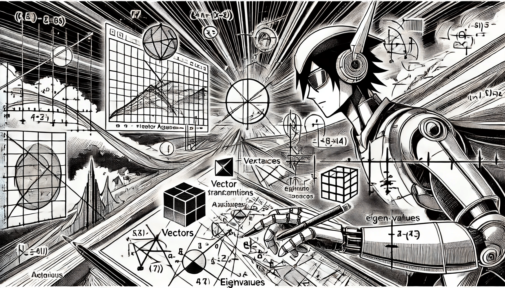

# Linear Algebra

Linear algebra is a fundamental pillar of machine learning, as it provides the mathematical framework for understanding and manipulating the data that algorithms use. At its core, linear algebra deals with vectors, matrices, and linear transformations, which are essential for representing complex datasets and operations on them.&#x20;

<figure><figcaption>
Linear Algebra
</figcaption></figure>

Many machine learning models, such as support vector machines, neural networks, and principal component analysis, rely on linear algebra concepts to process and analyze high-dimensional data efficiently. For instance, data can be represented as vectors in a multi-dimensional space, and operations like dot products and matrix multiplications enable algorithms to learn patterns and relationships within the data. Furthermore, linear algebra facilitates optimization processes, allowing models to adjust their parameters during training to minimize errors.&#x20;

Overall, a solid understanding of linear algebra is crucial for anyone looking to delve into machine learning, as it not only enhances comprehension of the underlying algorithms but also improves the ability to implement and innovate upon them.

