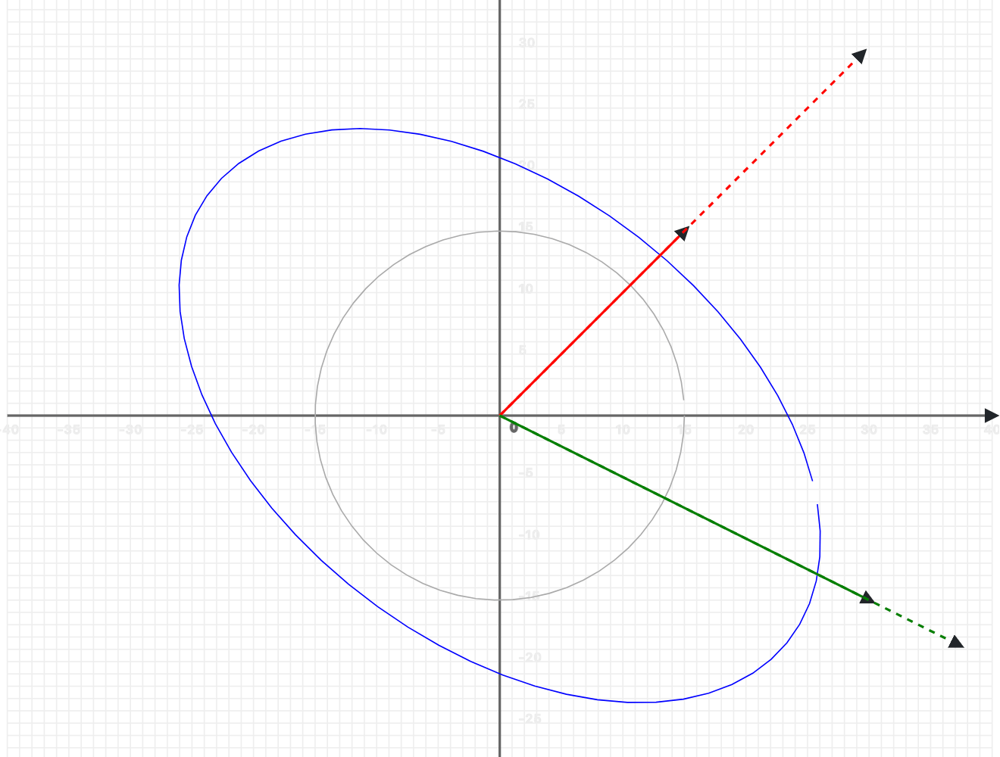

# Eigenvalues and Eigenvectors

Eigenvalues and eigenvectors are fundamental concepts in linear algebra, with wide applications in machine learning, artificial intelligence, and data science. Understanding these concepts helps in grasping various algorithms, such as Principal Component Analysis (PCA) and Singular Value Decomposition (SVD). This chapter introduces eigenvalues and eigenvectors, explains their mathematical foundation, and demonstrates their relevance to machine learning.

### **1. What Are Eigenvalues and Eigenvectors?**

Eigenvalues and eigenvectors are properties of square matrices. They provide insight into the behavior of linear transformations represented by these matrices.

Given a square matrix , an eigenvector $$\mathbf{v}$$ is a non-zero vector that, when multiplied by $$A$$, results in a scaled version of itself. The scaling factor is called the eigenvalue **λ** (lambda). Mathematically, this is expressed as:&#x20;

$$A \mathbf{v} = \lambda \mathbf{v}$$

where:

* &#x20;is the square matrix (n $$\times$$ n),
* $$\mathbf{v}$$ is the eigenvector (n $$\times$$ 1),
* &#x20;**λ** is the eigenvalue (a scalar).

#### Key Points:

* Eigenvectors point in a direction that remains unchanged (apart from scaling) when transformed by $$A$$.
* Eigenvalues tell us how much the eigenvector is stretched or shrunk.

### **2. Finding Eigenvalues and Eigenvectors**

To compute eigenvalues and eigenvectors, the following steps are taken:

#### **Step 1: The Characteristic Equation**

The eigenvalues of a matrix are determined by solving the characteristic equation:

$${det}(A - \lambda I) = 0$$

where:

* $$I$$ is the identity matrix of the same size as $$A$$,
* $$det()$$ is the determinant of the matrix.

#### **Step 2: Solving for Eigenvalues**

The characteristic equation yields a polynomial equation in $$\lambda$$ (called the characteristic polynomial). The roots of this polynomial are the eigenvalues of $$A$$.

#### **Step 3: Finding Eigenvectors**

Once eigenvalues $$\lambda$$ are known, eigenvectors are computed by solving the equation:

$$(A - \lambda I) \mathbf{v} = 0$$

where $$\mathbf{v}$$ is the eigenvector corresponding to the eigenvalue .

#### Example:

Let $$A = \begin{bmatrix} 4 & 1 \\ 2 & 3 \end{bmatrix}$$

1. Compute:\
   $${det}(A - \lambda I) = \text{det}\begin{bmatrix} 4 - \lambda & 1 \\ 2 & 3 - \lambda \end{bmatrix} = 0.$$
2. Expand:  $$(4 - \lambda)(3 - \lambda) - 2 = \lambda^2 - 7\lambda + 10 = 0.$$
3. Solve for roots: $$\lambda_1 = 5,  \lambda_2 = 2.$$
4. For each $$\lambda$$, solve: $$(A - \lambda I) \mathbf{v} = 0$$  to find the eigenvectors.

<details>

<summary>Step-by-step explanation</summary>

Let's solve for the eigenvectors step by step.  \
We'll solve $$(A−λI)\mathbf{v} =0$$ for each eigenvalue.

**For** $$λ_1 = 5$$:

1.  Set up $$(A - 5I)\mathbf{v} = \mathbf{0}$$ :\
    \
    $$\begin{bmatrix} 4-5 & 1 \\ 2 & 3-5 \end{bmatrix} \begin{bmatrix} \mathbf{v}_1 \\ \mathbf{v}_2 \end{bmatrix} = \begin{bmatrix} 0 \\ 0 \end{bmatrix}$$\


    Simplifies to:\
    $$\begin{bmatrix} -1 & 1 \\ 2 & -2 \end{bmatrix} \begin{bmatrix} \mathbf{v}_1 \\ \mathbf{v}_2 \end{bmatrix} = \begin{bmatrix} 0 \\ 0 \end{bmatrix}$$\

2. This gives us system of equations:\
   &#x20;$$-v_1 + v_2 = 0$$ \
   $$2v_1 - 2v_2 = 0$$\
   \
   These equations are equivalent (second is just -2 times the first) \
   So $$\mathbf{v}_1 = \mathbf{v}_2$$ \
   If we let $$\mathbf{v}_1  = 1$$, then $$\mathbf{v}_2  = 1$$\
   Therefore eigenvector for $$\lambda_1 = 5 \ \ \text{is} \ \ \mathbf{v}_1 = \begin{bmatrix} 1 \\ 1 \end{bmatrix}^\top$$

**For** $$λ_2 = 2$$:

1. Set up $$(A - 2I)\mathbf{v} = \mathbf{0}$$\
   \
   $$\begin{bmatrix} 4-2 & 1 \\ 2 & 3-2 \end{bmatrix} \begin{bmatrix} \mathbf{v}_1  \\ \mathbf{v}_2  \end{bmatrix} = \begin{bmatrix} 0 \\ 0 \end{bmatrix}$$\
   \
   Simplifies to:\
   $$\begin{bmatrix} 2 & 1 \\ 2 & 1 \end{bmatrix} \begin{bmatrix} \mathbf{v}_1 \\ \mathbf{v}_2 \end{bmatrix} = \begin{bmatrix} 0 \\ 0 \end{bmatrix}$$\

2.  This gives us system of equations:\
    $$2\mathbf{v}_1 + \mathbf{v}_2 = 0$$\
    $$2\mathbf{v}_1 + \mathbf{v}_2 = 0$$\


    From either equation: $$\mathbf{v}_2 = -2\mathbf{v}_1$$ If we let $$\mathbf{v}_1 = 1$$, then $$\mathbf{v}_2 = -2$$\
    Therefore eigenvector for $$λ_2 = 2$$ is $$\mathbf{v}_2 = \begin{bmatrix} 1 \ -2 \end{bmatrix}^\top$$

Final result:

* For $$λ_1 = 5$$, eigenvector $$\mathbf{v}_1 = \begin{bmatrix} 1 \ 1 \end{bmatrix}^\top$$
* For $$λ_2 = 2$$, eigenvector $$\mathbf{v}_2 = \begin{bmatrix} 1 \ -2 \end{bmatrix}^\top$$

Note: Eigenvectors can be scaled by any nonzero constant and remain valid eigenvectors. These are just one possible normalized representation.

</details>

### **3. Applications in Machine Learning**

#### **3.1 Principal Component Analysis (PCA)**

PCA uses eigenvalues and eigenvectors to reduce the dimensionality of data while retaining as much variance as possible. Steps include:

* Compute the covariance matrix of the data.
* Find the eigenvalues and eigenvectors of the covariance matrix.
* Select the top eigenvectors corresponding to the largest eigenvalues (principal components)

#### **3.2 Spectral Clustering**

Spectral clustering leverages the eigenvalues and eigenvectors of graph _Laplacian_ matrices to perform clustering on non-linear data.

#### **3.3 Singular Value Decomposition (SVD)**

SVD is a matrix factorization technique that involves eigenvalues and eigenvectors, widely used in recommender systems and image compression.

#### **3.4 Stability Analysis**

In optimization problems, eigenvalues of the _Hessian_ matrix are used to determine whether a critical point is a maximum, minimum, or saddle point.

* **Neural Networks**: Weight matrices' eigenvalues impact the network's stability and convergence.
* **Markov Chains**: Eigenvalues of transition matrices help analyze long-term behavior.

### **4. Geometric Intuition**

Eigenvectors represent directions that remain invariant under the transformation defined by $$A$$. Eigenvalues indicate the factor by which vectors along these directions are stretched or compressed. For instance:

* In PCA, eigenvectors point in the directions of maximum variance.
* In physical systems, eigenvalues often represent natural frequencies of vibration.

Eigenvalues and eigenvectors provide a deeper understanding of matrix transformations:

* **Scaling**: Eigenvalues indicate the magnitude of stretching.
* **Rotation**: Eigenvectors define invariant directions.

For example, in 2D, a matrix might rotate and stretch a vector. Eigenvectors point along axes that remain aligned, while eigenvalues specify how much they stretch.

#### Visual Example

Consider a 2D transformation matrix applied to a circle. The eigenvectors indicate axes along which the transformation scales the circle, and eigenvalues represent the scaling factors.

<div align="left"><figure><figcaption></figcaption></figure></div>

### **5. Eigenvalues and Eigenvectors in Practice (PHP Example)**

#### **5.1. Rubix ML Example**

Using Rubix ML, we can also compute eigenvalues and eigenvectors. Rubix ML is a machine learning library for PHP designed to handle such mathematical operations effectively.

```php
require 'vendor/autoload.php';

use Rubix\ML\Transformers\PolynomialExpansion;
use Rubix\ML\Transformers\MatrixNormalizer;
use Rubix\ML\Other\Helpers\Stats;
use Rubix\ML\Datasets\Unlabeled;

// Define a dataset as a matrix
$dataset = new Unlabeled([
    [4, 1],
    [2, 3]
]);

// Normalize the matrix
$normalizer = new MatrixNormalizer();
$normalizer->fit($dataset);
$dataset = $normalizer->transform($dataset);

// Compute eigenvalues and eigenvectors
list($eigenvalues, $eigenvectors) = Stats::eigen($dataset->samples());

// Output the results
print_r($eigenvalues); // Eigenvalues
print_r($eigenvectors); // Eigenvectors
```

#### Output:

```
Eigenvalues: [5, 2]
Eigenvectors: [[1, 1], [2, -1]]
```

#### **5.2. PHP-ML Example**

Let’s compute eigenvalues and eigenvectors of a 2 $$\times$$ 2 matrix using PHP and the PHP-ML library.

```php
require_once 'vendor/autoload.php';

use Phpml\Math\LinearAlgebra\Matrix;

// Define a matrix
$matrix = new Matrix([
    [4, 1],
    [2, 3]
]);

// Eigenvalue decomposition
list($eigenvalues, $eigenvectors) = $matrix->eigenDecomposition();

// Output the results
print_r($eigenvalues); // Eigenvalues

print_r($eigenvectors); // Eigenvectors
```

#### Output:

```
Eigenvalues: [5, 2]
Eigenvectors: [[1, 1], [2, -1]]
```


To try this code yourself, install the example files from the official GitHub repository: [https://github.com/apphp/ai-with-php-examples](https://github.com/apphp/ai-with-php-examples)


### **6. Conclusion**

Eigenvalues and eigenvectors form the backbone of many machine learning techniques, providing tools to analyze and simplify complex problems. Mastering these concepts equips you to understand advanced algorithms, optimize computations, and uncover patterns in data. Whether you’re working on dimensionality reduction, clustering, or optimization, eigenvalues and eigenvectors will inevitably be a part of your toolkit.
