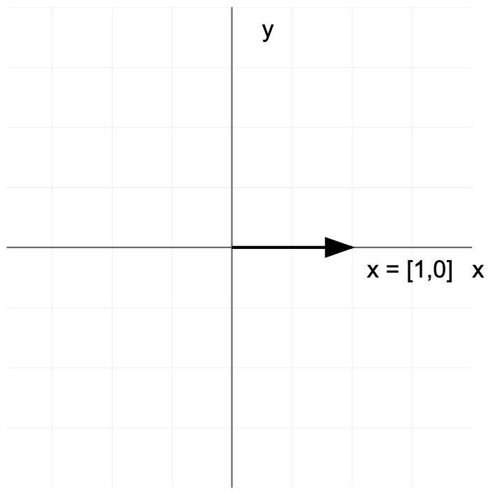

# Introduction

### **1. Understanding Linear Mappings Between Vector Spaces**

#### **Definition**

A **linear transformation** is a mapping between two vector spaces that preserves vector addition and scalar multiplication. In simple terms, linear transformations ensure that the structure of a vector space is maintained during the mapping.

Mathematically, a function $$T:V→W$$ between two vector spaces $$V$$ and $$W$$ (over the same field, such as real numbers $$\mathbb{R}$$) that satisfies two main properties::

1. **Additivity** (preserves vector addition):\
   \
   $$T(u + v) = T(u) + T(v), \quad \forall u, v \in V$$.\\
2. **Homogeneity** (preserves scalar multiplication):\
   \
   $$T(c u) = c T(u), \quad \forall c \in \mathbb{R}, u \in V.$$

These two properties ensure that a linear transformation maintains the "linear structure" of a vector space, such as straight lines, scalar multiples, and sums.

#### **Matrix Representation of Linear Transformations**

Any linear transformation $$T: \mathbb{R}^n \to \mathbb{R}^m$$ can be represented as a matrix $$A \in \mathbb{R}^{m \times n}$$:

$$T(x) = Ax,$$

where $$\mathbf{x} \in \mathbb{R}^n$$ n is the input vector, and $$𝐴$$ is the transformation matrix.

***

#### **Example 1:**

If $$T: \mathbb{R}^2 \to \mathbb{R}^2$$ is defined as $$T\left( \begin{bmatrix} x \\ y \end{bmatrix} \right) = \begin{bmatrix} 2x \\ 3y \end{bmatrix}$$

it is a linear transformation because it satisfies both vector addition and scalar multiplication.

#### **Example 2:**

(Simple Scaling Transformation)

If $$T: \mathbb{R}^2 \to \mathbb{R}^2$$ scales a vector $$\mathbf{x} = \begin{bmatrix} x \\ y \end{bmatrix}$$, then: $$T\left( \begin{bmatrix} x \\ y \end{bmatrix} \right) = \begin{bmatrix} 2x \\ 3y \end{bmatrix}$$

For $$\mathbf{x} = \begin{bmatrix} 1 \\ 2 \end{bmatrix}$$, the output is: $$T\left( \begin{bmatrix} 1 \\ 2 \end{bmatrix} \right) = \begin{bmatrix} 2 \cdot 1 \\ 3 \cdot 2 \end{bmatrix} = \begin{bmatrix} 2 \\ 6 \end{bmatrix}$$

**Visualization of a Scaling Transformation**

Scaling transforms a square grid, stretching it vertically and horizontally:

<table><thead><tr><th width="383" align="center">Original Grid</th><th align="center">Scaled Grid (2x, 3y)</th></tr></thead><tbody><tr><td align="center"></td><td align="center"></td></tr></tbody></table>

<details>

<summary>Step by step explanation</summary>

1. Original Grid:
   * A standard coordinate system with equal spacing
   * The point (1,2) marked in red
   * Grid lines for reference

2) Scaled Grid:
   * The same coordinate system after applying the transformation
   * The transformed point (2,6) marked in blue
   * Grid lines showing the scaling effect (2x horizontal, 3y vertical)
   * Reference axes remaining in original position

You can clearly see how the transformation stretches the grid, with:

* Horizontal spacing doubled (2x scaling in x-direction)
* Vertical spacing tripled (3y scaling in y-direction)

The example point moves from (1,2) to (2,6), demonstrating how the transformation affects individual points in the space.

</details>

\
**Example 3:**

Let $$T: \mathbb{R}^2 \to \mathbb{R}^2$$ be defined as: $$T\left( \begin{bmatrix} x \\ y \end{bmatrix} \right) = \begin{bmatrix} 3x + 2y \\ -x + 4y \end{bmatrix}.$$

This transformation can be expressed using a matrix: $$A = \begin{bmatrix} 3 & 2 \\ -1 & 4 \end{bmatrix}.$$

Given , the transformation is:

$$T(x) = Ax = \begin{bmatrix} 3 & 2 \\ -1 & 4 \end{bmatrix} \begin{bmatrix} 1 \\ 2 \end{bmatrix}$$

Perform the multiplication:

$$T(x) = \begin{bmatrix} 3(1) + 2(2) \\ -1(1) + 4(2) \end{bmatrix} = \begin{bmatrix} 7 \\ 7 \end{bmatrix}.$$

#### **Visualization of the Transformation**

<table><thead><tr><th width="391" align="center">Original Vector</th><th align="center">Transformed Vector</th></tr></thead><tbody><tr><td align="center"></td><td align="center"></td></tr></tbody></table>

The original grid is distorted based on the transformation matrix $$A$$, stretching and rotating the space.

<details>

<summary>Step by step explanation</summary>

Let's start with the given transformation matrix A and walk through how it transforms \[1, 2] to \[7, 7].

1.  The transformation matrix A is:

    ```
    A = [3  2]
        [-1 4]
    ```
2.  When we multiply matrix A by vector \[1, 2], we get:

    ```
    [3  2] [1] = [3(1) + 2(2)]
    [-1 4] [2]   [-1(1) + 4(2)]
    ```
3. Let's calculate each component:
   * First component (x-coordinate):
     * 3(1) + 2(2)
     * \= 3 + 4
     * \= 7
   * Second component (y-coordinate):
     * -1(1) + 4(2)
     * \= -1 + 8
     * \= 7
4.  Therefore:

    ```
    A[1] = [7]
     [2]   [7]
    ```

This shows how the linear transformation A maps the vector \[1, 2] to \[7, 7]. The transformation stretches and rotates the original vector in such a way that the resulting vector has coordinates \[7, 7].

</details>

***

### **2. Mathematical Properties of Linear Transformations**

A linear transformation $$T: \mathbb{R}^n \to \mathbb{R}^m$$ has the following properties:

1. **Zero Vector Mapping**:\
   The zero vector in $$V$$ always maps to the zero vector in $$W$$:\
   \
   $$T(0) = 0$$\\
2. **Preservation of Linear Combinations**:\
   For vectors $$u, v \in V$$ and scalars $$a, b \in \mathbb{R}$$:\
   \
   $$T(au + bv) = aT(u) + bT(v)$$\\
3. **Kernel (Null Space)**:\
   The set of all vectors that map to the zero vector:\
   \
   $$\text{Ker}(T) = \{ x \in V : T(x) = 0 \}$$\\
4. **Image (Range)**:\
   The set of all vectors in $$W$$ that are outputs of $$T$$:\
   \
   $$\text{Im}(T) = \{ T(x) : x \in V \}$$

### **3. Geometric Interpretation**

* **Scaling** stretches or compresses vectors.
* **Rotation** changes the direction of vectors.
* **Reflection** mirrors vectors across an axis.

#### **Visualization**

Below are visualizations of common transformations:

<table><thead><tr><th width="261" align="center">Scaling Transformation</th><th width="240" align="center">Rotation Transformation</th><th align="center">Reflection Transformation</th></tr></thead><tbody><tr><td align="center"></td><td align="center"></td><td align="center"></td></tr></tbody></table>

### **4. Application of Matrices in Transforming Data**

Linear transformations can be efficiently represented as **matrix multiplications**. For a transformation $$T$$ represented by matrix $$A$$:

$$T(x) = Ax$$

***

#### **Example 1:**

The rotation matrix rotates vectors by an angle $$\theta$$:

$$A = \begin{bmatrix} \cos\theta & -\sin\theta \\ \sin\theta & \cos\theta \end{bmatrix}$$

For $$\theta = 90^\circ$$:

$$A = \begin{bmatrix} 0 & -1 \\ 1 & 0 \end{bmatrix}$$

Rotating $$x = \begin{bmatrix} 1 \\ 0 \end{bmatrix}$$:

$$Ax = \begin{bmatrix} 0 & -1 \\ 1 & 0 \end{bmatrix} \begin{bmatrix} 1 \\ 0 \end{bmatrix} = \begin{bmatrix} 0 \\ 1 \end{bmatrix}$$

<table><thead><tr><th width="386" align="center">Original Grid</th><th align="center">Rotated Grid (90°)</th></tr></thead><tbody><tr><td align="center"></td><td align="center"></td></tr></tbody></table>
