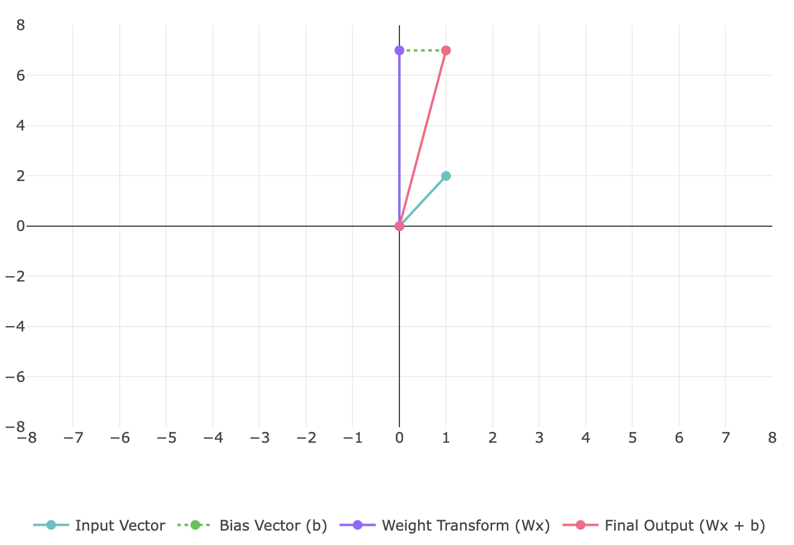

# LT with PHP

In addition in PHP it can be written as a class **LinearTransformation** with implementation of a set of linear transformation operations.

<details>

<summary>Example of Class <strong>LinearTransformation</strong></summary>

```php
class LinearTransformation {
    private $matrix;
    private $rows;
    private $cols;

    /**
     * Constructor to initialize the transformation matrix
     * @param array $matrix The transformation matrix
     * @throws InvalidArgumentException If matrix is invalid
     */
    public function __construct(array $matrix) {
        if (!$this->isValidMatrix($matrix)) {
            throw new InvalidArgumentException("Invalid matrix: all rows must have same length");
        }
        $this->matrix = $matrix;
        $this->rows = count($matrix);
        $this->cols = count($matrix[0]);
    }

    /**
     * Apply the linear transformation to a vector
     * @param array $vector The input vector
     * @return array The transformed vector
     * @throws InvalidArgumentException If vector dimension doesn't match matrix columns
     */
    public function transform(array $vector): array {
        if (count($vector) !== $this->cols) {
            throw new InvalidArgumentException(
                "Vector dimension ({$this->cols}) must match matrix columns ({$this->cols})"
            );
        }

        $result = [];
        for ($i = 0; $i < $this->rows; $i++) {
            $sum = 0;
            for ($j = 0; $j < $this->cols; $j++) {
                $sum += $this->matrix[$i][$j] * $vector[$j];
            }
            $result[] = $sum;
        }
        return $result;
    }

    /**
     * Apply linear transformation with weights and bias: y = Wx + b
     * @param array $input The input vector
     * @param array $bias The bias vector
     * @return array The transformed vector with bias added
     * @throws InvalidArgumentException If dimensions don't match
     */
    public function linearLayer(array $input, array $bias): array {
        // First validate that bias vector length matches number of rows
        if (count($bias) !== $this->rows) {
            throw new InvalidArgumentException(
                "Bias dimension must match matrix rows"
            );
        }

        // Use existing transform method to compute Wx
        $transformed = $this->transform($input);

        // Add bias to each element: Wx + b
        $result = [];
        for ($i = 0; $i < $this->rows; $i++) {
            $result[] = $transformed[$i] + $bias[$i];
        }

        return $result;
    }

    /**
     * Apply ReLU activation function to a vector
     * @param array $vector Input vector
     * @return array Vector with ReLU activation applied
     */
    public function relu(array $vector): array {
        return array_map(function($v) {
            return max(0, $v);
        }, $vector);
    }

    /**
     * Static method to perform linear transformation with weights and bias: y = Wx + b
     * @param array $weights The weight matrix W
     * @param array $bias The bias vector b
     * @param array $input The input vector x
     * @return array The transformed vector
     * @throws InvalidArgumentException If dimensions don't match
     */
    public function linearTransform(array $weights, array $bias, array $input): array {
        // Use existing linearLayer method
        return $this->linearLayer($input, $bias);
    }

    /**
     * Get the transformation matrix
     * @return array The transformation matrix
     */
    public function getMatrix(): array {
        return $this->matrix;
    }

    /**
     * Get matrix dimensions
     * @return array [rows, columns]
     */
    public function getDimensions(): array {
        return [$this->rows, $this->cols];
    }

    /**
     * Validate if the matrix has consistent dimensions
     * @param array $matrix Matrix to validate
     * @return bool True if valid, false otherwise
     */
    private function isValidMatrix(array $matrix): bool {
        if (empty($matrix) || !is_array($matrix[0])) return false;

        $columnCount = count($matrix[0]);
        foreach ($matrix as $row) {
            if (!is_array($row) || count($row) !== $columnCount) {
                return false;
            }
        }
        return true;
    }
}
```

</details>


To try this code yourself, install the example files from the official GitHub repository: [https://github.com/apphp/ai-with-php-examples](https://github.com/apphp/ai-with-php-examples)


Below there are some examples of linear transformation, implemented with PHP.

### 1. **Application of Matrices in Transforming Data**

#### Example: Scale Transformation

Here, the matrix $$A = \begin{bmatrix} 2 & 0 \\ 0 & 3 \end{bmatrix}$$ scales x-coordinate by 2 and y-coordinate by 3.

```php
// Example 1: 2x2 matrix (scale transformation)
$transformMatrix = [
    [2, 0],
    [0, 3]
];

$vector2D = [1, 2];

$transformation2D = new LinearTransformation($transformMatrix);
$result2D = $transformation2D->transform($vector2D);

echo "2D Transformation Result: [" . implode(", ", $result2D) . "]\n";
```

**Output:**

```
2D Transformation Result: [2, 6]
```

**Result Visualization**:

<div align="left"><figure><figcaption></figcaption></figure></div>

### 2. Linear Transformations in Neural Networks

In neural networks, linear transformations are represented as: $$𝑦 = 𝑊 𝑥 + 𝑏$$.\
Here, $$W$$ is a weight matrix, $$x$$ is the input, and $$b$$ is the bias vector.

#### Example: Simple Linear Layer

```php
// Example usage:
$weightMatrix = [[2, -1], [1, 3]];  // Weight matrix W
$inputVector = [1, 2];              // Input vector x
$bias = [1, 0];                     // Bias vector b

$linearTransform = new LinearTransformation($weightMatrix);
$result = $linearTransform->linearLayer($inputVector, $bias);

echo "Output after Linear Layer: [" . implode(", ", $result) . "]";
```

**Output:**

```
Output after Linear Layer: [1, 7]
```

**Result Visualization**:

<div align="left"><figure><figcaption></figcaption></figure></div>

### **3. Linear Transformations in Neural Networks**

In a neural network, each layer applies a linear transformation followed by an activation function: $$y=Wx+b$$.

Here:

* $$W$$ is the weight matrix, representing the linear transformation.
* $$x$$ is the input vector.
* $$b$$ is the bias vector.

#### **Example: Transformation in a Fully Connected Layer**

```php
// Example usage:
$weightMatrix = [[3, 2], [-1, 4]];  // Weight matrix W
$inputVector = [1, 2];              // Input vector x
$bias = [1, -2];                    // Bias vector b

$linearTransform = new LinearTransformation($weightMatrix);
$result = $linearTransform->linearTransform($weightMatrix, $bias, $inputVector);

echo "Output after Fully Connected Layer: [" . implode(", ", $result) . "]";
```

**Mathematical Representation**:

$$y = \begin{bmatrix} 3 & 2 \\ -1 & 4 \end{bmatrix} \begin{bmatrix} 1 \\ 2 \end{bmatrix} + \begin{bmatrix} 1 \\ -2 \end{bmatrix}$$

Performing the calculation: $$y = \begin{bmatrix} 7 \\ 7 \end{bmatrix} + \begin{bmatrix} 1 \\ -2 \end{bmatrix} = \begin{bmatrix} 8 \\ 5 \end{bmatrix}$$

**Output:**

```
Output after Fully Connected Layer: [8, 5]
```

**Result Visualization:**

### **4. Activation Functions and the Importance of Nonlinearities**

Linear transformations alone cannot solve complex, nonlinear problems. **Activation functions** like ReLU or Sigmoid introduce nonlinearity to the network.

#### **Example 4: ReLU Activation**

The ReLU function is defined as: $$ReLU(x)=max⁡(0,x)$$.

**PHP Code:**

```php
// Example usage:
$weightMatrix = [[-1, 2], [1, -2]];  // Weight matrix W
$inputVector = [5, 3];               // Input vector x
$bias = [-10, 2];                    // Bias vector b

// Example usage with values that will produce both positive and negative results
$transform = new LinearTransformation($weightMatrix);

// Apply linear transformation with bias
$linearResult = $transform->linearLayer($inputVector, $bias);

// Apply ReLU activation
$activated = $transform->relu($linearResult);

echo "Original values: [" . implode(", ", $linearResult) . "]\n";
echo "ReLU Output: [" . implode(", ", $activated) . "]";
```

**Output:**

```
Original values: [-9, 1]
ReLU Output: [0, 1]
```

**Result Visualization**:

<div align="left"><figure><figcaption></figcaption></figure></div>
