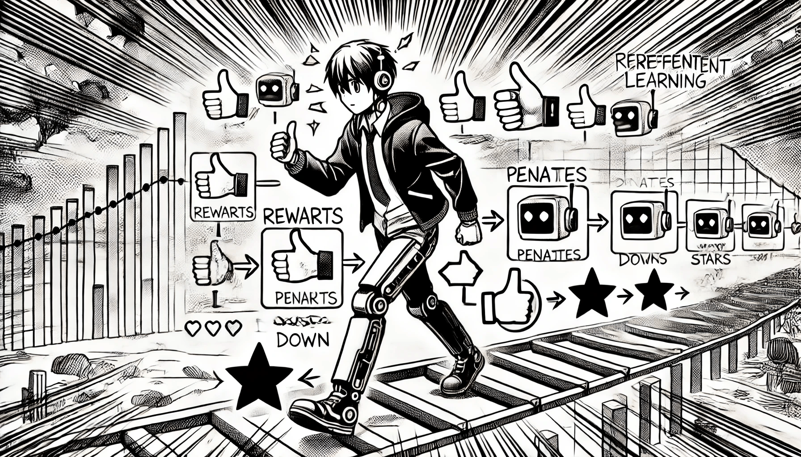

# Reinforcement Learning

Reinforcement learning (RL) involves an agent that interacts with an environment and learns to make decisions by receiving feedback in the form of rewards or penalties. The agent’s objective is to maximize cumulative rewards over time. This technique is widely used in game AI, robotics, and autonomous systems.

<figure><figcaption>
Reinforcement Learning
</figcaption></figure>

### Reinforcement Learning

Algorithms that learn through interactions with an environment, using rewards or penalties to improve behavior.

* Q-Learning
* SARSA (State-Action-Reward-State-Action)
* Deep Q-Networks (DQN)
* Policy Gradients
* Proximal Policy Optimization (PPO)
* Bayesian Q-Learning. (tasks: Optimal Decision-Making, Handling Uncertainty, Exploration vs. Exploitation, Adaptation to Changes )
* (In-context Reinforcement Learning
