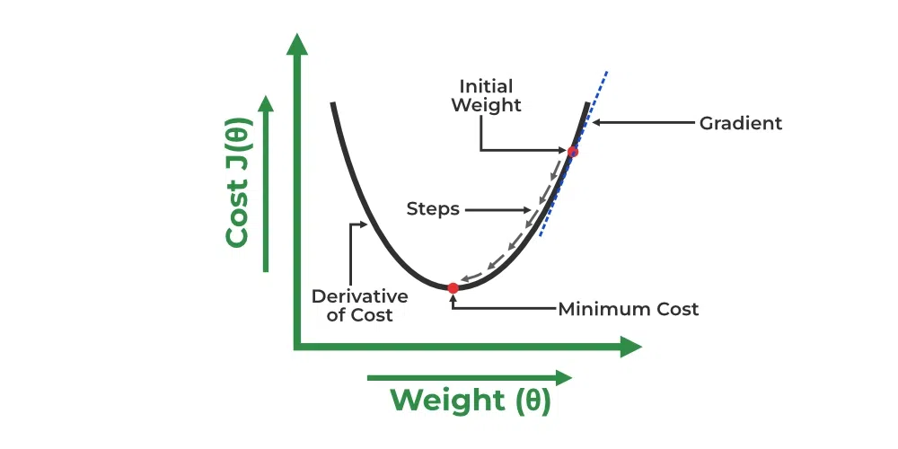

# Finding Best Fit Line

### What is the best Fit Line? 

Our primary objective while using linear regression is to locate the best-fit line, which implies that the error between the predicted and actual values should be kept to a minimum. There will be the least error in the best-fit line.

The best Fit Line equation provides a straight line that represents the relationship between the dependent and independent variables. The slope of the line indicates how much the dependent variable changes for a unit change in the independent variable(s).

<figure><figcaption></figcaption></figure>

Linear Regression

\
Here Y is called a dependent or target variable and X is called an independent variable also known as the predictor of Y. There are many types of functions or modules that can be used for regression. A linear function is the simplest type of function. Here, X may be a single feature or multiple features representing the problem.

Linear regression performs the task to predict a dependent variable value (y) based on a given independent variable (x)). Hence, the name is Linear Regression. In the figure above, X (input) is the work experience and Y (output) is the salary of a person. The regression line is the best-fit line for our model.

We utilize the cost function to compute the best values in order to get the best fit line since different values for weights or the coefficient of lines result in different regression lines.

#### **Hypothesis function in Linear Regression**

As we have assumed earlier that our independent feature is the experience i.e X and the respective salary Y is the dependent variable. Let’s assume there is a linear relationship between X and Y then the salary can be predicted using:

Y^=θ1+θ2XY^=θ1​+θ2​X

OR

y^i=θ1+θ2xiy^​i​=θ1​+θ2​xi​

Here,

* yiϵY(i=1,2,⋯,n) yi​ϵY(i=1,2,⋯,n) are labels to data (Supervised learning)
* xiϵX(i=1,2,⋯,n) xi​ϵX(i=1,2,⋯,n) are the input independent training data (univariate – one input variable(parameter))
* yi^ϵY^(i=1,2,⋯,n) yi​^​ϵY^(i=1,2,⋯,n) are the predicted values.

The model gets the best regression fit line by finding the best θ1 and θ2 values.

* **θ1:** intercept
* **θ2:** coefficient of x

Once we find the best θ1 and θ2 values, we get the best-fit line. So when we are finally using our model for prediction, it will predict the value of y for the input value of x.

#### **How to update θ1 and θ2 values to get the best-fit line?**

To achieve the best-fit regression line, the model aims to predict the target value Y^ Y^ such that the error difference between the predicted value Y^ Y^ and the true value Y is minimum. So, it is very important to update the θ1 and θ2 values, to reach the best value that minimizes the error between the predicted y value (pred) and the true y value (y).

minimize1n∑i=1n(yi^−yi)2minimizen1​∑i=1n​(yi​^​−yi​)2

### Cost function for Linear Regression 

The cost function or the loss function is nothing but the error or difference between the predicted value Y^ Y^ and the true value Y.

In Linear Regression, the **Mean Squared Error (MSE)** cost function is employed, which calculates the average of the squared errors between the predicted values y^iy^​i​ and the actual values yiyi​. The purpose is to determine the optimal values for the intercept θ1θ1​ and the coefficient of the input feature θ2θ2​ providing the best-fit line for the given data points. The linear equation expressing this relationship is y^i=θ1+θ2xiy^​i​=θ1​+θ2​xi​.

MSE function can be calculated as:

Cost function(J)=1n∑ni(yi^−yi)2Cost function(J)=n1​∑ni​(yi​^​−yi​)2

Utilizing the MSE function, the iterative process of gradient descent is applied to update the values of \θ1&θ2θ1​&θ2​. This ensures that the MSE value converges to the global minima, signifying the most accurate fit of the linear regression line to the dataset.

This process involves continuously adjusting the parameters \\(\theta\_1\\) and \\(\theta\_2\\) based on the gradients calculated from the MSE. The final result is a linear regression line that minimizes the overall squared differences between the predicted and actual values, providing an optimal representation of the underlying relationship in the data.

#### **Gradient Descent for Linear Regression**

A linear regression model can be trained using the optimization algorithm [gradient descent ](https://www.geeksforgeeks.org/gradient-descent-algorithm-and-its-variants/)by iteratively modifying the model’s parameters to reduce the[ mean squared error (MSE)](https://www.geeksforgeeks.org/python-mean-squared-error/) of the model on a training dataset. To update θ1 and θ2 values in order to reduce the Cost function (minimizing RMSE value) and achieve the best-fit line the model uses Gradient Descent. The idea is to start with random θ1 and θ2 values and then iteratively update the values, reaching minimum cost.

A gradient is nothing but a derivative that defines the effects on outputs of the function with a little bit of variation in inputs.

Let’s differentiate the cost function(J) with respect to θ1 θ1​

J’θ1=∂J(θ1,θ2)∂θ1=∂∂θ1\[1n(∑i=1n(y^i−yi)2)]=1n\[∑i=1n2(y^i−yi)(∂∂θ1(y^i−yi))]=1n\[∑i=1n2(y^i−yi)(∂∂θ1(θ1+θ2xi−yi))]=1n\[∑i=1n2(y^i−yi)(1+0−0)]=1n\[∑i=1n(y^i−yi)(2)]=2n∑i=1n(y^i−yi)J’θ1​​​=∂θ1​∂J(θ1​,θ2​)​=∂θ1​∂​\[n1​(i=1∑n​(y^​i​−yi​)2)]=n1​\[i=1∑n​2(y^​i​−yi​)(∂θ1​∂​(y^​i​−yi​))]=n1​\[i=1∑n​2(y^​i​−yi​)(∂θ1​∂​(θ1​+θ2​xi​−yi​))]=n1​\[i=1∑n​2(y^​i​−yi​)(1+0−0)]=n1​\[i=1∑n​(y^​i​−yi​)(2)]=n2​i=1∑n​(y^​i​−yi​)​

Let’s differentiate the cost function(J) with respect to θ2θ2​

J’θ2=∂J(θ1,θ2)∂θ2=∂∂θ2\[1n(∑i=1n(y^i−yi)2)]=1n\[∑i=1n2(y^i−yi)(∂∂θ2(y^i−yi))]=1n\[∑i=1n2(y^i−yi)(∂∂θ2(θ1+θ2xi−yi))]=1n\[∑i=1n2(y^i−yi)(0+xi−0)]=1n\[∑i=1n(y^i−yi)(2xi)]=2n∑i=1n(y^i−yi)⋅xiJ’θ2​​​=∂θ2​∂J(θ1​,θ2​)​=∂θ2​∂​\[n1​(i=1∑n​(y^​i​−yi​)2)]=n1​\[i=1∑n​2(y^​i​−yi​)(∂θ2​∂​(y^​i​−yi​))]=n1​\[i=1∑n​2(y^​i​−yi​)(∂θ2​∂​(θ1​+θ2​xi​−yi​))]=n1​\[i=1∑n​2(y^​i​−yi​)(0+xi​−0)]=n1​\[i=1∑n​(y^​i​−yi​)(2xi​)]=n2​i=1∑n​(y^​i​−yi​)⋅xi​​

Finding the coefficients of a linear equation that best fits the training data is the objective of linear regression. By moving in the direction of the Mean Squared Error negative gradient with respect to the coefficients, the coefficients can be changed. And the respective intercept and coefficient of X will be if α α is the learning rate.

<figure><figcaption></figcaption></figure>

Gradient Descent\
$$\theta_1 = \theta_1 - \alpha \left( \frac{1}{n} \sum_{i=1}^{n} ( \hat{y}_i - y_i ) \right) \theta_2 = \theta_2 - \alpha \left( \frac{1}{n} \sum_{i=1}^{n} ( \hat{y}_i - y_i ) \cdot x_i \right)$$\\

\\
