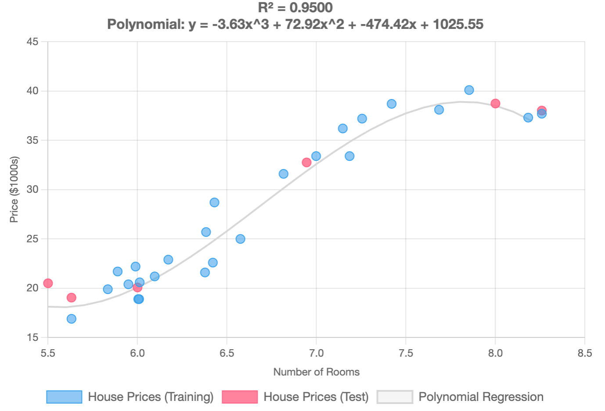

# Polynomial Regression

### Coding Polynomial Regression in PHP

Polynomial regression is an extension of linear regression that allows us to model nonlinear relationships between variables by adding polynomial terms to the predictor variables. In this article, we'll explore how to implement polynomial regression in PHP using two popular machine learning libraries: **RubixML** and **PHP-ML**.

***

### Implementing Polynomial Regression with Rubix ML

RubixML provides a powerful and flexible implementation of polynomial regression. Here's how to use it:

#### **Step 1: Prepare the Data**

```php
use Rubix\ML\Datasets\Labeled;
use Rubix\ML\Transformers\PolynomialExpander;
use Rubix\ML\Regressors\Ridge;

// Prepare your training data
$samples = [
    [6.575], [6.421], [7.185], [6.998], [7.147], [6.430], [6.012], [6.172],
    [5.631], [6.004], [6.377], [6.009], [5.889], [5.949], [6.096], [5.834],
    [5.989], [8.259], [8.183], [7.853], [7.255], [6.383], [6.816], [7.420],
    [7.685],
];

$labels = [
    25.0, 22.6, 33.4, 33.4, 36.2, 28.7, 20.6, 22.9, 16.9, 18.9, 21.6,
    18.9, 21.7, 20.4, 21.2, 19.9, 22.2, 37.7, 37.3, 40.1, 37.2, 25.7,
    31.6, 38.7, 38.1,
]; 

// Create a labeled dataset
$dataset = new Labeled($samples, $labels);
```

#### **Step 2:** Create a Polynomial Expander Transformer

Create a polynomial expander transformer. The argument '3' means we'll create cubing features $$x^3$$.\
Expands the dataset by adding polynomial terms to increase the model’s capacity to capture non-linear relationships.

```php
$expander = new PolynomialExpander(3);
```

#### **Step 3:** Create Model

Create the model. We use `Ridge` regression.

```php
$regression = new Ridge(0.00001);
```

#### **Step 4:** Transform the Features

This creates polynomial features from original data. This transformer expands features into higher-degree polynomial terms, allowing the model to capture non-linear relationships effectively. In this case, the degree is set to 3 to include cubed features.

```php
// Transform features using PolynomialExpander
$samplesTransformed = $samples;
$expander->transform($samples);
```

#### **Step 5:** Train the Model 

Ridge regression algorithm that introduces regularization to minimize overfitting by penalizing large coefficients. Smaller values increase regularization.

```php
$regression->train(new Labeled($samplesTransformed, $labels));
```

**Step 4: Make Predictions**

Create test data and predict their values.

```php
// Prepare test samples
$testSamples = [[5.5], [6], [8], [6.945], [5.631], [8.259]];

// Make predictions
$predictions = $regression->predict(new Unlabeled($testSamples));

print_r($predictions);
```

**Full Code:**

<details>

<summary>Full Code of Example</summary>

```php
use Rubix\ML\Datasets\Labeled;
use Rubix\ML\Datasets\Unlabeled;
use Rubix\ML\Extractors\CSV;
use Rubix\ML\Transformers\PolynomialExpander;
use Rubix\ML\Regressors\Ridge;

// Step 1: Prepare your training data
$samples = [
    [6.575], [6.421], [7.185], [6.998], [7.147], [6.430], [6.012], [6.172],
    [5.631], [6.004], [6.377], [6.009], [5.889], [5.949], [6.096], [5.834],
    [5.989], [8.259], [8.183], [7.853], [7.255], [6.383], [6.816], [7.420],
    [7.685],
];

$labels = [
    25.0, 22.6, 33.4, 33.4, 36.2, 28.7, 20.6, 22.9, 16.9, 18.9, 21.6,
    18.9, 21.7, 20.4, 21.2, 19.9, 22.2, 37.7, 37.3, 40.1, 37.2, 25.7,
    31.6, 38.7, 38.1,
];

// Step 2: Create a labeled dataset
$dataset = new Labeled($samples, $labels);

// Step 3: Create a polynomial expander transformer and normalizer
$expander = new PolynomialExpander(3);

// Step 4: Create the model
$regression = new Ridge(0.00001);

// Step 5: Transform and normalize the features
$samplesTransformed = $samples;
$expander->transform($samples);

// Step 6: Train the model
$regression->train(new Labeled($samplesTransformed, $labels));

// Step 7: Make predictions
$testSamples = [[5.5], [6], [8], [6.945], [5.631], [8.259]];

// Make predictions
$predictions = $regression->predict(new Unlabeled($testSamples));

print_r($predictions);
```

</details>

**Result:**

```
Price Predictions:
-----------------
A house with 5.5 rooms is predicted to cost $18,039.92
A house with 6.0 rooms is predicted to cost $20,395.93
A house with 8.0 rooms is predicted to cost $39,254.11
A house with 6.9 rooms is predicted to cost $32,370.76
A house with 5.6 rooms is predicted to cost $18,172.87
A house with 8.3 rooms is predicted to cost $37,258.75
```

**Chart:**

<div align="left"><figure><figcaption></figcaption></figure></div>

#### Key Features of RubixML Implementation:

1. **PolynomialExpander**: This transformer automatically creates polynomial features up to the specified degree.
2. **Ridge Regression**: Used instead of standard linear regression to prevent overfitting.
3. **Regularization**: A regression algorithm that incorporates L2 regularization (also known as Ridge Regression) to reduce the risk of overfitting and improve model generalization.
4. **Training Pipeline**: The workflow follows a structured pipeline where training data is first transformed (using PolynomialExpander) before training the model.

***

### Implementing Polynomial Regression with PHP-ML

PHP-ML offers a different approach to polynomial regression. Here's how to implement it:

<details>

<summary>Full Code of Example</summary>

```php
use Phpml\Dataset\CsvDataset;
use Phpml\Regression\LeastSquares;
use Phpml\Metric\Regression;
use Phpml\Preprocessing\Normalizer;
use Phpml\Math\Matrix;

// Prepare your training data
$samples = [
    [6.575], [6.421], [7.185], [6.998], [7.147], [6.430], [6.012], [6.172],
    [5.631], [6.004], [6.377], [6.009], [5.889], [5.949], [6.096], [5.834],
    [5.989], [8.259], [8.183], [7.853], [7.255], [6.383], [6.816], [7.420],
    [7.685],
];

$targets = [
    25.0, 22.6, 33.4, 33.4, 36.2, 28.7, 20.6, 22.9, 16.9, 18.9, 21.6,
    18.9, 21.7, 20.4, 21.2, 19.9, 22.2, 37.7, 37.3, 40.1, 37.2, 25.7,
    31.6, 38.7, 38.1,
]; 

// Create regression model
$regression = new LeastSquares();

// Polynomial expander - transform features to include squared and cubed terms
$samplesTransformed = array_map(function($sample) {
    return [
       $sample[0],           // original feature
       pow($sample[0], 2),   // squared feature
       pow($sample[0], 3)    // cubed feature
    ];
}, $samples);

// Train the model
echo "\nTraining model...\n";

// Train the model with original and squared features
$regression->train($samplesTransformed, $targets);

// Prepare test samples
$testSamples = [[5.5], [6], [8], [6.945], [5.631], [8.259]];

// Polynomial expander
$samplesTransformed = array_map(function($sample) {
    return [
       $sample[0],           // original feature
       pow($sample[0], 2),   // squared feature
       pow($sample[0], 3)    // cubed feature
    ];
}, $testSamples);

$predictions = $regression->predict($samplesTransformed);

print_r($predictions);
```

</details>

**Result:**

```
Price Predictions:
-----------------
A house with 5.5 rooms is predicted to cost $18,361.73
A house with 6.0 rooms is predicted to cost $20,378.35
A house with 8.0 rooms is predicted to cost $39,283.73
A house with 6.9 rooms is predicted to cost $32,376.76
A house with 5.6 rooms is predicted to cost $18,369.81
A house with 8.3 rooms is predicted to cost $37,143.58
```

#### Key Features of PHP-ML Implementation:

1. **PolynomialFeatures**: Transforms input features into polynomial features.
2. **LeastSquares**: Implements ordinary least squares regression.
3. **Simple API**: More straightforward API compared to RubixML.

***

### Conclusion

Both RubixML and PHP-ML provide robust implementations of polynomial regression, each with its own advantages. RubixML offers more advanced features and better scalability, while PHP-ML provides a simpler interface that's great for learning and smaller projects. Choose the library that best fits your specific needs, considering factors like dataset size, required features, and performance requirements.

Remember to always preprocess your data, validate your model's performance, and handle errors appropriately. With proper implementation, polynomial regression can be a powerful tool for modeling nonlinear relationships in your PHP applications.
