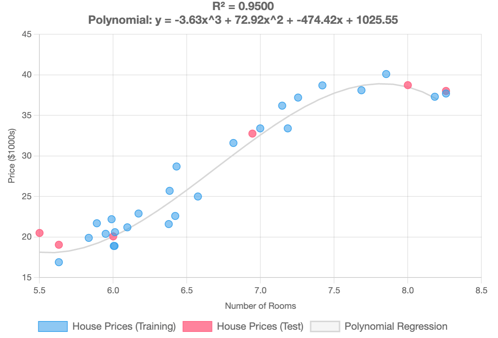

# Implementation in PHP

### Coding Polynomial Regression in PHP

Polynomial regression is an extension of linear regression that allows us to model nonlinear relationships between variables by adding polynomial terms to the predictor variables. In this article, we'll explore how to implement polynomial regression in PHP using two popular machine learning libraries: **RubixML** and **PHP-ML**.

***

### Implementing Polynomial Regression with Rubix ML

RubixML provides a powerful and flexible implementation of polynomial regression. Here's how to use it:

#### **Step 1: Prepare** training **data and c**reate dataset

```php
use Rubix\ML\Datasets\Labeled;
use Rubix\ML\Datasets\Unlabeled;
use Rubix\ML\Transformers\PolynomialExpander;
use Rubix\ML\Regressors\Ridge;

$samples = [
    [6.575], [6.421], [7.185], [6.998], [7.147], [6.430], [6.012], [6.172],
    [5.631], [6.004], [6.377], [6.009], [5.889], [5.949], [6.096], [5.834],
    [5.989], [8.259], [8.183], [7.853], [7.255], [6.383], [6.816], [7.420],
    [7.685],
];
$labels = [
    25.0, 22.6, 33.4, 33.4, 36.2, 28.7, 20.6, 22.9, 16.9, 18.9, 21.6,
    18.9, 21.7, 20.4, 21.2, 19.9, 22.2, 37.7, 37.3, 40.1, 37.2, 25.7,
    31.6, 38.7, 38.1,
];
$dataset = new Labeled($samples, $labels);
```

#### **Step 2:** Create a polynomial expander transformer and transform features

Create a polynomial expander transformer. The argument '3' means we'll create cubing features $$x^3$$.\
This transformer expands features into higher-degree polynomial terms, allowing the model to capture non-linear relationships effectively. In this case, the degree is set to 3 to include cubed features.m the features

```php
$expander = new PolynomialExpander(3);
$dataset->apply($expander);
```

#### **Step 3:** Create Model and train the model

Create the model. We use `Ridge` regression. Ridge regression algorithm introduces regularization to minimize overfitting by penalizing large coefficients. Smaller values increase regularization.

```php
$regression = new Ridge(0.00001);
$regression->train($dataset);
```

#### **Step 4:** Prepare test samples and create a unlabeled dataset

Prepare test sample for testing model prediction.

```php
$testSamples = [[5.5], [6], [8], [6.945], [5.631], [8.259]];
$testDataset = new Unlabeled($testSamples);
```

**Step 5: Make Predictions**

Predict values for testing samples.

```php
$testDataset->apply($expander);
$predictions = $regression->predict($testDataset);

print_r($predictions);
```

**Full Code:**

<details>

<summary>Full Code of Example</summary>

```php
use Rubix\ML\Datasets\Labeled;
use Rubix\ML\Datasets\Unlabeled;
use Rubix\ML\Transformers\PolynomialExpander;
use Rubix\ML\Regressors\Ridge;

// Step 1: Prepare your training data and create a labeled dataset
$samples = [
    [6.575], [6.421], [7.185], [6.998], [7.147], [6.430], [6.012], [6.172],
    [5.631], [6.004], [6.377], [6.009], [5.889], [5.949], [6.096], [5.834],
    [5.989], [8.259], [8.183], [7.853], [7.255], [6.383], [6.816], [7.420],
    [7.685],
];
$labels = [
    25.0, 22.6, 33.4, 33.4, 36.2, 28.7, 20.6, 22.9, 16.9, 18.9, 21.6,
    18.9, 21.7, 20.4, 21.2, 19.9, 22.2, 37.7, 37.3, 40.1, 37.2, 25.7,
    31.6, 38.7, 38.1,
];
$dataset = new Labeled($samples, $labels);

// Step 2: Create a polynomial expander transformer & transform the features
$expander = new PolynomialExpander(3);
$dataset->apply($expander);

// Step 3: Create the model and tran the model
$regression = new Ridge(0.00001);
$regression->train($dataset);

// Step 4: Prepare test samples and create a unlabeled dataset
$testSamples = [[5.5], [6], [8], [6.945], [5.631], [8.259]];
$testDataset = new Unlabeled($testSamples);

// Step 5: Make predictions
$testDataset->apply($expander);
$predictions = $regression->predict($testDataset);

print_r($predictions);
```

</details>

**Result:**

```
Price Predictions:
-----------------
A house with 5.5 rooms is predicted to cost $18,039.92
A house with 6.0 rooms is predicted to cost $20,395.93
A house with 8.0 rooms is predicted to cost $39,254.11
A house with 6.9 rooms is predicted to cost $32,370.76
A house with 5.6 rooms is predicted to cost $18,172.87
A house with 8.3 rooms is predicted to cost $37,258.75
```

**Chart:**

<div align="left"><figure><figcaption></figcaption></figure></div>

#### Key Features of RubixML Implementation:

1. **PolynomialExpander**: This transformer automatically creates polynomial features up to the specified degree.
2. **Ridge Regression**: Used instead of standard linear regression to prevent overfitting.
3. **Regularization**: A regression algorithm that incorporates L2 regularization (also known as Ridge Regression) to reduce the risk of overfitting and improve model generalization.
4. **Training Pipeline**: The workflow follows a structured pipeline where training data is first transformed (using PolynomialExpander) before training the model.

***

### Implementing Polynomial Regression with PHP-ML

PHP-ML offers a different approach to polynomial regression. Here's how to implement it:

<details>

<summary>Full Code of Example</summary>

```php
use Phpml\Dataset\CsvDataset;
use Phpml\Regression\LeastSquares;
use Phpml\Metric\Regression;
use Phpml\Preprocessing\Normalizer;
use Phpml\Math\Matrix;

// Step 1: Prepare your training data
$samples = [
    [6.575], [6.421], [7.185], [6.998], [7.147], [6.430], [6.012], [6.172],
    [5.631], [6.004], [6.377], [6.009], [5.889], [5.949], [6.096], [5.834],
    [5.989], [8.259], [8.183], [7.853], [7.255], [6.383], [6.816], [7.420],
    [7.685],
];

$targets = [
    25.0, 22.6, 33.4, 33.4, 36.2, 28.7, 20.6, 22.9, 16.9, 18.9, 21.6,
    18.9, 21.7, 20.4, 21.2, 19.9, 22.2, 37.7, 37.3, 40.1, 37.2, 25.7,
    31.6, 38.7, 38.1,
]; 

// Step 2: Polynomial expander. 
// Transform features to include squared and cubed terms
$samplesTransformed = array_map(function($sample) {
    return [
       $sample[0],           // original feature
       pow($sample[0], 2),   // squared feature
       pow($sample[0], 3)    // cubed feature
    ];
}, $samples);

// Step 3: Create regression model
$regression = new LeastSquares();

// Step 4: Train the model with original and squared features
$regression->train($samplesTransformed, $targets);

// Step 5: Prepare test samples
$testSamples = [[5.5], [6], [8], [6.945], [5.631], [8.259]];

// Step 6: Polynomial expander - transform samples
$samplesTransformed = array_map(function($sample) {
    return [
       $sample[0],           // original feature
       pow($sample[0], 2),   // squared feature
       pow($sample[0], 3)    // cubed feature
    ];
}, $testSamples);

// Step 7: Make predictions
$predictions = $regression->predict($samplesTransformed);

print_r($predictions);
```

</details>

**Result:**

```
Price Predictions:
-----------------
A house with 5.5 rooms is predicted to cost $18,361.73
A house with 6.0 rooms is predicted to cost $20,378.35
A house with 8.0 rooms is predicted to cost $39,283.73
A house with 6.9 rooms is predicted to cost $32,376.76
A house with 5.6 rooms is predicted to cost $18,369.81
A house with 8.3 rooms is predicted to cost $37,143.58
```

#### Key Features of PHP-ML Implementation:

1. **PolynomialFeatures**: Transforms input features into polynomial features.
2. **LeastSquares**: Implements ordinary least squares regression.
3. **Simple API**: More straightforward API compared to RubixML.

***

### Conclusion

Both RubixML and PHP-ML provide robust implementations of polynomial regression, each with its own advantages. RubixML offers more advanced features and better scalability, while PHP-ML provides a simpler interface that's great for learning and smaller projects. Choose the library that best fits your specific needs, considering factors like dataset size, required features, and performance requirements.

Remember to always preprocess your data, validate your model's performance, and handle errors appropriately. With proper implementation, polynomial regression can be a powerful tool for modeling nonlinear relationships in your PHP applications.


To try this code yourself, install the example files from the official GitHub repository: [https://github.com/apphp/ai-with-php-examples](https://github.com/apphp/ai-with-php-examples)

