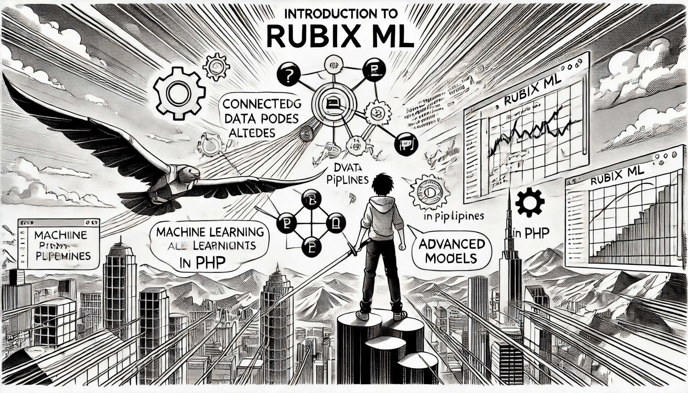

# Introduction to Rubix ML

## Introduction to Rubix ML

Rubix ML is a powerful machine learning library for PHP that provides a wide range of tools and algorithms for data analysis, predictive modeling, and machine learning tasks. This introduction will cover the basics of getting started with Rubix ML, its key components, and some considerations for its use.

Official documentation: [https://docs.rubixml.com/2.0/](https://docs.rubixml.com/2.0/)

<div align="left"><figure><figcaption><p>Introduction to Rubix ML</p></figcaption></figure></div>

### Installing and Configuring the Rubix ML Library

To install Rubix ML, you can use Composer, PHP's dependency management tool. Run the following command in your project directory:

```
composer require rubix/ml
```

After installation, you can include Rubix ML in your PHP scripts using Composer's autoloader:

```php
require 'vendor/autoload.php';
```

### Overview of Library Components

#### 1. Datasets

Datasets in Rubix ML are used to store and manipulate collections of samples and their corresponding labels (for supervised learning) or just samples (for unsupervised learning). The library provides several dataset types:

* Labeled: For supervised learning tasks
* Unlabeled: For unsupervised learning tasks
* Persistent: For working with large datasets that don't fit in memory

#### 2. Machine Learning Algorithms

Rubix ML offers a variety of machine learning algorithms, including:

* Classifiers (e.g., K Nearest Neighbors, Random Forest, Naive Bayes)
* Regressors (e.g., Regression Tree, Ridge, Lasso)
* Clusterers (e.g., K Means, DBSCAN, Gaussian Mixture)
* Anomaly Detectors (e.g., Isolation Forest, Local Outlier Factor)

#### 3. Metrics for Evaluating Models

The library provides several metrics for evaluating model performance:

* Classification metrics (e.g., Accuracy, F1 Score, Confusion Matrix)
* Regression metrics (e.g., Mean Squared Error, R-Squared)
* Clustering metrics (e.g., V Measure, Rand Index)

#### 4. Loading, Saving, and Reusing Trained Models

Rubix ML allows you to persist trained models to disk and load them later for predictions:

```php
use Rubix\ML\Persisters\Filesystem;

$persister = new Filesystem('model.rbx');
$persister->save($model);

// Later...
$model = $persister->load();
```

### Getting Started with Rubix ML

To start using Rubix ML, follow these steps:

1. Prepare your data: Load and preprocess your dataset.
2. Choose an algorithm: Select the appropriate algorithm for your task.
3. Train the model: Fit the model to your training data.
4. Evaluate performance: Use metrics to assess model performance.
5. Make predictions: Use the trained model to make predictions on new data.

Here's a simple example of training a K Nearest Neighbors classifier:

```php
use Rubix\ML\Classifiers\KNearestNeighbors;
use Rubix\ML\Datasets\Labeled;

// Prepare your data
$samples = [[1, 2, 3], [4, 5, 6], /* ... */];
$labels = ['A', 'B', /* ... */];
$dataset = new Labeled($samples, $labels);

// Create and train the model
$model = new KNearestNeighbors(3);
$model->train($dataset);

// Make predictions
$predictions = $model->predict($testDataset);
```

After training, you can make predictions on new data, evaluate the model, and even save it for reuse.

### Applications of Rubix ML

Rubix ML can be applied across a wide variety of domains, including:

* **Predictive Analytics**: Making data-driven predictions based on historical data.
* **Anomaly Detection**: Identifying unusual patterns in network data or user activity.
* **Recommendation Systems**: Providing personalized suggestions based on user preferences.
* **Customer Segmentation**: Grouping customers into distinct categories based on behavior.

### Limitations to Consider

Rubix ML is a powerful tool, but it has some limitations. First, it is designed specifically for PHP, which may not provide the same computational speed as lower-level languages like Python or C++. Additionally, while the library includes many popular algorithms, it may not have the depth of specialized models found in more mature machine learning frameworks. For extremely large datasets, you may find that PHP's memory limitations pose challenges.

### Conclusion

Rubix ML opens the door for PHP developers to build machine learning models with ease. Whether you are a seasoned data scientist or a developer exploring machine learning for the first time, Rubix ML's approachable interface and comprehensive feature set can help you bring AI into your projects. By understanding the library's components and practical uses, you can start creating intelligent applications today.
