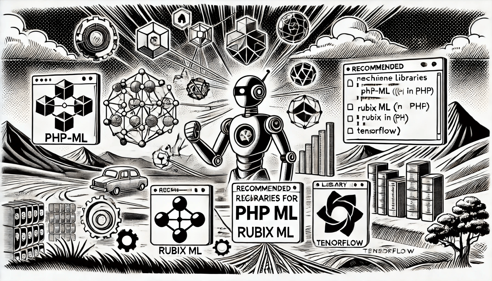

# Overview of ML Libraries in PHP

### Introduction

Machine learning has become an essential tool in modern software development, helping to build intelligent systems that can learn from data and make predictions. While languages like Python and R are typically associated with machine learning, PHP, a popular server-side scripting language, has also embraced machine learning capabilities. In recent years, several machine learning libraries have emerged in PHP, allowing developers to implement machine learning solutions without switching to a different programming language.

<figure><figcaption>
Overview of Machine Learning Libraries in PHP
</figcaption></figure>

### Why Use PHP for Machine Learning?

PHP is widely used for web development and powers a significant portion of the internet. Although PHP wasn't originally designed for machine learning, the availability of ML libraries in PHP makes it easier for web developers to integrate intelligent features, such as recommendation engines, predictive analytics, or data classification, directly into their web applications.

### Popular Machine Learning Libraries in PHP

#### **1. Rubix ML**

Official website: [https://rubixml.com](https://rubixml.com/)

Rubix ML is another powerful PHP library that is designed to be easy to use while still offering advanced machine learning capabilities. It supports a wide variety of supervised and unsupervised learning algorithms, including neural networks, decision trees, and clustering methods. Rubix ML is known for its flexibility and performance, making it suitable for production-level applications. It also provides tools for data transformation, pipelines, and model evaluation.

**2. PHP-ML (PHP Machine Learning Library)**

Official website: [https://php-ml.readthedocs.io](https://php-ml.readthedocs.io/) _(hasn't been updated for a long time)_

PHP-ML is one of the most comprehensive machine learning libraries for PHP. It provides a wide range of algorithms for classification, regression, clustering, and more. Some of the key features include:

* Algorithms such as Support Vector Machines (SVM), k-Nearest Neighbors (k-NN), and Naive Bayes.
* Data pre-processing tools like normalization and feature extraction.
* Cross-validation methods for evaluating model performance. This library is perfect for developers who need to add basic machine learning functionalities to their PHP applications without a deep understanding of ML.

### **PHP Mathematical** Libraries (for scientific computing)

#### 1. NumPower

Official website: [https://numpower.org](https://numpower.org/)

NumPower is a PHP extension designed for high-performance numerical computing (currently only for x86-64 (AVX2 instructions)), offering efficient multi-dimensional array operations and linear algebra functions, similar to Python's NumPy. It provides GPU acceleration through CUDA support, enabling parallel computations on NVIDIA GPUs, significantly enhancing performance for large-scale data processing and scientific computing tasks.

#### 2. MathPHP

Official website: [https://github.com/markrogoyski/math-php](https://github.com/markrogoyski/math-php)

Powerful Modern Math Library for PHP. The only library you need to integrate mathematical functions into your applications. It is a self-contained library in pure PHP with no external dependencies.

#### 3. RubixML/Tensor

Official website: [https://github.com/RubixML/Tensor](https://github.com/RubixML/Tensor)

The RubixML/Tensor library is a high-performance linear algebra extension for PHP, designed for efficient numerical computing. It provides fast, memory-optimized tensor and matrix operations, including element-wise arithmetic, decompositions, and transformations. Built with PHP’s native extensions and optimized for speed, Tensor enables developers to perform complex mathematical computations essential for machine learning and data science applications without relying on external dependencies like NumPy or BLAS.

#### 4. NumPHP

Official website: [https://numphp.org](https://numphp.org/) _(hasn't been updated for a long time)_

NumPHP is a PHP library for scientific computing, inspired by NumPy in Python. It provides multi-dimensional arrays and mathematical operations optimized for performance, making it easier to work with numerical data in PHP. With support for matrix operations, linear algebra, and statistical functions, NumPHP is particularly useful for developers working on data analysis, machine learning, and numerical computations in a PHP environment.

#### 5. SciPhp

Official website: [https://sciphp.org](https://sciphp.org/) _(hasn't been updated for a long time)_

SciPhp is a PHP library designed for scientific computing, providing a NumPy-like experience in PHP. It offers multi-dimensional arrays (ndarrays), along with mathematical, statistical, and linear algebra functions, making it easier to perform numerical computations within PHP applications.

### **PHP E**xtensions

#### 1. LibSVM (PHP Extension)

Official website: [https://github.com/ianbarber/php-svm](https://github.com/ianbarber/php-svm?tab=readme-ov-file)

A PHP wrapper for the LibSVM library, which provides support for Support Vector Machines (SVM). This extension allows PHP developers to use SVM for classification and regression tasks.

### **JavaScript with PHP Integration**

#### 1. TensorFlow.js **(for JavaScript with PHP Integration)**

Official website: [https://www.tensorflow.org](https://www.tensorflow.org/)

TensorFlow is one of the most popular machine learning libraries globally, but it is typically used with Python. However, there are ways to integrate TensorFlow models into PHP applications through APIs and bridges. For example, developers can use TensorFlow.js to run models in JavaScript on the client side and communicate with PHP for data processing. Although PHP does not natively support TensorFlow, using such workarounds makes it possible to leverage TensorFlow’s capabilities.

#### 2. **Brain.js (for JavaScript with PHP Integration)**

Official website: [https://brain.js.org](https://brain.js.org/)

While Brain.js is a JavaScript-based neural network library, it can be combined with PHP to enable machine learning on the client side. It’s useful for handling simple machine learning tasks directly in the browser, while PHP handles server-side operations.

### Benefits of Machine Learning in PHP

* **Seamless Web Integration**: Since PHP is predominantly used in web development, using PHP for machine learning allows for the direct integration of intelligent features into web applications without the need to switch languages.
* **Familiarity for Developers**: PHP developers can implement machine learning solutions without learning new programming languages, enabling them to build more sophisticated applications while staying within their comfort zone.
* **Server-Side Capabilities**: With PHP, you can handle machine learning operations on the server, offering more control over the data and results.

### Challenges and Limitations

While PHP has some useful machine learning libraries, it is still not as mature in this domain as Python or R. Many advanced tools and libraries available in Python, such as deep learning frameworks like TensorFlow and PyTorch, are more challenging to implement in PHP. Therefore, for more complex machine learning tasks, developers may still need to rely on other languages.

### Conclusion

Machine learning in PHP is no longer just a theoretical possibility. Libraries like Rubix ML and PHP-ML allow developers to incorporate intelligent features into their applications without leaving the PHP ecosystem. Although PHP may not be the first choice for machine learning, it offers a practical option for web developers who want to bring machine learning capabilities to their projects without switching languages.
