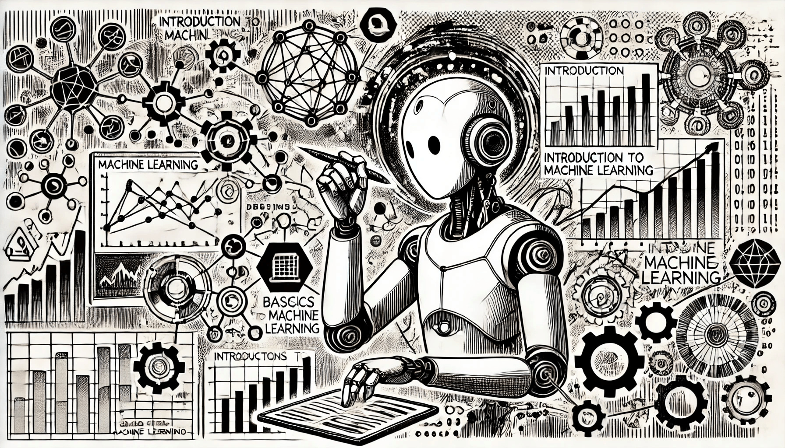

# Overview of ML

### Prerequisites

Before starting with machine learning, it's helpful to know a few basic concepts. Having a general understanding of what machine learning is and how it works will make it easier to understand the rest of the material.

<figure><figcaption>
Overview of ML
</figcaption></figure>

### What is Machine Learning?

In our daily lives, we learn from experience. For example, if we touch something hot, we learn not to do it again. But what about computers? Normally, computers follow the exact instructions we give them. But can they also learn from experience, just like we do? That’s where **machine learning (ML)** comes in.

Machine learning is a way to teach computers to learn from data and make decisions or predictions without being told what to do step by step. Instead of programming every action, we give the computer examples, and it figures out patterns on its own. After learning these patterns, the computer can then use them to make decisions with new information.

### The Difference Between Traditional Programming and Machine Learning

In Traditional Programming, we provide rules (logic written by programmers) and data (input examples), and the system produces answers (outputs). For example, if we write a program to calculate tax, we hardcode the tax rules and feed in income data — the program then outputs the tax amount.

In Machine Learning, the approach is reversed. We feed the system with data and answers (also called labeled examples), and the system learns the rules (a model). For instance, if we give a machine learning algorithm thousands of loan applications (data) along with whether they were approved or not (answers), it can learn the rules to predict loan approval.

This shift in paradigm is what allows machine learning to uncover patterns and make predictions without explicitly being programmed for every possible situation.

<figure><figcaption></figcaption></figure>

### Why Do We Need Machine Learning?

Machine learning is important because it helps us solve problems that are too complicated to handle manually. Humans can only process a limited amount of data, but machines can handle large amounts quickly and easily. This is where machine learning makes our life easier - it allows computers to process and learn from big data.

By giving computers lots of data to work with, they can explore, build models, and make predictions automatically. This not only saves our time but also reduces the costs of many activities, because machines can handle tasks that would take humans much longer to complete.

### Machine Learning and Deep Learning

These terms are often used interchangeably with artificial intelligence, but in reality, they are specific branches within the broader field.

* Machine Learning (ML) Machine learning is a branch of artificial intelligence that enables systems to learn and improve from experience without needing explicit programming. It’s similar to teaching a child by providing examples and allowing them to learn through experience rather than giving step-by-step instructions.
* Deep Learning (DL) Deep learning builds on machine learning by using neural networks—complex algorithmic structures that replicate how humans think and learn. It’s like trying to replicate the intricacy of the human brain’s processes on a computer.

### Why Machine Learning Matters?

Machine learning has become part of everyday life, even if we don’t always notice it. Here are some ways it’s being used:

* **Self-driving cars**: These cars learn to "see" the road, make decisions, and drive safely based on data from sensors and past experiences.
* **Fraud detection**: Financial systems use machine learning to spot unusual activity, like suspicious transactions, which could indicate fraud.
* **Face recognition**: Phones and security systems use machine learning to recognize faces and identify people.
* **Recommendations**: Websites like Netflix or Amazon use machine learning to suggest movies, shows, or products you might like based on what you’ve watched or bought before.
* **Virtual Personal Assistants:** Assistants Siri or Alexa can recognize your voice, understand your questions, and adapt to your preferences over time. These virtual assistants rely on a mix of artificial intelligence, machine learning, and deep learning to offer a personalized experience.

### Key Benefits of Machine Learning

Machine learning is valuable for several reasons. First, it helps us manage and understand the large amounts of data being produced every day. As data continues to grow rapidly, machine learning makes it possible to process and analyze it efficiently. It is also great at solving complex problems that are too difficult for humans to tackle manually.

In addition, machine learning improves decision-making across various industries, like finance, where quick and accurate decisions are important. Another key benefit is its ability to find hidden patterns in data, revealing insights that might not be obvious to humans. Overall, machine learning saves time, improves accuracy, and enhances how we work with information.

In general, machine learning is becoming essential because it helps computers learn from data, solve complex problems, and make decisions faster than humans can on their own.
