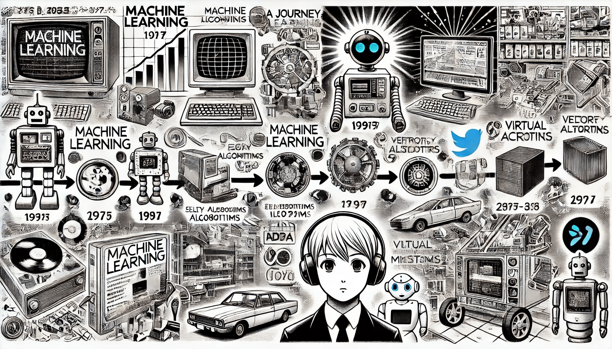

# History of ML

### Machine Learning: A Journey Through Time

Machine learning, which once seemed like something out of science fiction, has now become an integral part of our everyday lives. It is embedded in technologies like self-driving cars and virtual assistants like Amazon's Alexa, and it makes many aspects of our lives much easier.&#x20;

Although machine learning seems like a modern innovation, its fundamental ideas and developments have a long history. Below, we look at key milestones that have played an important role in the development of machine learning.

<figure><figcaption>
History of ML
</figcaption></figure>

