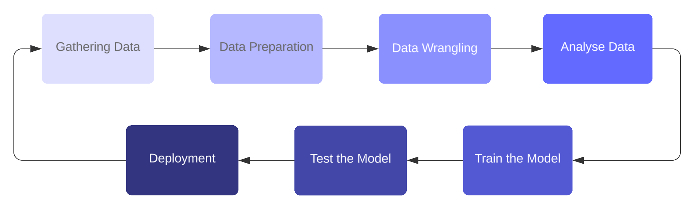

# Machine Learning Life Cycle

Let’s dive into the fascinating world of machine learning through its life cycle — a process that allows computers to learn on their own without being explicitly programmed. But how exactly does this magic happen? Think of it as a step-by-step journey that turns raw data into smart systems. The whole purpose of the machine learning life cycle is to find a solution to a problem by building an efficient model, much like crafting the perfect tool for a specific job.

<figure><figcaption>
Life Cycle of Machine Learning
</figcaption></figure>

Now, let’s break down the key stages in this journey:

### 1. Gathering Data: The Fuel of Machine Learning

Before we can teach a machine to learn, we need to feed it information — lots of it. Data is like the fuel for machine learning. We collect it from different sources: databases, files, websites, or even mobile devices. The more data we gather, the better the machine can make accurate predictions. But it’s not just about quantity—quality matters too!

### 2. Data Preparation: Organizing the Chaos

Once we’ve got the data, we need to get it ready for action. This stage is all about putting the data in the right place and making sure it’s in good shape. We mix things up, randomize the data, and start exploring it. This helps us understand the general trends, patterns, and any oddities in the data.

### 3. Data Wrangling: Cleaning It Up

Real-world data can be messy—missing values, duplicates, or irrelevant information. Data wrangling is like tidying up before a big event. We clean the data, pick the variables we actually need, and transform it into a format that’s ready for analysis. This ensures the model works with the best possible data.

### 4. Data Analysis: Building the Blueprint

With clean data in hand, it’s time to analyze it. At this stage, we choose which machine learning techniques to use, like classification or regression, depending on the problem we’re trying to solve. Think of it as building a blueprint for your machine learning model. You’re crafting the framework that will soon power the system.

### 5. Train the Model: The Learning Phase

Here’s where the magic happens! The model begins its training process. We feed the data into it and teach the system to recognize patterns, rules, and features. Just like a student learning from examples, the machine improves its understanding of how to handle similar problems in the future.

### 6. Test the Model: Time for a Quiz

Once the model is trained, we give it a test! We provide a fresh set of data to see how well it performs. Testing helps us measure the accuracy of the model, determining if it’s ready for the real world. If the model passes with flying colors, we know we’re on the right track.

### 7. Deployment: Putting the Model to Work

Finally, we reach the deployment phase—where the model is put to use in the real world. If everything is functioning as expected and delivering accurate results, the model is integrated into the actual system. This step is similar to presenting the final version of a project—everything needs to be polished and performing well.

Throughout the entire life cycle, the key to success is understanding the problem you’re trying to solve. Every decision, from gathering data to deploying the model, stems from a deep understanding of the challenge at hand. And that’s the heart of machine learning—combining data, technology, and insight to create systems that learn and adapt over time.

### Life Cycle Diagram

For better visualization find below a cycle diagram of Machine Learning Life Cycle

<figure><figcaption></figcaption></figure>

### Machine Learning Engineering Life Cycle

In addition let's review the life cycle of a machine learning project. The diagram below shows the complete process of machine learning engineering, beginning with a business task and ending with continuous model support. It starts when a business analyst defines a goal based on a specific task or problem. Once the goal is clear, data engineers and labelers step in to collect and prepare the necessary data, ensuring it’s clean and usable for training. From there, the data goes through feature engineering, where key attributes are selected or created to help the model learn effectively.

After the features are ready, the model is trained using the prepared data, and then evaluated by data analysts to check its performance. If the model performs well, it's deployed into a live environment by DevOps professionals. Once deployed, the model starts handling real-world requests and delivering predictions.

However, the process doesn’t end there. The model needs to be monitored over time to ensure it remains accurate and effective. If any issues are detected, or performance drops, the model enters the support phase, where it can be retrained, updated, or adjusted. Throughout the entire cycle, feedback loops allow teams to revisit earlier steps — like refining features or redefining the original goal — based on insights gained during later stages. This ongoing process helps maintain the quality and relevance of machine learning models in real-world applications.

<figure><figcaption></figcaption></figure>

