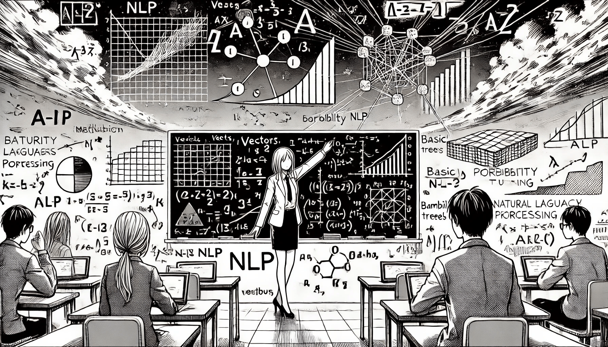

# Introduction to Mathematics for NLP

Behind all the algorithms, tools, and models used in NLP, there is a strong foundation of mathematics. If we want to build reliable and efficient NLP systems, we must understand the mathematical principles that guide them.

<figure><figcaption>
Introduction to Mathematics for NLP
</figcaption></figure>

This chapter will explain why mathematics is essential for NLP and give an overview of the main mathematical concepts used in the field. The goal is to help you feel more comfortable when you see mathematical formulas in NLP papers or work with machine learning libraries that require this knowledge.

### Why Mathematics is Essential for NLP

When we talk about understanding language, it might sound like something only humans can do. We learn words, grammar, and meaning naturally. However, computers need a different method. They can’t "understand" language the way people do, so we teach them to work with numbers. Mathematics gives us the tools to translate words into numbers, compare meanings, detect patterns, and build predictions.

Here are some examples where math is critical:

* Computers need to represent text using **vectors and matrices**.
* To understand relationships between words, we use **probability and statistics**.
* To improve models with data, we use **calculus and optimization**.
* To reduce data complexity, we use **linear algebra and dimensionality reduction**.

Without math, we could not build systems that can classify spam emails, translate text, or answer questions from users.

### From Words to Numbers: A Simple Example

Let’s say we have three words: cat, dog, and banana. We want a computer to know that cat and dog are more similar than banana. Using math, we can turn these words into vectors like this (it's a 2-dimensional word embeddings, just for example):

cat → \[0.10, 0.32]

dog → \[0.11, 0.31]

banana → \[0.80, 0.45]

Now we can use a formula called **cosine similarity** to check how close the word vectors are to each other. This is a key part of how search engines or recommendation systems work.

### Overview of Mathematical Concepts in NLP

Let’s look at the core mathematical areas used in NLP. You don’t need to be a mathematician, but having a good understanding of these concepts will help you understand how NLP models work and how to improve them.

#### **1. Linear Algebra**

Linear algebra is the study of vectors, matrices, and operations on them. In NLP, we often represent words and sentences as **vectors**. This is called word embedding. For example, the word "king" might be a vector like \[0.2, 0.8, -0.5, ...]. Each number in the vector represents a feature of the word.

For example, a sentence like "I love AI" may be turned into a matrix of word vectors. The model multiplies these with other matrices to calculate predictions.

If you’ve used tools like Word2Vec or BERT, you’ve already used linear algebra in practice.

**Matrices** are used to store multiple word vectors, sentences, or even entire documents. We use operations like matrix multiplication to find relationships between these elements. For example, when calculating attention in Transformer models, matrix operations are used.

#### **2. Probability and Statistics**

Natural language is full of uncertainty. We don’t always know exactly what a person means or which word will come next. That’s why probability is so important.

We don’t always say the same thing in the same way. Probability helps models decide what is _likely_ to happen next. For example, in the sentence:

> “She is going to the \_\_\_.”

A model might assign probabilities like this:

* park: 0.5
* store: 0.3
* moon: 0.01

This helps the model choose the most natural next word.

Statistics is used to find patterns in text — like how often words appear together. It also helps us evaluate model performance (e.g., accuracy, precision, recall).

We use probability to model the chance that one word follows another, or that a sentence is correct. For example, a language model like GPT predicts the most probable next word based on previous ones.

Statistics helps us understand how often words appear, how they are distributed, and what patterns are in our data. Techniques like **Bayes' Theorem** or **Markov Chains** are often used in older NLP systems and still appear in some tasks today.

#### **3. Calculus and Optimization**

To improve NLP models, we need to train them. Training means adjusting internal parameters so the model gives better answers. This process uses calculus, especially derivatives, to find where the model is wrong and how to fix it.

A method called gradient descent is used to minimize errors. It moves the model in the direction that reduces the difference between predicted and correct answers.

For instance, when training a sentiment analysis model, calculus helps the system slowly learn which words suggest "positive" or "negative" meaning.

#### **4. Discrete Mathematics and Combinatorics**

Language is made of symbols, characters, and words, which are discrete elements. That’s why discrete mathematics is important. It helps us analyze things like token frequency, permutations of words, and sentence structures.

It is used in tasks like:

* Syntax parsing (breaking down sentences into grammar trees)
* Tokenization (splitting text into words or subwords)
* Finite state machines (used in early NLP applications)

Combinatorics, the study of counting and arranging elements, is useful for calculating how many different sentence forms or grammar structures are possible. This is useful when designing algorithms that generate or correct sentences.

#### **5. Information Theory**

Information theory tells us how much information is in a message and how uncertain it is. Two key ideas are:

* **Entropy**: Measures how unpredictable a text is. High entropy means more surprise.
* **Mutual Information**: Measures how much knowing one word helps you predict another. For example, "New" and "York" have high mutual information because they often appear together.

These ideas help in building efficient language models and selecting the most useful features in a dataset.

### From Words to Numbers

One of the first steps in NLP is converting words into numbers. This is called **vectorization**. Simple methods like **one-hot encoding** assign a unique number to each word. More advanced techniques like **TF-IDF** and **word embeddings** (e.g., Word2Vec, GloVe, or FastText) use mathematical functions to find more meaningful representations of words based on their context.

Thanks to these techniques, computers can calculate how similar two words are (for example, “king” and “queen”), or how likely a sentence is correct in a specific language.

### Tools That Use Math for NLP

Modern NLP tools and libraries use all of the concepts above. For example:

* **Scikit-learn** applies statistics and vectorization in basic NLP tasks.
* **TensorFlow** and **PyTorch** use calculus and linear algebra to train deep learning models.
* **Hugging Face Transformers** apply these mathematical ideas in large pre-trained models like BERT or GPT.

When you use these tools, you are using mathematics behind the scenes — even if you don’t see it directly. There are also some specific tools for PHP and we'll review them later.

### A Quick Look at NLP Evolution

It is also helpful to know how the role of math in NLP has evolved over time:

* **Early NLP**: Rule-based, with very little math. Logic and grammar trees were hand-crafted.
* **Statistical NLP**: Introduced probability, Bayes’ theorem, and frequency models.
* **Modern NLP**: Uses machine learning, neural networks, and large-scale matrix operations.

With each stage, the use of mathematics became more important.

### The Role of Models and Learning

Mathematics also helps us define and train models that can "learn" from data. In supervised learning (e.g., classifying sentiment as positive or negative), we use **loss functions** to measure how wrong the model is and update it using **gradients**.

In deep learning-based NLP (like Transformers), many mathematical operations happen inside the model: matrix multiplication, normalization, softmax functions, and activation functions. All these require a basic understanding of math to know what the model is doing.

### Final Thoughts

Mathematics is the language that machines understand. If we want them to understand our language, we must use math to teach them. Whether you are building a chatbot, analyzing emotions in social media, or creating a machine translation tool, the principles of linear algebra, probability, and optimization will be behind the scenes.

As you move forward in NLP, take time to improve your mathematical thinking. Even a basic understanding of the topics we discussed will help you better understand models, interpret results, and become a stronger NLP developer or researcher.

In the next chapters, we will explore how these mathematical tools are used in real NLP tasks like text classification, language modeling, and sequence-to-sequence learning.
