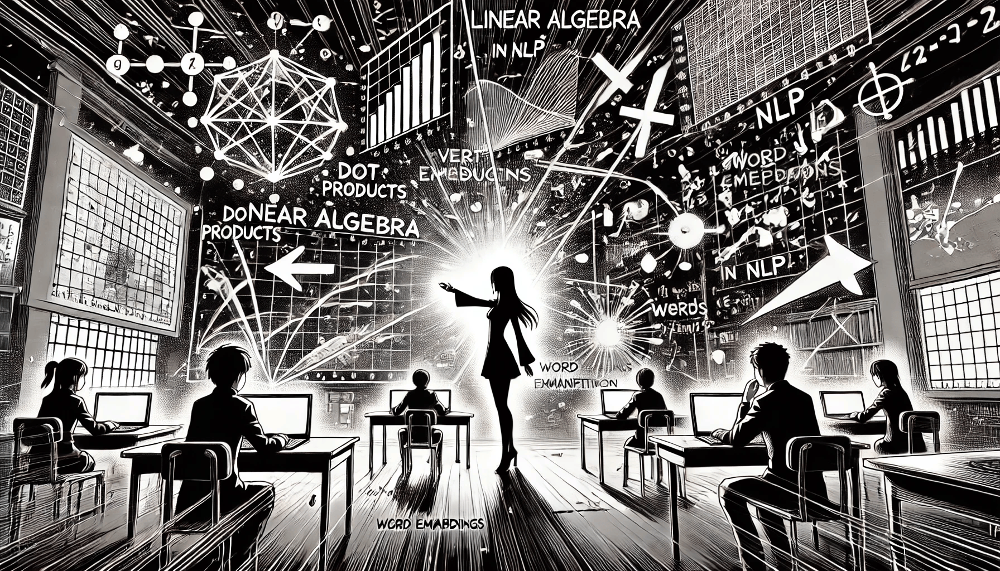

# Linear Algebra in NLP

Natural Language Processing helps computers understand human language by turning it into numbers. This transformation depends on **linear algebra**. Vectors, matrices, and operations like multiplication and decomposition allow computers to compare, cluster, classify, and even “understand” text.

<div align="left"><figure><figcaption><p>Linear Algebra in NLP</p></figcaption></figure></div>

This chapter explains how linear algebra powers important NLP techniques: **Singular Value Decomposition (SVD)**, **word embeddings** like **Word2Vec** and **GloVe**, and **Principal Component Analysis (PCA)**. You’ll also learn how to compare text using **cosine similarity**, and you'll see **real-world examples** of how each concept is used in practice.

### **Words as Vectors**

To use math on language, we must turn words into vectors. A common method is to create a **co-occurrence matrix**, where each cell represents how often two words appear near each other in a corpus.

**Example: Co-occurrence matrix from movie reviews**

|         | happy | sad | popcorn |
| ------- | ----- | --- | ------- |
| happy   | 0     | 2   | 3       |
| sad     | 2     | 0   | 1       |
| popcorn | 3     | 1   | 0       |

From this matrix, we can analyze which words appear in similar contexts and reduce the data using the techniques below.

### **Singular Value Decomposition (SVD)**

SVD is a mathematical technique used to factorize a matrix A into three parts:

$$
A=UΣV^T
$$

* $$U$$: Word-topic matrix (e.g., how strongly words relate to hidden topics)
* $$\Sigma$$: Diagonal matrix of strengths (singular values)
* $$V^T$$: Document-topic matrix (e.g., how documents relate to topics)

**Real Example: Search engine document ranking**

In a search engine, a query like "machine learning trends" may not match documents with different words like “AI developments” or “neural networks.” By applying **SVD** to the document-term matrix, the system identifies **latent topics** and can match related content even if exact words don't overlap.

**Pseudocode Example (PHP-style):**

```php
use Phpml\Decomposition\SVD;
use Phpml\FeatureExtraction\TokenCountVectorizer;
use Phpml\Tokenization\WhitespaceTokenizer;

$documents = [
    'I love NLP',
    'Natural Language Processing is amazing',
    'I study machine learning',
];

$vectorizer = new TokenCountVectorizer(new WhitespaceTokenizer());
$vectorizer->fit($documents);
$vectorizer->transform($documents);

$svd = new SVD(2);
$reducedMatrix = $svd->fitTransform($documents);
```

Now `$reducedMatrix` contains simplified vectors that retain semantic meaning and can be compared efficiently.

### **Word Embeddings: Word2Vec and GloVe**

Traditional word vectors are sparse and high-dimensional. Word embeddings solve this by learning **dense**, low-dimensional vectors that reflect meaning based on usage.

**Example: Word2Vec**

Given the sentence:\
&#xNAN;_"The king ruled the kingdom and the queen ruled the castle."_

**Word2Vec** will learn that "king" and "queen" appear in similar contexts, and place them near each other in vector space. It also learns that:

```php
$king = $model->getVector('king');
$man = $model->getVector('man');
$woman = $model->getVector('woman');

$guess = vector_add(vector_sub($king, $man), $woman);
// expect $guess ≈ vector for "queen"
```

_Assume `vector_add` and `vector_sub` are helper functions for vector arithmetic._

**Practical Use: Chatbots**

Chatbots use Word2Vec vectors to compare user input with known questions. For example, if a user says, "Tell me about banking services," and a FAQ contains "What services does the bank offer?", the similarity of word vectors helps the chatbot match the question even if it’s phrased differently.

**Example: GloVe**

GloVe builds a word-context matrix from global co-occurrence counts and factorizes it. This helps capture patterns like:

```
ice - cold ≈ steam - hot
```

Useful for **auto-tagging** content or enriching search results.

### **Cosine Similarity**

Cosine similarity measures how similar two vectors are, by computing the angle between them. It is defined as:

$$
\text{cosine\_similarity}(A, B) = \frac{A \cdot B}{||A|| \cdot ||B||}
$$

**Practical Use: Duplicate question detection**

On platforms like Stack Overflow or Quora, two users may ask the same question differently:

* "How do I train a neural net?"
* "What steps are needed to train a neural network?"

Even though the wording differs, cosine similarity between their vectors will be high, helping the system detect redundancy.

**Pseudocode Example (PHP-style):**

```php
function cosineSimilarity(array $vec1, array $vec2): float {
    $dot = 0;
    $norm1 = 0;
    $norm2 = 0;

    foreach ($vec1 as $i => $val) {
        $dot += $val * $vec2[$i];
        $norm1 += $val ** 2;
        $norm2 += $vec2[$i] ** 2;
    }

    return $dot / (sqrt($norm1) * sqrt($norm2));
}
```

This is useful in search engines, recommendation systems, and clustering.

### **Principal Component Analysis (PCA)**

PCA reduces data dimensionality by identifying the directions (principal components) where variance is highest. This is especially useful for simplifying or visualizing word embeddings.

**Real Example: Visualizing word embeddings**

If Word2Vec creates 300-dimensional vectors, PCA can reduce them to 2D:

```php
use Phpml\DimensionReduction\PCA;

$pca = new PCA(2);
$lowDim = $pca->fitTransform($vectors);

// Now plot $lowDim using any graph library (e.g., Chart.js or Plotly in frontend)
```

You’ll see clusters like:

* \["king", "queen", "prince", "princess"]
* \["car", "truck", "bus"]

**Other Uses:**

* Compressing document embeddings before classification
* Reducing training time
* Cleaning noisy data in NLP pipelines

#### **Limitations to Consider**

Even though these techniques are powerful, they are not perfect:

* **Word2Vec** and **GloVe** assign **one vector per word**, which ignores context. So "bank" (river vs. finance) always maps to the same vector.
* **PCA** only captures **linear patterns** and may not represent complex relationships.
* **SVD** can be computationally expensive on large corpora or matrices.

Newer models like **BERT** solve many of these problems by assigning **context-aware** vectors to words, but they still rely on fundamental linear algebra principles.

### **Conclusion**

Linear algebra is the backbone of modern NLP. It turns human language into vectors, which machines can process efficiently.

* **SVD** reveals hidden relationships by reducing matrix complexity.
* **Word2Vec** and **GloVe** create compact, meaningful word representations.
* **Cosine similarity** lets us compare and rank text.
* **PCA** reduces high-dimensional vectors for analysis and visualization.

These tools are used in translation systems, chatbots, email filtering, document search, and almost every real-world NLP application.

