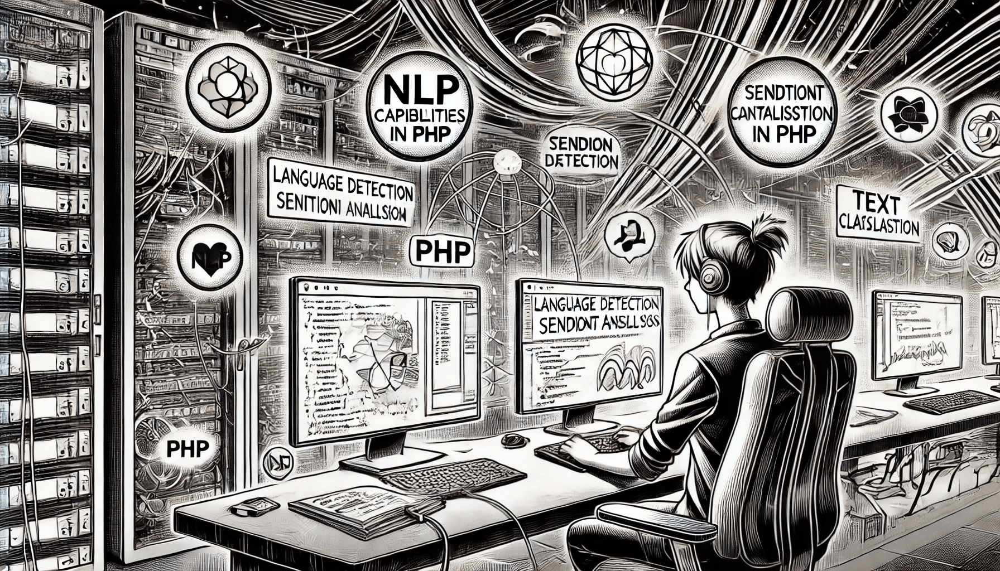

# NLP Capabilities in PHP

NLP plays a vital role in modern AI applications, powering everything from chatbots and sentiment analysis to language translation and text summarization. While languages like Python dominate the NLP and AI landscape due to their rich ecosystem of libraries, PHP is still widely used for web development and often finds itself needing to interact with or process natural language data — especially in content-heavy platforms, customer support systems, or email automation tools.

<figure><figcaption>
NLP Capabilities in PHP
</figcaption></figure>

This section explores how NLP can be approached using PHP. First, we provide an **overview of the most commonly used PHP NLP libraries**, including tools for tokenization, stemming, language detection, and sentiment analysis. Next, we examine the **challenges developers typically encounter** when implementing NLP solutions in PHP, such as limited community support, performance constraints, and integration with more powerful AI services. Finally, we look beyond the PHP ecosystem to highlight **other popular tools and services** — often accessed via APIs — that can supplement or replace native PHP NLP efforts, allowing developers to harness advanced NLP capabilities without switching languages entirely.

Whether you're maintaining a legacy systems or looking to enhance a web application with language intelligence, this section will guide you through your options and help you understand where PHP stands in the broader context of NLP.
