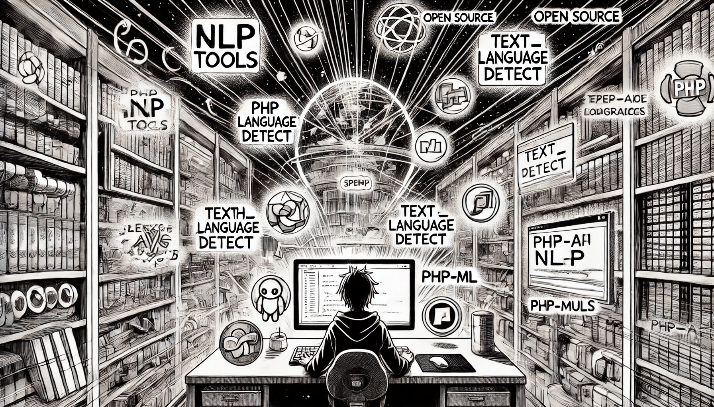

# Overview of NLP Libraries in PHP

Let's overview popular MLP libraries for PHP.

<figure><figcaption>
Overview of NLP Libraries in PHP
</figcaption></figure>

### 1. OpenAI Integrations for PHP

#### OpenAI PHP Client

Official website: [https://github.com/openai-php](https://github.com/openai-php)

One of the most powerful Natural Language Processing (NLP) libraries available for PHP developers is the **OpenAI PHP Client**. This library provides an easy-to-use interface for integrating OpenAI’s language models, including GPT-based models, into PHP applications. The OpenAI PHP Client is designed to simplify communication with OpenAI’s API.

#### OpenAI PHP Extension

Official website: [https://openai-php.com](https://openai-php.com/)

The OpenAI PHP is an extension that allows PHP developers to integrate the powerful capabilities of OpenAI into their applications. Activating the extension on the web server will allow users to quickly access the services offered by OpenAI without additional libraries in PHP.

### 2. General NLP/AI Frameworks for PHP

#### EasyAI-PHP

Official website: [https://github.com/HosonoDE/EasyAI-PHP](https://github.com/HosonoDE/EasyAI-PHP)

EasyAI-PHP is an open-source initiative designed to significantly simplify the entry into artificial intelligence for PHP-developers (so basically Lang-Chain for PHP). This project integrates advanced AI models and utilities, allowing developers to incorporate complex AI functionalities with minimal coding.

#### LLPhant

Official website: [https://github.com/theodo-group/LLPhant](https://github.com/theodo-group/LLPhant)

LLPhant - A comprehensive PHP Generative AI Framework

#### TransformersPHP

State-of-the-art Machine Learning for PHP. Run Transformers natively in your PHP projects

Official website: [https://codewithkyrian.github.io/transformers-php/](https://codewithkyrian.github.io/transformers-php/)

### **3. NLP Agent & Workflow Frameworks**

#### LLM Agents PHP SDK **(PHP LLM-based AI Agents Library)**

Official website: [https://github.com/llm-agents-php/agents](https://github.com/llm-agents-php/agents)

The **LLM Agents PHP SDK** is a robust PHP library designed to facilitate the creation and management of Language Model (LLM)-based agents. It offers a comprehensive framework that enables developers to build autonomous agents capable of performing complex tasks, making informed decisions, and interacting seamlessly with various tools and APIs.

* **Agent Creation:** Define and configure LLM-based agents with customizable behaviors.
* **Tool Integration:** Connect agents with various tools and APIs for extended functionality.
* **Memory Management:** Enable agents to retain and recall information for better context.
* **Prompt Handling:** Manage prompts efficiently to guide agent responses.
* **Extensible Architecture:** Easily add new agent types, tools, and capabilities.
* **Multi-Agent Support:** Allow multiple agents to collaborate on complex tasks.

### **4. NLP Utility Libraries**

#### DeepL-php (PHP client library for the DeepL API)

Official website: [https://github.com/DeepLcom/deepl-php](https://github.com/DeepLcom/deepl-php)

The DeepL API is a language translation API that allows other computer programs to send texts and documents to DeepL's servers and receive high-quality translations. This opens a whole universe of opportunities for developers: any translation product you can imagine can now be built on top of DeepL's best-in-class translation technology.


You may read more about how [Configure an Environment for PHP](../../machine-learning/ml-capabilities-in-php/configuring-an-environment-for-php/).

