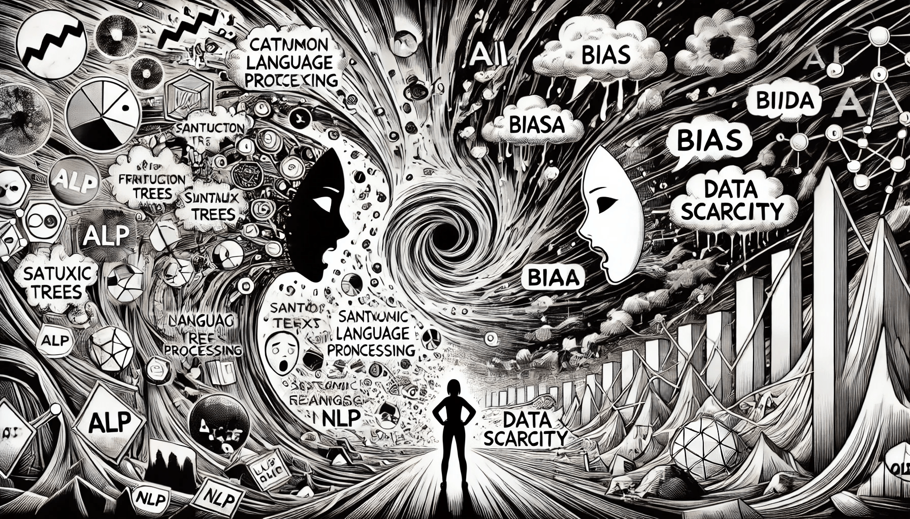

# Common Challenges in NLP

Despite great progress in recent years, building NLP systems remains complex. Language is rich, diverse, and often unpredictable — making it hard for machines to interpret with full accuracy.

This chapter explores the most common challenges in NLP. From ambiguity in meaning to privacy concerns, each obstacle requires a unique approach and continued innovation.

<figure><figcaption>
Common Challenges in NLP
</figcaption></figure>

### Ambiguity: One Word, Many Meanings

One of the most persistent challenges in NLP is ambiguity. Human language often allows multiple interpretations of the same word or phrase. For instance, the word _“bank”_ could mean a place to keep money or the side of a river. Similarly, the phrase _“I saw the man with the telescope”_ is unclear: did you use a telescope, or did the man have one?

Humans use background knowledge and context to resolve such confusion quickly. Machines, however, rely only on text patterns and probabilities. Even advanced language models like ChatGPT or Google Gemini can misunderstand intent if the wording is vague. Resolving ambiguity continues to be a major focus in NLP research and model training.

### Cultural and Linguistic Diversity

Languages are not only different in grammar and vocabulary — they also carry deep cultural meanings. A word that is common in one country might sound strange or even rude in another. For example, the expression “I’ll ping you” makes sense in tech communities, but may confuse someone unfamiliar with that jargon.

On top of this, many NLP tools are built primarily for a few dominant languages like English, Chinese, or Spanish. Support for regional dialects or minority languages is limited. This leads to unfair performance gaps between users.

> **Real-World Example:**\
> A chatbot designed for English-speaking users may fail to understand informal Indian English or Nigerian Pidgin, even though both are widely used. As a result, users may receive poor responses or no answers at all.

Addressing linguistic and cultural diversity requires training models on a wider range of languages and speaking styles. It also demands local expertise and ethical data collection.

### >>>>>> Understanding Context: Beyond the Words

Imagine you ask your digital assistant: _“Is it cold tomorrow?”_ Then follow up with _“What about Friday?”_ A human listener knows you’re still asking about the weather. But machines often treat each sentence as a new, separate request.

Context is vital for true language understanding. Without it, systems may give answers that are technically correct but feel irrelevant or robotic. Detecting sarcasm, humor, or emotion is even harder. When someone says, _“Yeah, great job,”_ the tone determines whether it’s sincere or sarcastic—something most NLP systems cannot reliably detect.

To improve, models need to remember previous interactions, track conversation history, and learn how meaning shifts based on tone and setting.

### Multilingual Processing

Many modern NLP applications are expected to support multiple languages out of the box. Services like Google Translate or Microsoft Azure Translator aim to handle dozens of languages with a single model. However, building a model that performs equally well across all languages is extremely challenging.

Languages with lots of digital content—like English or French—get better results because they provide more training data. In contrast, low-resource languages suffer from poor translation quality and limited understanding.

| **Language Type**                       | **Training Data Volume** | **Typical Model Accuracy** |
| --------------------------------------- | ------------------------ | -------------------------- |
| High-resource (e.g., English, Mandarin) | Extensive                | High                       |
| Low-resource (e.g., Amharic, Quechua)   | Limited                  | Low                        |

Even when a model is multilingual, it might “prefer” certain languages and ignore subtle rules or meanings in others. Researchers are exploring transfer learning and multilingual pre-training to narrow the gap, but performance remains uneven.

### Data Privacy: Language and Responsibility

NLP systems often process user data, especially in personal assistants, messaging apps, or help desk bots. This raises serious privacy concerns. A single text message might include names, locations, medical details, or passwords.

If sensitive data is collected or stored without protection, users are at risk. Misuse or leaks can damage both individuals and the reputation of the product.

> **Practical Measures to Ensure Privacy in NLP:**
>
> * Anonymizing or masking names and personal identifiers.
> * Using on-device processing instead of cloud storage.
> * Applying **differential privacy** to reduce data leakage during training.

Respecting privacy laws like GDPR or HIPAA is not optional—it’s a core responsibility in AI development.

### Bias and Fairness

Language reflects society, and that includes its biases. If the training data contains stereotypes or imbalanced representation, the model will likely reproduce them. This can lead to unfair treatment or harmful suggestions.

For example, a resume screening tool might associate engineering roles more often with male names, simply because historical data shows that pattern. This is not a technical bug—it’s a reflection of biased input.

Mitigating bias in NLP involves careful data selection, fairness testing, and frequent audits. Some researchers are also developing models that can explain why they made a decision, helping users spot unfair patterns.

### Noisy and Informal Language

Not all text follows grammar rules. On social media, in chat apps, or among teenagers, people often use slang, abbreviations, emojis, or typos. NLP models trained on formal texts like books or news articles may struggle with this type of input.

For example, someone might write:

> _“idk lol gonna crash ttyl 😴”_

Understanding this message requires both linguistic flexibility and cultural awareness. Preprocessing, text normalization, and training on informal data are essential to improve performance in real-world settings.

### Summary

Natural language is messy, emotional, and constantly evolving. Machines are getting better at understanding it, but many obstacles remain. These include:

* **Ambiguity**, where meaning is unclear without context.
* **Cultural diversity**, making it hard to support all languages fairly.
* **Context awareness**, which machines still lack in deep conversations.
* **Data privacy**, requiring secure and ethical handling of user text.
* **Bias**, which can lead to unfair or harmful outputs.
* **Noisy input**, common in social media and daily messaging.

Solving these challenges requires a mix of technical innovation, linguistic expertise, and ethical design. As NLP systems continue to evolve, their ability to understand—and respect—human language will define their success.
