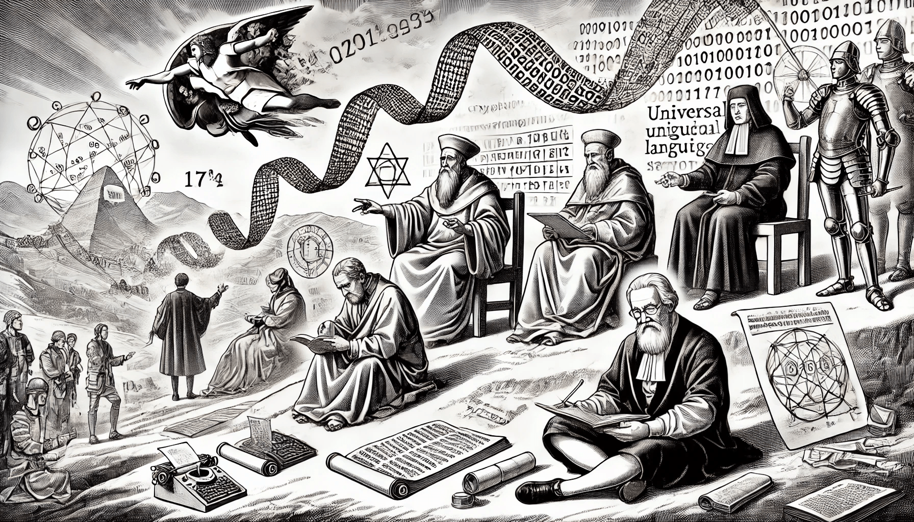

# History of NLP

The journey of Natural Language Processing (NLP) began long before computers, rooted in humanity's efforts to understand, analyze, and formalize language. Historical contributions from linguistics, logic, and mechanical innovation laid the groundwork for modern NLP systems.

<figure><figcaption>
History of NLP
</figcaption></figure>

**Ancient and Medieval Origins**

The formal study of language began with ancient scholars like Panini (4th century BCE), who created a comprehensive grammar for Sanskrit. His rule-based system influenced the development of computational grammars. In the medieval Islamic world, scholars like Al-Kindi pioneered frequency analysis in cryptography, a precursor to statistical methods in NLP. Meanwhile, the revival of Aristotelian logic by philosophers like Averroes and Thomas Aquinas emphasized structured reasoning, foundational for symbolic approaches in language processing.

**Renaissance and Enlightenment Advances**

The Renaissance and Enlightenment periods witnessed advancements in linguistics, logic, and mechanical devices. Antonio de Nebrija’s grammar of Spanish (1492) and Samuel Johnson’s English dictionary (1755) standardized languages, creating resources later used in text analysis. Philosophers like Leibniz envisioned universal languages and symbolic reasoning, foreshadowing computational models. Wolfgang von Kempelen’s speaking machine in the 18th century was an early attempt at speech synthesis, connecting mechanical innovation with language.

**Toward the Computational Era**

By the 19th century, these intellectual efforts converged with innovations in logic and computation, such as Boolean algebra and early automata. These breakthroughs directly influenced the 20th-century development of NLP, where the integration of linguistic principles and computational power transformed language into a domain that machines could process, analyze, and generate.

This rich historical tapestry underscores NLP's interdisciplinary roots and its evolution into a field that bridges language, mathematics, and technology.
