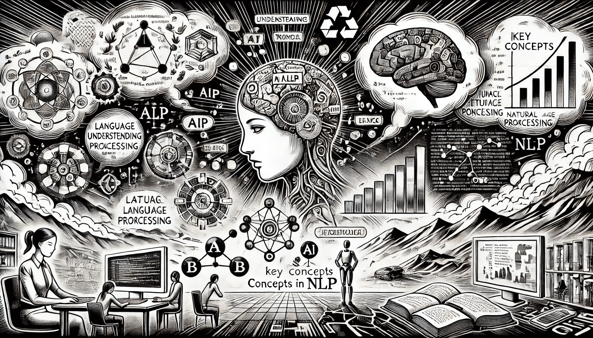

# Key Concepts in NLP

According to previous chapters we understood that NLP acts as a bridge between human communication and machine understanding. To build effective NLP systems, it is important to understand the basic steps and tools used to process language.

This chapter introduces the most important concepts in NLP in a way that is clear and practical.

<div align="left"><figure><figcaption><p>Key Concepts in NLP</p></figcaption></figure></div>

### NLP Pipeline Diagram

A typical NLP system follows a structured pipeline:

```
Raw Text
   ↓
Text Preprocessing
   ↓
Tokenization & Normalization
   ↓
POS Tagging
   ↓
NER / Parsing / Embeddings
   ↓
Application (e.g. sentiment analysis, translation, chatbot)
```

Each stage prepares the text for the next, turning messy raw input into structured data a machine can work with.

### Syntax vs. Semantics

To understand language, machines need to handle both **syntax** and **semantics**.

**Syntax** refers to the rules that determine the structure of sentences. It focuses on grammar — how words are ordered and connected. For example, “red car” is correct in English, while “car red” sounds unusual.

**Semantics** is about the meaning behind the words. A sentence like “The cloud ate the bicycle” is grammatically correct but does not make sense. So, while syntax tells us how a sentence is formed, semantics tells us whether it means something real or useful.

Both are necessary for full language understanding.

### Tokenization and Text Segmentation

To analyze text, NLP systems first break it down into smaller pieces called **tokens**. A token is usually a word, but it can also be a punctuation mark, number, or even a single character depending on the task.

**Tokenization** is the process of splitting text into these parts. For example:

> “NLP is powerful.”

is tokenized as:

> \[“NLP”, “is”, “powerful”, “.”]

For some languages like Chinese or Thai, words are not separated by spaces. In those cases, NLP tools perform **text segmentation** to decide where one word ends and another begins.

Tokenization and segmentation help systems understand text in manageable pieces.

### Text Normalization

Before analyzing the content of the text, it's helpful to **normalize** it. This means converting the text into a consistent and standard format.

Normalization often includes:

* Turning all letters into lowercase (e.g., “Apple” → “apple”)
* Removing punctuation and symbols
* Correcting spelling mistakes
* Expanding contractions (e.g., “don’t” → “do not”)
* Advanced normalization may also include converting numbers (“five” → 5) or replacing emojis with their text meanings (😊 → “smiling face”).

This step removes unnecessary variation and helps NLP models focus on the meaning of the words.

### Lemmatization and Stemming

Words often appear in different forms. For example: “run”, “running”, “ran”, and “runs” are all related.

**Stemming** is a quick method that removes endings to find a rough base form of a word. For instance, “running” might become “run”.

**Lemmatization** is more advanced. It uses grammar rules and dictionaries to return the true base form (called the _lemma_), like turning “was” into “be” or “better” into “good”.

Lemmatization is slower but more accurate. These tools help NLP models treat related word forms as one.

### Stop Words and Their Role

Many sentences include common words like “the”, “is”, “and”, or “in”. These are called **stop words**. On their own, they don’t add much meaning. For this reason, some NLP systems remove them to focus on more important content.

However, stop words are not always useless. In some cases — such as **sentiment analysis** or **question answering** — they can be important. For example, “not happy” is very different from “happy”.

Whether to remove stop words depends on the specific goal of the NLP task.

### Parts of Speech (POS) Tagging

After cleaning the text, it's important to understand the role each word plays. **Parts of Speech (POS) tagging** labels each word as a noun, verb, adjective, and so on.

For example, in:

> “The quick brown fox jumps.”

the tags would be:

* “quick” → adjective
* “fox” → noun
* “jumps” → verb

POS tagging helps machines understand grammar and sentence structure. It supports other tasks such as parsing, translation, and question answering.

### Named Entity Recognition (NER)

Some words in a sentence refer to specific things like names, places, or dates. **Named Entity Recognition (NER)** finds and labels these special terms.

For example:

> “Apple Inc. was founded by Steve Jobs in California.”

NER can identify:

* “Apple Inc.” as an organization
* “Steve Jobs” as a person
* “California” as a location

NER is used in:

* Chatbots to detect user names or locations
* Search engines to return better results
* Business tools to extract company names from documents

Advanced NER systems can also identify dates, monetary values, or product names.

This process helps machines find important facts in documents, news, or customer feedback.

### Parsing and Syntax Trees

Once we understand individual words and their roles, the next step is to understand how they connect. This is done using **parsing**.

Parsing creates a **syntax tree**, which shows the structure of a sentence and how words group into phrases. There are two main types:

* **Constituency parsing**: focuses on dividing a sentence into parts or phrases.
* **Dependency parsing**: focuses on how words relate to each other (like which word is the subject of a verb).

Parsing is essential for deeper tasks such as translation, summarization, or generating natural-sounding text.

For example, in:

> “The cat sat on the mat.”

Dependency parsing shows:

* “sat” is the main verb
* “cat” is the subject
* “on” links to “mat”

This is crucial in translation, grammar checking, or summarization.

### Word Embeddings and Meaning

Understanding words individually is not enough. NLP models also need to understand **how words relate** to each other. This is done using **word embeddings**.

Word embeddings turn words into numbers (vectors) in a space where similar meanings are close together. For example, “king” and “queen” or “Paris” and “France” will have similar positions.

Popular methods include Word2Vec, GloVe, and modern models like BERT. These embeddings help systems understand context and meaning more accurately.

### Context and Ambiguity

One of the biggest challenges in NLP is **ambiguity** — words that have more than one meaning. For example, the word “bank” could mean:

* A financial institution
* The side of a river

Example:

* “He sat by the bank to fish.”\
  → Likely means a riverbank
* “He deposited cash at the bank.”\
  → Financial institution

The correct meaning depends on context. Advanced models like BERT, RoBERTa or GPT are trained to understand context and reduce this kind of confusion. This is important for tasks like translation, chatbot conversations, or document summarization.

### Summary and Next Steps

In this chapter, we explored the key ideas of Natural Language Processing. We started with how language is broken into parts using tokenization and segmentation, and then cleaned through normalization. We saw how tools like POS tagging, NER, and parsing help machines understand grammar and meaning. We also looked at how word embeddings and context-aware models improve the depth of understanding.

These are the building blocks of any NLP system. Understanding these core concepts will help you build, improve, or evaluate any system that works with human language.
