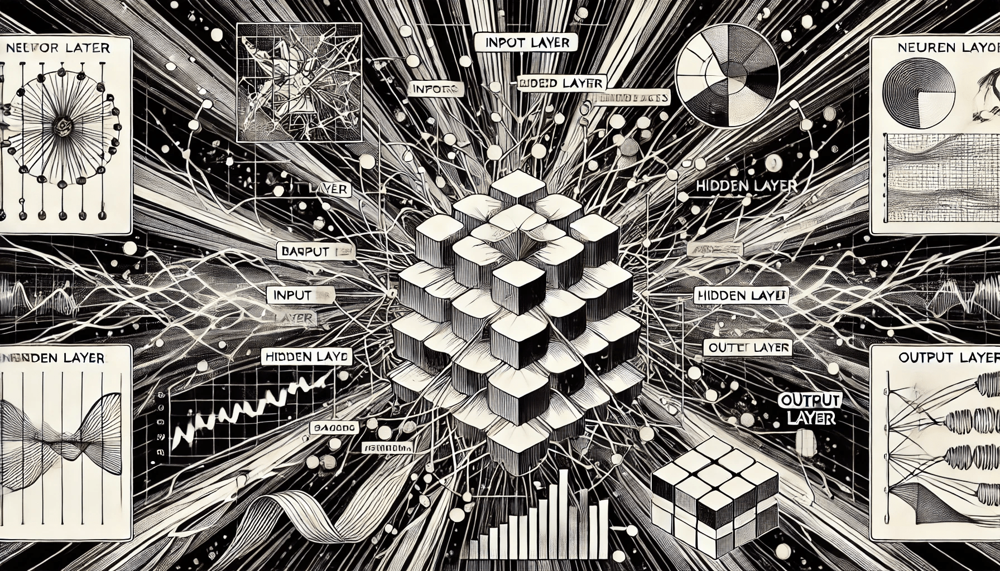

# Basic Components of NN

Neural networks are the backbone of many AI systems, mimicking the way the human brain processes information. At their core, neural networks are composed of three primary components: neurons, layers, and the connections between them, defined by weights. In this chapter, we’ll explore these elements and understand how they work together to process information.

<figure><figcaption>
Basic Components of NN
</figcaption></figure>

Understanding the basic components of neural networks — neurons, layers, inputs, activation functions and connections — is important to mastering how they function. Each component plays a vital role in processing information, transforming raw data into actionable insights. By manipulating these elements, neural networks achieve remarkable feats in AI, from diagnosing diseases to driving cars.
