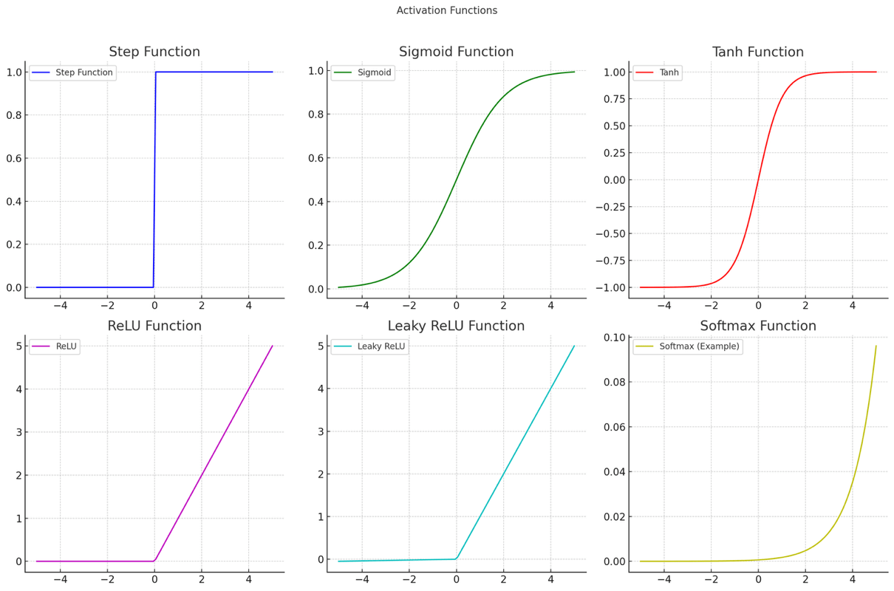

# Activation Functions

Activation functions play a crucial role in neural networks by determining whether a neuron should be activated or not based on the weighted sum of its inputs. Without activation functions, neural networks would behave like simple linear models, limiting their ability to learn complex patterns.

In this chapter, we will explore different types of activation functions, their mathematical properties, and how to implement them using PHP.

\>>>>>>>

### Why Are Activation Functions Important?

Activation functions introduce non-linearity into a neural network, allowing it to learn and model complex data relationships. Without them, even deep networks would be equivalent to a single-layer perceptron, unable to solve problems that require non-linear decision boundaries.

### Common Activation Functions

#### 1. Step Function

The step function is one of the simplest activation functions. It outputs either 0 or 1 based on a threshold.

**Formula:** \[ f(x) = \begin{cases} 1, & x \geq 0 \ 0, & x < 0 \end{cases} ]

**PHP Implementation:**

```php
function stepFunction($x) {
    return $x >= 0 ? 1 : 0;
}
```

#### 2. Sigmoid Function

The sigmoid function outputs values between 0 and 1, making it useful for probabilistic interpretations.

**Formula:** \[ f(x) = \frac{1}{1 + e^{-x\}} ]

**PHP Implementation:**

```php
function sigmoid($x) {
    return 1 / (1 + exp(-$x));
}
```

#### 3. Hyperbolic Tangent (Tanh) Function

The tanh function is similar to the sigmoid but outputs values between -1 and 1, making it zero-centered.

**Formula:** \[ f(x) = \frac{e^x - e^{-x\}}{e^x + e^{-x\}} ]

**PHP Implementation:**

```php
function tanhFunction($x) {
    return tanh($x);
}
```

#### 4. Rectified Linear Unit (ReLU)

ReLU is one of the most widely used activation functions due to its simplicity and efficiency.

**Formula:** \[ f(x) = \max(0, x) ]

**PHP Implementation:**

```php
function relu($x) {
    return max(0, $x);
}
```

#### 5. Leaky ReLU

A variation of ReLU that allows small negative values to prevent dead neurons.

**Formula:** \[ f(x) = \begin{cases} x, & x > 0 \ 0.01x, & x \leq 0 \end{cases} ]

**PHP Implementation:**

```php
function leakyRelu($x, $alpha = 0.01) {
    return $x > 0 ? $x : $alpha * $x;
}
```

#### 6. Softmax Function

The softmax function is commonly used in classification problems, converting logits into probabilities.

**Formula:** \[ f(x\_i) = \frac{e^{x\_i\}}{\sum\_{j} e^{x\_j\}} ]

**PHP Implementation:**

```php
function softmax($values) {
    $expValues = array_map('exp', $values);
    $sumExpValues = array_sum($expValues);
    return array_map(fn($v) => $v / $sumExpValues, $expValues);
}
```

### Choosing the Right Activation Function

* **Step Function:** Rarely used in modern neural networks because of several limitations.
* **Sigmoid:** Useful for binary classification but suffers from vanishing gradient problems.
* **Tanh:** Similar to sigmoid but better centered around zero.
* **ReLU:** Preferred for hidden layers in deep networks due to computational efficiency.
* **Leaky ReLU:** Helps with dead neurons in ReLU.
* **Softmax:** Best for multi-class classification.

Here are visual charts for each activation function to help illustrate their behavior.

<figure><figcaption></figcaption></figure>

### Conclusion

Activation functions are an essential part of neural networks, enabling them to model complex patterns. Understanding their strengths and weaknesses helps in selecting the right function for different tasks.

In the next chapter, we will explore how to optimize neural network training using backpropagation and gradient descent.
