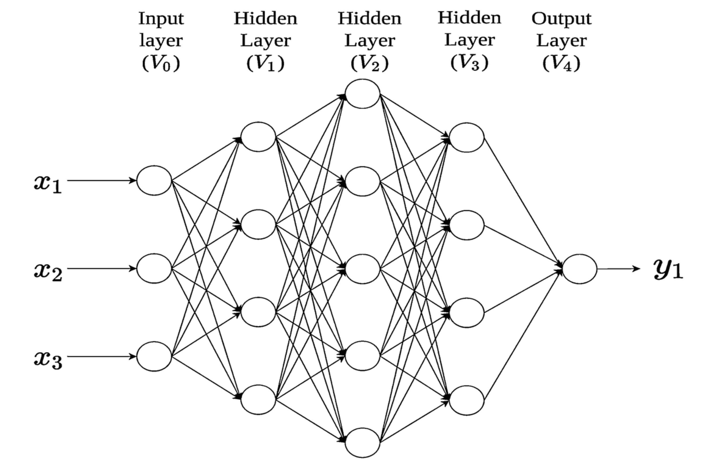

# Layers

### Neuron Layers

In the architecture of neural networks, layers are fundamental to organizing and processing information. Each layer in a neural network serves a distinct purpose, contributing to the transformation of input data into meaningful outputs. By understanding the roles and interactions of these layers, we can grasp how neural networks learn and solve complex problems.

### Organizing the Network

A neural network is structured as a sequence of interconnected layers. These layers work together to extract, process, and refine information as it flows from the input to the output.

The arrangement of these layers, including their size and complexity, determines the network’s ability to model various phenomena:

* **Input Layer**: Receives the raw data.
* **Hidden Layers**: Transform the data, extracting patterns and features.
* **Output Layer**: Produces the final result based on learned information.

The flexibility and power of a neural network lie in how its layers are organized and configured.

<figure><figcaption></figcaption></figure>

### Types of Layers

#### 1. Input Layer

The input layer is the starting point of the network, where raw data is fed into the system.

**Characteristics:**

* Representation: Each neuron corresponds to a feature in the input data. For example:
* In image processing, neurons represent pixel values.
* In tabular data, neurons correspond to individual features like age, income, or location.
* No Computation: The input layer does not perform any calculations or transformations. Its sole responsibility is to pass the data to the next layer.

**Example:**

In a dataset predicting house prices:

* Features might include square footage, number of bedrooms, and location.
* The input layer would have three neurons, each representing one of these features.

#### 2. Hidden Layers

Hidden layers are the core computational units of a neural network. These intermediate layers are where the network learns patterns and relationships in the data.

**Characteristics:**

* Number of Layers: A network may have one or more hidden layers. The number of layers and neurons per layer determines the network’s complexity.
* Non-Linear Transformations: Hidden layers apply activation functions to introduce non-linearity, enabling the network to learn complex mappings from inputs to outputs.

**Activation Functions:**

Common activation functions used in hidden layers include:

* ReLU (Rectified Linear Unit): Activates only when the input is positive:\
  $$f(x) = \max(0, x)$$
* Sigmoid: Squashes values between 0 and 1, often used in binary classification tasks: $$f(x) = \frac{1}{1 + e^{-x}}$$
* Tanh: Squashes values between -1 and 1, centered at zero:\
  $$f(x) = \frac{e^x - e^{-x}}{e^x + e^{-x}}$$

**Learning Patterns:**

* Hidden layers extract features from the data.
* Deeper layers combine lower-level features into higher-level abstractions.

**Example:**

In a network recognizing handwritten digits:

* Early hidden layers might detect edges and curves.
* Deeper hidden layers might identify shapes and patterns specific to digits.

#### 3. Output Layer

The output layer is the final layer of the network, producing results based on the learned information.

**Characteristics:**

* Output Neurons: The number of neurons depends on the task:
* For binary classification: One neuron with a sigmoid activation.
* For multi-class classification: One neuron per class with a softmax activation.
* For regression: One neuron representing the predicted value.
* Purpose: Translates internal representations into human-interpretable results.

**Example:**

In a multi-class image classification problem:

* If there are 10 categories (e.g., digits 0–9), the output layer will have 10 neurons.
* Each neuron represents the probability of the input belonging to a specific category, calculated using the softmax function:

### Practical Implementation in PHP

Using the Rubix ML library, let’s build a simple neural network to classify data. This example demonstrates how input, hidden, and output layers interact.

### Conclusion

Understanding neuron layers is essential for designing and fine-tuning neural networks. The input layer feeds raw data into the network, hidden layers perform the heavy lifting of feature extraction and transformation, and the output layer delivers the final results. Together, these layers enable neural networks to tackle diverse and complex problems, from image recognition to financial forecasting.
