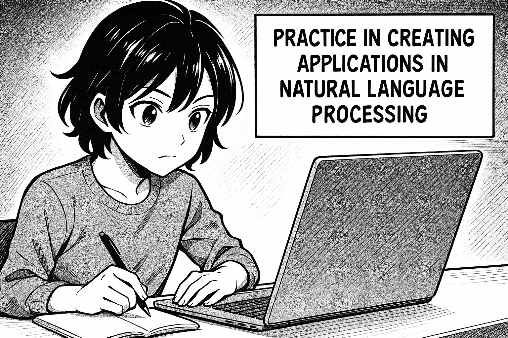

# Practice

<figure><figcaption></figcaption></figure>

#### Building your own LLM in PHP

This book, Build Your Own LLM with PHP, is a complete journey into building and understanding your own language model using nothing but PHP. You will not depend on external AI services or heavy Python frameworks. Instead, you will see how far PHP can go on its own when it comes to working with text, numbers, and knowledge.



\---
