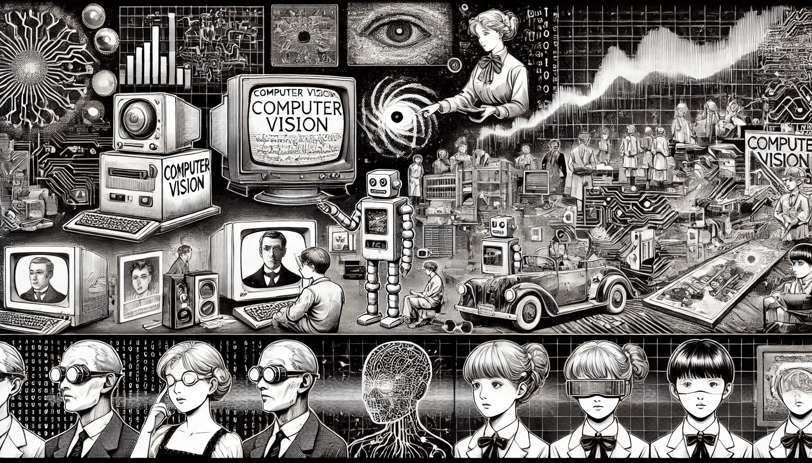
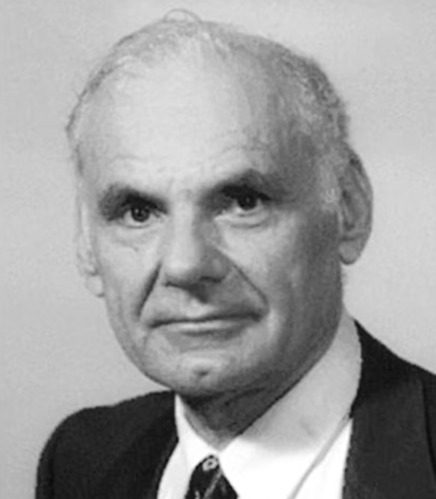

# History of CV

Computer vision is a field of AI that enables machines to interpret and understand visual information from the world. Over the decades, this field has evolved dramatically from simple image processing techniques to complex AI-driven models. Early computer vision systems focused on basic operations like filtering images and detecting edges. Today, modern systems use advanced deep learning models capable of recognizing faces, detecting objects, and even segmenting images into meaningful regions. This chapter provides a historical overview of computer vision’s evolution, highlighting major milestones and breakthroughs that have shaped its development in research and real-world applications.

<div align="left"><figure><figcaption><p>History of CV</p></figcaption></figure></div>

### Early Beginnings (1950s–1960s)

The roots of computer vision trace back to the 1950s and 1960s, when the first digital images were processed by computers. In 1957, scientists successfully scanned a photograph into a computer, creating what is considered the first digital image. This breakthrough in digitizing images made it possible to apply mathematical operations to pictures, laying the groundwork for digital image processing. Around the same time, researchers began asking whether a computer could interpret visual patterns. An early example was the Perceptron, a simple neural network developed in the late 1950s that was trained to recognize basic shapes. While the Perceptron had limited capabilities and could only handle very simple patterns, it demonstrated that automated image recognition was conceptually possible.

In the early 1960s, academic interest in machine vision grew. In 1963, Lawrence Roberts presented a thesis on deriving three-dimensional information about objects from two-dimensional photographs. He showed how a computer might infer the 3D shape of solid objects (like polyhedral blocks) from a single 2D image.&#x20;

<div align="left"><figure><figcaption><p>Lawrence Gilman Roberts</p></figcaption></figure></div>

His work inspired many researchers. In 1966, the MIT Summer Vision Project was launched, aiming to connect a camera to a computer and have it describe what it saw. This project revealed the immense complexity of vision tasks and set the foundation for many sub-problems researchers would address for years to come.

Early experiments in the 1960s also included detecting military targets and recognizing faces. Researchers manually identified facial landmarks on photographs and wrote programs to compare these features across images. Though limited, these projects showed that computers could be programmed to handle visual tasks, even if in basic forms.

### Building the Foundations (1970s–1980s)

In the 1970s and 1980s, computer vision research expanded rapidly. A major theoretical contribution came from David Marr, who proposed that visual perception could be broken into stages: detecting basic features (edges, textures), building a structured representation (depth, orientation), and finally forming a full 3D understanding of objects. This layered processing approach influenced how vision systems were designed in later decades.

Researchers also developed essential algorithms. For example, the Sobel and Canny edge detectors helped identify object boundaries by finding areas of rapid brightness change. Corner detectors like Moravec's and the Harris operator became useful for identifying key points in an image. The Hough Transform allowed reliable detection of geometric shapes like lines and circles.

During this time, motion and segmentation techniques improved. Optical flow methods were used to estimate pixel movement between video frames. Segmentation progressed from basic thresholding to region growing and energy-based methods like active contours ("snakes"). These improvements made it possible for systems to start identifying objects with greater reliability.

In 1980, Kunihiko Fukushima developed the Neocognitron, a neural network inspired by the human visual cortex.&#x20;

<div align="left"><figure><figcaption><p>Kunihiko Fukushima</p></figcaption></figure></div>

Although limited by computational power, this model introduced concepts that would later be used in deep learning. By the end of the 1980s, vision systems could analyze edges, corners, motion, and regions, though still under constrained conditions.

\>>>>>>>>>>>>>>

### Rise of Machine Learning in Vision (1990s)

The 1990s introduced more learning-based approaches. One of the decade's major achievements was the Eigenfaces method for face recognition. This technique reduced face images to essential features using principal component analysis, enabling efficient comparison.

Neural networks also found use in practical tasks. LeNet, developed by Yann LeCun, used convolutional layers to recognize handwritten digits and was used by the U.S. Postal Service. However, limited data and computing power restricted broader applications.

Instead, researchers favored classifiers like support vector machines (SVMs). These were paired with handcrafted features to detect objects in images. Object detection used region proposals or sliding windows with feature matching. Basic tracking algorithms followed moving objects in video frames using motion estimation.

This decade also saw the rise of standardized datasets like FERET (for face recognition) and MNIST (for handwritten digits). These allowed researchers to evaluate and compare methods more systematically.

### Handcrafted Features and Recognition (2000s)

The 2000s are known for strong handcrafted features. SIFT (Scale-Invariant Feature Transform) and SURF (Speeded-Up Robust Features) allowed robust matching of objects across different scales and viewpoints. HOG (Histogram of Oriented Gradients) helped detect humans in images with high accuracy, especially when used with SVMs.

The Viola-Jones face detector, introduced in 2001, used Haar-like features and a cascade of classifiers to detect faces in real time. This was a major success in applying machine learning to detection tasks.

Segmentation techniques also advanced. Graph-based methods like Normalized Cuts and energy minimization techniques such as Graph Cuts enabled better image partitioning. Algorithms like U-Net (later developed for medical imaging) built on these foundations.

Competitions such as PASCAL VOC (started in 2005) helped track progress and compare methods. Datasets like Caltech-101 and Caltech-256 expanded object categories. These efforts made it clear that good data and evaluation were essential to progress.

#### Case Studies

**Object Recognition in Industrial Robotics (2008)**

In 2008, an automotive parts manufacturer adopted a vision-based robotic inspection system. Using SIFT features and a bag-of-visual-words model trained with SVMs, the system could recognize faulty components from camera feeds. The result was a 35% reduction in quality control errors and faster processing time. This case demonstrated how handcrafted features, when paired with machine learning, were effective in real industrial environments.

**Face Detection in Consumer Electronics (2010)**

A major camera manufacturer integrated the Viola-Jones face detector into their digital cameras to improve auto-focus and exposure settings. By detecting faces in real time, cameras could automatically center the image on a person’s face. This feature greatly enhanced user experience and quickly became a standard in consumer photography products.

**Pedestrian Detection in Driver Assistance Systems (2009-2012)**

Before the deep learning boom, car manufacturers implemented HOG-based pedestrian detection systems to power automatic emergency braking. These systems helped identify people on the road in front of the vehicle, triggering alerts or automatic braking to avoid collisions. While not perfect, these early systems reduced accidents and laid the foundation for today’s advanced vision-based ADAS (Advanced Driver Assistance Systems).

### Deep Learning Revolution (2010s)

The turning point came in 2012 when AlexNet, a deep convolutional neural network, won the ImageNet competition with a much lower error rate than previous models. This demonstrated that neural networks trained on large datasets with GPUs could outperform traditional approaches.

Following AlexNet, architectures like VGG, Inception, and ResNet pushed performance even higher. ResNet, with its 152 layers, showed that very deep networks could be trained effectively using residual connections. These models learned features automatically, eliminating the need for handcrafted descriptors.

Deep learning also changed object detection. R-CNN and its successors (Fast R-CNN, Faster R-CNN) introduced CNNs into detection pipelines. YOLO and SSD offered real-time object detection by skipping the region proposal step.

In segmentation, Fully Convolutional Networks (FCNs) and Mask R-CNN enabled pixel-level labeling and instance segmentation. Medical, autonomous vehicle, and industrial applications benefited greatly.

Face recognition systems like DeepFace and FaceNet achieved near-human accuracy. These systems mapped faces into high-dimensional embeddings, enabling robust identity verification.

Generative models like GANs (Generative Adversarial Networks) introduced new capabilities. Systems could generate realistic images, synthesize faces, or describe images using natural language. Vision became part of broader AI systems, enabling applications in self-driving, augmented reality, and more.

#### Technical Diagram: Evolution of Computer Vision Approaches

```
1950s-60s     1970s-80s         1990s                2000s                    2010s
Image Filters → Edge Detection → Eigenfaces/PCA → SIFT/SURF/HOG → Deep CNNs (AlexNet, VGG)
Manual Labels → Segmentation   → SVMs & Neural Nets → Real-time Detection → R-CNN, YOLO, Mask R-CNN
```

### Recent Trends and Ethical Considerations (2020s)

In the 2020s, vision models began adopting Transformers, originally from natural language processing. Vision Transformer (ViT) models use self-attention instead of convolutions and have shown strong results in classification tasks.

Self-supervised learning is gaining attention. These methods allow models to learn from unlabeled data, reducing the need for large annotated datasets. This is important for domains where labels are hard to obtain, such as medical imaging.

Larger and more diverse datasets are being used, including 3D and video data. These help models handle real-world complexity and temporal changes.

Computer vision is now found in daily life: photo tagging, face unlocking, driver assistance systems, and industrial inspections. However, as these technologies become widespread, **ethical concerns** have emerged. Issues include surveillance, data privacy, and algorithmic bias. Face recognition, in particular, has raised debates about fairness and responsible use.

The field is also becoming more accessible. Open-source tools and pre-trained models allow even small teams to use powerful vision algorithms. This encourages innovation but also increases the need for ethical guidelines.

### Conclusion

The history of computer vision shows a remarkable evolution from simple image filters to complex AI-driven perception. Each decade introduced new techniques, from mathematical edge detectors and handcrafted features to deep learning models that learn from data.

Major breakthroughs like SIFT, AlexNet, R-CNN, and Vision Transformers have shaped how machines see the world. Dataset development and increased computing power have been key to enabling progress.

Today, computer vision is deeply integrated into AI and is used in industries, homes, medicine, and cities. As we look ahead, vision systems will continue improving, solving complex problems, and raising new questions about privacy, trust, and fairness.

Understanding the field’s history helps us appreciate its progress and prepare for its future. As machines get better at interpreting images, our challenge will be not just to improve the technology but also to use it wisely and responsibly.
