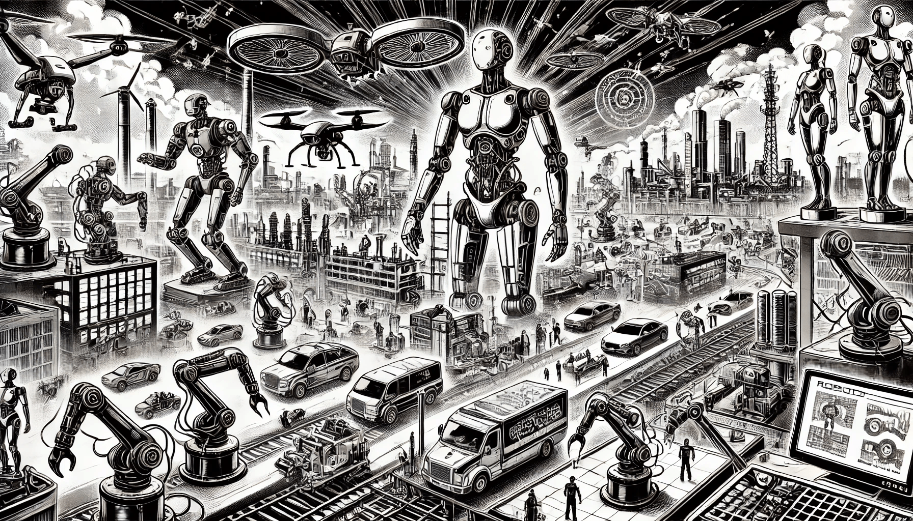

# Overview of Robotics

Robotics is a modern and fast-growing field that combines mechanical engineering, electronics, and computer science. It focuses on building machines — called robots — that can move, sense the environment, and make decisions. In this book, we explore robotics from the AI and machine learning perspective, showing how intelligent systems can control physical machines.

<figure><figcaption>
Overview of Robotics
</figcaption></figure>

To understand robotics, it is important to know what knowledge is needed, why robotics is important, where robots are used today, and what challenges the field still faces. We will also look into future trends that will shape the next generation of robotic systems.

### Prerequisites

Before studying robotics in detail, some background knowledge is helpful. Robotics is a mix of software and hardware. A basic understanding of physics is useful for motion and force. Mathematics, especially algebra and geometry, helps in understanding robot movement and position in space. Programming knowledge is also important because robots are controlled by software. While many robotics systems use languages like Python or C++, web developers can still play a role using PHP to build dashboards, control systems, or connect robots to the internet.\
\
Understanding electronics is also useful, especially for working with sensors and motors. Finally, since this book focuses on AI and machine learning, you should be familiar with how intelligent algorithms make decisions, learn from data, and adapt to new situations.

### Why Do We Need Robotics?

In the modern world, robotics solves many problems that are too difficult, dangerous, or repetitive for humans. Robots can work in conditions that are unsafe for people, such as deep underwater, in space, or in areas with high radiation. They are also used to improve efficiency in factories, where they perform the same task thousands of times without getting tired.

\>>>>>>>>>>>>>>>

Besides safety and productivity, robots also help improve the quality of services. For example, surgical robots can perform operations with high precision. In agriculture, robots help farmers monitor crops and harvest with better timing. Robots also help people in their daily lives, such as cleaning floors, assisting the elderly, or delivering packages.

The need for robotics continues to grow as societies demand more automation, better services, and higher safety in dangerous jobs.

### Where Robotics Is Used

Robots are no longer found only in factories. Today, they are used in many fields. In healthcare, robots assist doctors in performing surgeries, monitor patients, and help with physical therapy. In transportation, autonomous vehicles like self-driving cars use robotics and AI to move safely and make decisions on the road.

In agriculture, robots monitor soil conditions, plant seeds, and harvest crops with great accuracy. In the military, robots are used for surveillance, rescue missions, and even in combat situations. Even in homes, simple robots clean floors or act as companions and personal assistants.

In logistics and delivery services, companies use robots to manage inventory, move goods in warehouses, and deliver products to customers. As technology becomes cheaper and more advanced, robotics will enter even more areas of life and work.

### Disadvantages of Robotics

Although robotics brings many benefits, it also has some disadvantages that we need to understand. One major concern is cost. Developing and maintaining robots can be expensive, especially when high precision or custom parts are required. Small businesses often find it hard to afford robotic systems.

Another issue is job loss. In some industries, robots replace human workers, especially in roles that are repetitive or dangerous. While this can increase safety and reduce costs, it can also create unemployment if new jobs are not created.

Robots also have technical limits. Many robots can only perform tasks they are programmed for. They may fail when something unexpected happens or when the environment changes. This is why AI is so important—it helps robots become more flexible and able to learn. Still, building robots that truly adapt to complex environments remains a challenge.

Finally, there are ethical and legal questions. For example, who is responsible if a robot makes a mistake or causes harm? Should robots be allowed to make decisions in life-critical situations? These questions are still being debated as robots become more advanced.

### Future Trends

The future of robotics looks promising, with new technologies making robots smarter, smaller, and more connected. One important trend is collaborative robotics. These are robots designed to work safely next to humans, not behind safety barriers. They can learn from humans and help with complex tasks in factories and offices.

Another trend is the use of AI to make robots more autonomous. With machine learning, robots can recognize objects, understand speech, and plan actions on their own. Some robots even learn from experience, becoming better over time.

Cloud robotics is also growing. In this approach, robots connect to powerful computers over the internet. This allows them to share data, learn from each other, and use advanced AI models without needing powerful hardware inside the robot itself.

Soft robotics is an area where robots are made from flexible materials. These machines are safe to use around people and are ideal for tasks that involve delicate objects or sensitive environments. In the future, we may also see more swarm robotics—systems where many small robots work together like a group of ants or bees.

These future trends show that robotics will not only be more intelligent, but also more integrated into everyday life. Understanding these developments is important for anyone working in AI, software development, or automation.

In the next chapter, we will look more closely at the components that make up a robot. You will learn about sensors, actuators, control systems, and how all these parts work together with AI to create intelligent machines.
